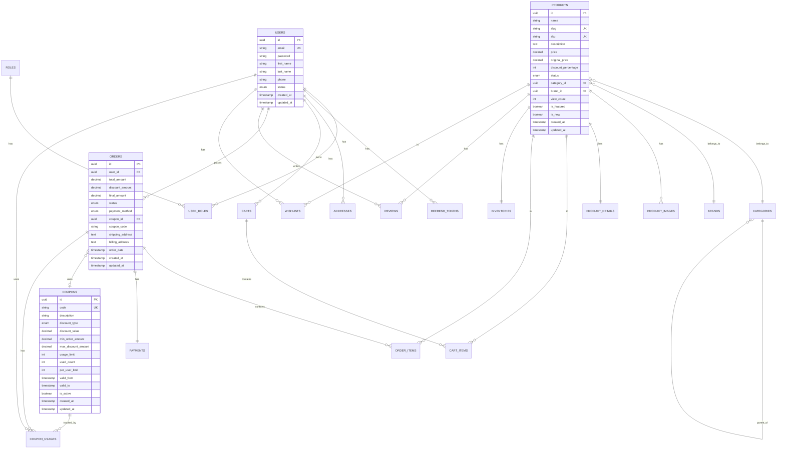
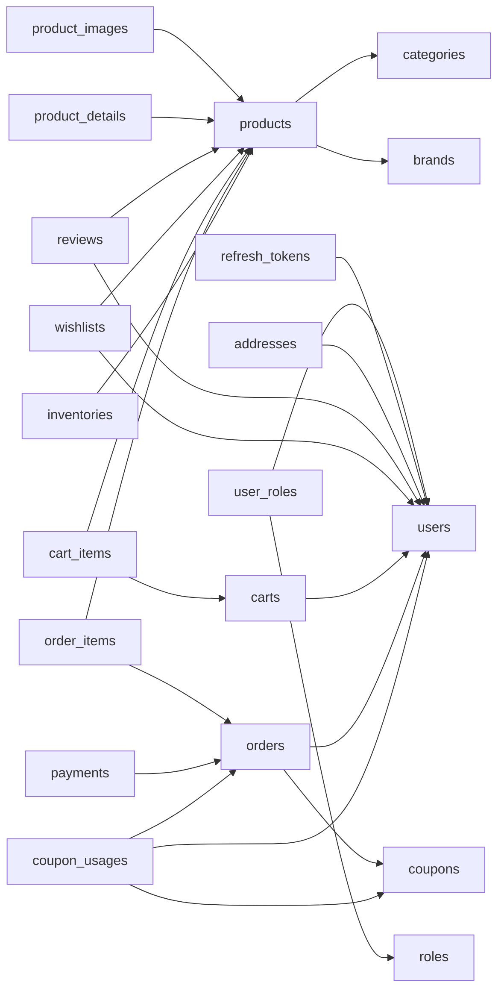

# Database Schema - Watchify Backend

## 📋 Mục Lục

- [1. Tổng Quan](#1-tổng-quan)
- [2. ERD Diagram](#2-erd-diagram)
- [3. Chi Tiết Các Bảng](#3-chi-tiết-các-bảng)
- [4. Relationships](#4-relationships)
- [5. Indexes](#5-indexes)
- [6. Migration History](#6-migration-history)
- [7. Entity-Table Mapping](#7-entity-table-mapping)

---

## 1. Tổng Quan

### 1.1. Database Information

| Property | Value |
|----------|-------|
| **Database Type** | MariaDB / PostgreSQL |
| **Migration Tool** | Flyway |
| **Naming Convention** | snake_case |
| **Primary Key Type** | UUID (CHAR(36) hoặc UUID) |
| **Timestamp Type** | TIMESTAMP |
| **Character Set** | UTF-8 |

### 1.2. Tables Overview

| Module | Tables | Description |
|--------|--------|-------------|
| **Identity** | users, roles, user_roles, refresh_tokens, addresses | Quản lý người dùng và xác thực |
| **Catalog** | products, categories, brands, product_images, product_details, reviews, wishlists | Quản lý sản phẩm và catalog |
| **Shopping** | carts, cart_items | Giỏ hàng |
| **Order** | orders, order_items | Quản lý đơn hàng |
| **Inventory** | inventories | Quản lý tồn kho |
| **Payment** | payments | Giao dịch thanh toán |
| **Promotion** | coupons, coupon_usages | Mã giảm giá |

**Tổng số bảng**: ~17 tables

---

## 2. ERD Diagram

### 2.1. Complete ERD



---

## 3. Chi Tiết Các Bảng

### 3.1. Identity Module Tables

#### USERS
**Mục đích**: Lưu trữ thông tin người dùng

```sql
CREATE TABLE users (
    id CHAR(36) PRIMARY KEY,
    email VARCHAR(255) NOT NULL UNIQUE,
    password VARCHAR(255) NOT NULL,
    first_name VARCHAR(100) NOT NULL,
    last_name VARCHAR(100) NOT NULL,
    phone VARCHAR(20),
    status VARCHAR(20) NOT NULL DEFAULT 'ACTIVE',
    created_at TIMESTAMP NOT NULL DEFAULT CURRENT_TIMESTAMP,
    updated_at TIMESTAMP NOT NULL DEFAULT CURRENT_TIMESTAMP ON UPDATE CURRENT_TIMESTAMP,
    
    CONSTRAINT chk_user_status CHECK (status IN ('ACTIVE', 'INACTIVE', 'BANNED'))
);

CREATE INDEX idx_user_email ON users(email);
CREATE INDEX idx_user_status ON users(status);
```

**Columns**:

| Column | Type | Constraints | Description |
|--------|------|-------------|-------------|
| id | CHAR(36) | PK | UUID primary key |
| email | VARCHAR(255) | NOT NULL, UNIQUE | Email đăng nhập |
| password | VARCHAR(255) | NOT NULL | BCrypt hashed password |
| first_name | VARCHAR(100) | NOT NULL | Tên |
| last_name | VARCHAR(100) | NOT NULL | Họ |
| phone | VARCHAR(20) | NULL | Số điện thoại |
| status | VARCHAR(20) | NOT NULL, DEFAULT 'ACTIVE' | Trạng thái: ACTIVE, INACTIVE, BANNED |
| created_at | TIMESTAMP | NOT NULL | Thời gian tạo |
| updated_at | TIMESTAMP | NOT NULL | Thời gian cập nhật |

---

#### ROLES
**Mục đích**: Định nghĩa các vai trò trong hệ thống

```sql
CREATE TABLE roles (
    id CHAR(36) PRIMARY KEY,
    name VARCHAR(50) NOT NULL UNIQUE,
    description VARCHAR(255),
    created_at TIMESTAMP NOT NULL DEFAULT CURRENT_TIMESTAMP,
    
    CONSTRAINT chk_role_name CHECK (name IN ('ADMIN', 'CUSTOMER'))
);
```

**Sample Data**:
- ADMIN - Quản trị viên
- CUSTOMER - Khách hàng

---

#### USER_ROLES
**Mục đích**: Bảng trung gian many-to-many giữa users và roles

```sql
CREATE TABLE user_roles (
    user_id CHAR(36) NOT NULL,
    role_id CHAR(36) NOT NULL,
    
    PRIMARY KEY (user_id, role_id),
    FOREIGN KEY (user_id) REFERENCES users(id) ON DELETE CASCADE,
    FOREIGN KEY (role_id) REFERENCES roles(id) ON DELETE CASCADE
);
```

---

#### REFRESH_TOKENS
**Mục đích**: Lưu trữ refresh tokens cho JWT authentication

```sql
CREATE TABLE refresh_tokens (
    id CHAR(36) PRIMARY KEY,
    token VARCHAR(255) NOT NULL UNIQUE,
    user_id CHAR(36) NOT NULL,
    expiry_date TIMESTAMP NOT NULL,
    created_at TIMESTAMP NOT NULL DEFAULT CURRENT_TIMESTAMP,
    
    FOREIGN KEY (user_id) REFERENCES users(id) ON DELETE CASCADE
);

CREATE INDEX idx_refresh_token_token ON refresh_tokens(token);
CREATE INDEX idx_refresh_token_user ON refresh_tokens(user_id);
```

---

#### ADDRESSES
**Mục đích**: Lưu địa chỉ giao hàng/thanh toán của user

```sql
CREATE TABLE addresses (
    id CHAR(36) PRIMARY KEY,
    user_id CHAR(36) NOT NULL,
    full_name VARCHAR(100) NOT NULL,
    phone VARCHAR(20) NOT NULL,
    address_line VARCHAR(255) NOT NULL,
    city VARCHAR(100) NOT NULL,
    district VARCHAR(100),
    ward VARCHAR(100),
    postal_code VARCHAR(20),
    type VARCHAR(20) NOT NULL,
    is_default BOOLEAN DEFAULT FALSE,
    created_at TIMESTAMP NOT NULL DEFAULT CURRENT_TIMESTAMP,
    updated_at TIMESTAMP NOT NULL DEFAULT CURRENT_TIMESTAMP ON UPDATE CURRENT_TIMESTAMP,
    
    FOREIGN KEY (user_id) REFERENCES users(id) ON DELETE CASCADE,
    CONSTRAINT chk_address_type CHECK (type IN ('SHIPPING', 'BILLING'))
);

CREATE INDEX idx_address_user ON addresses(user_id);
```

---

### 3.2. Catalog Module Tables

#### PRODUCTS
**Mục đích**: Lưu trữ thông tin sản phẩm đồng hồ

```sql
CREATE TABLE products (
    id CHAR(36) PRIMARY KEY,
    name VARCHAR(255) NOT NULL,
    slug VARCHAR(255) NOT NULL UNIQUE,
    sku VARCHAR(100) NOT NULL UNIQUE,
    description TEXT,
    price DECIMAL(15,2) NOT NULL,
    original_price DECIMAL(15,2),
    discount_percentage INT,
    status VARCHAR(20) NOT NULL DEFAULT 'ACTIVE',
    category_id CHAR(36) NOT NULL,
    brand_id CHAR(36) NOT NULL,
    view_count INT DEFAULT 0,
    is_featured BOOLEAN DEFAULT FALSE,
    is_new BOOLEAN DEFAULT FALSE,
    created_at TIMESTAMP NOT NULL DEFAULT CURRENT_TIMESTAMP,
    updated_at TIMESTAMP NOT NULL DEFAULT CURRENT_TIMESTAMP ON UPDATE CURRENT_TIMESTAMP,
    
    FOREIGN KEY (category_id) REFERENCES categories(id),
    FOREIGN KEY (brand_id) REFERENCES brands(id),
    CONSTRAINT chk_product_status CHECK (status IN ('ACTIVE', 'INACTIVE', 'DISCONTINUED')),
    CONSTRAINT chk_product_price CHECK (price > 0),
    CONSTRAINT chk_product_discount CHECK (discount_percentage >= 0 AND discount_percentage <= 100)
);

CREATE INDEX idx_product_slug ON products(slug);
CREATE INDEX idx_product_sku ON products(sku);
CREATE INDEX idx_product_category ON products(category_id);
CREATE INDEX idx_product_brand ON products(brand_id);
CREATE INDEX idx_product_status ON products(status);
CREATE INDEX idx_product_price ON products(price);
CREATE INDEX idx_product_featured ON products(is_featured);
CREATE INDEX idx_product_new ON products(is_new);
```

---

#### CATEGORIES
**Mục đích**: Phân loại sản phẩm (hỗ trợ hierarchical)

```sql
CREATE TABLE categories (
    id CHAR(36) PRIMARY KEY,
    name VARCHAR(100) NOT NULL,
    slug VARCHAR(100) NOT NULL UNIQUE,
    description TEXT,
    parent_id CHAR(36),
    display_order INT DEFAULT 0,
    is_active BOOLEAN DEFAULT TRUE,
    created_at TIMESTAMP NOT NULL DEFAULT CURRENT_TIMESTAMP,
    updated_at TIMESTAMP NOT NULL DEFAULT CURRENT_TIMESTAMP ON UPDATE CURRENT_TIMESTAMP,
    
    FOREIGN KEY (parent_id) REFERENCES categories(id) ON DELETE SET NULL
);

CREATE INDEX idx_category_slug ON categories(slug);
CREATE INDEX idx_category_parent ON categories(parent_id);
CREATE INDEX idx_category_active ON categories(is_active);
```

**Sample Data**:
- Men's Watches (parent_id = NULL)
  - Luxury (parent_id = Men's Watches)
  - Sport (parent_id = Men's Watches)
- Women's Watches (parent_id = NULL)

---

#### BRANDS
**Mục đích**: Thương hiệu đồng hồ

```sql
CREATE TABLE brands (
    id CHAR(36) PRIMARY KEY,
    name VARCHAR(100) NOT NULL UNIQUE,
    slug VARCHAR(100) NOT NULL UNIQUE,
    description TEXT,
    logo_url VARCHAR(500),
    website_url VARCHAR(500),
    is_active BOOLEAN DEFAULT TRUE,
    created_at TIMESTAMP NOT NULL DEFAULT CURRENT_TIMESTAMP,
    updated_at TIMESTAMP NOT NULL DEFAULT CURRENT_TIMESTAMP ON UPDATE CURRENT_TIMESTAMP
);

CREATE INDEX idx_brand_slug ON brands(slug);
CREATE INDEX idx_brand_active ON brands(is_active);
```

**Sample Data**: Rolex, Omega, Seiko, Casio, etc.

---

#### PRODUCT_IMAGES
**Mục đích**: Hình ảnh sản phẩm (multiple images per product)

```sql
CREATE TABLE product_images (
    id CHAR(36) PRIMARY KEY,
    product_id CHAR(36) NOT NULL,
    image_url VARCHAR(500) NOT NULL,
    is_primary BOOLEAN DEFAULT FALSE,
    display_order INT DEFAULT 0,
    created_at TIMESTAMP NOT NULL DEFAULT CURRENT_TIMESTAMP,
    
    FOREIGN KEY (product_id) REFERENCES products(id) ON DELETE CASCADE
);

CREATE INDEX idx_product_image_product ON product_images(product_id);
CREATE INDEX idx_product_image_primary ON product_images(product_id, is_primary);
```

---

#### PRODUCT_DETAILS
**Mục đích**: Thông tin kỹ thuật chi tiết của đồng hồ

```sql
CREATE TABLE product_details (
    id CHAR(36) PRIMARY KEY,
    product_id CHAR(36) NOT NULL UNIQUE,
    movement_type VARCHAR(50),           -- Automatic, Quartz, Manual
    case_material VARCHAR(100),          -- Stainless Steel, Gold, Titanium
    case_size VARCHAR(50),               -- e.g., "42mm"
    dial_color VARCHAR(50),
    strap_material VARCHAR(100),
    water_resistance VARCHAR(50),        -- e.g., "100m", "5 ATM"
    warranty VARCHAR(100),
    origin VARCHAR(100),                 -- Made in Switzerland, Japan
    created_at TIMESTAMP NOT NULL DEFAULT CURRENT_TIMESTAMP,
    updated_at TIMESTAMP NOT NULL DEFAULT CURRENT_TIMESTAMP ON UPDATE CURRENT_TIMESTAMP,
    
    FOREIGN KEY (product_id) REFERENCES products(id) ON DELETE CASCADE
);
```

---

#### REVIEWS
**Mục đích**: Đánh giá sản phẩm từ khách hàng

```sql
CREATE TABLE reviews (
    id CHAR(36) PRIMARY KEY,
    product_id CHAR(36) NOT NULL,
    user_id CHAR(36) NOT NULL,
    rating INT NOT NULL,
    title VARCHAR(200),
    content TEXT,
    status VARCHAR(20) NOT NULL DEFAULT 'PENDING',
    helpful_count INT DEFAULT 0,
    created_at TIMESTAMP NOT NULL DEFAULT CURRENT_TIMESTAMP,
    updated_at TIMESTAMP NOT NULL DEFAULT CURRENT_TIMESTAMP ON UPDATE CURRENT_TIMESTAMP,
    
    FOREIGN KEY (product_id) REFERENCES products(id) ON DELETE CASCADE,
    FOREIGN KEY (user_id) REFERENCES users(id) ON DELETE CASCADE,
    CONSTRAINT chk_review_rating CHECK (rating >= 1 AND rating <= 5),
    CONSTRAINT chk_review_status CHECK (status IN ('PENDING', 'APPROVED', 'REJECTED'))
);

CREATE INDEX idx_review_product ON reviews(product_id);
CREATE INDEX idx_review_user ON reviews(user_id);
CREATE INDEX idx_review_status ON reviews(status);
CREATE INDEX idx_review_rating ON reviews(product_id, rating);
```

---

#### WISHLISTS
**Mục đích**: Danh sách yêu thích của user

```sql
CREATE TABLE wishlists (
    id CHAR(36) PRIMARY KEY,
    user_id CHAR(36) NOT NULL,
    product_id CHAR(36) NOT NULL,
    notes VARCHAR(500),
    priority INT,                        -- 1 (high) to 5 (low)
    notify_on_sale BOOLEAN DEFAULT FALSE,
    notify_on_stock BOOLEAN DEFAULT FALSE,
    created_at TIMESTAMP NOT NULL DEFAULT CURRENT_TIMESTAMP,
    updated_at TIMESTAMP NOT NULL DEFAULT CURRENT_TIMESTAMP ON UPDATE CURRENT_TIMESTAMP,
    
    FOREIGN KEY (user_id) REFERENCES users(id) ON DELETE CASCADE,
    FOREIGN KEY (product_id) REFERENCES products(id) ON DELETE CASCADE,
    UNIQUE (user_id, product_id)
);

CREATE INDEX idx_wishlist_user ON wishlists(user_id);
CREATE INDEX idx_wishlist_product ON wishlists(product_id);
CREATE INDEX idx_wishlist_notify_sale ON wishlists(product_id) WHERE notify_on_sale = TRUE;
CREATE INDEX idx_wishlist_notify_stock ON wishlists(product_id) WHERE notify_on_stock = TRUE;
```

---

### 3.3. Shopping Tables

#### CARTS
**Mục đích**: Giỏ hàng của user

```sql
CREATE TABLE carts (
    id CHAR(36) PRIMARY KEY,
    user_id CHAR(36) NOT NULL UNIQUE,
    last_activity_at TIMESTAMP,
    created_at TIMESTAMP NOT NULL DEFAULT CURRENT_TIMESTAMP,
    updated_at TIMESTAMP NOT NULL DEFAULT CURRENT_TIMESTAMP ON UPDATE CURRENT_TIMESTAMP,
    
    FOREIGN KEY (user_id) REFERENCES users(id) ON DELETE CASCADE
);
```

---

#### CART_ITEMS
**Mục đích**: Sản phẩm trong giỏ hàng

```sql
CREATE TABLE cart_items (
    id CHAR(36) PRIMARY KEY,
    cart_id CHAR(36) NOT NULL,
    product_id CHAR(36) NOT NULL,
    quantity INT NOT NULL DEFAULT 1,
    unit_price DECIMAL(15,2) NOT NULL,
    created_at TIMESTAMP NOT NULL DEFAULT CURRENT_TIMESTAMP,
    updated_at TIMESTAMP NOT NULL DEFAULT CURRENT_TIMESTAMP ON UPDATE CURRENT_TIMESTAMP,
    
    FOREIGN KEY (cart_id) REFERENCES carts(id) ON DELETE CASCADE,
    FOREIGN KEY (product_id) REFERENCES products(id) ON DELETE CASCADE,
    UNIQUE (cart_id, product_id),
    CONSTRAINT chk_cart_item_quantity CHECK (quantity > 0)
);

CREATE INDEX idx_cart_item_cart ON cart_items(cart_id);
CREATE INDEX idx_cart_item_product ON cart_items(product_id);
```

---

### 3.4. Order Tables

#### ORDERS
**Mục đích**: Đơn hàng

```sql
CREATE TABLE orders (
    id CHAR(36) PRIMARY KEY,
    user_id CHAR(36),                    -- NULL for guest orders
    total_amount DECIMAL(15,2) NOT NULL,
    discount_amount DECIMAL(15,2) DEFAULT 0.00,
    final_amount DECIMAL(15,2) NOT NULL,
    status VARCHAR(20) NOT NULL DEFAULT 'PENDING',
    payment_method VARCHAR(20) NOT NULL,
    coupon_id CHAR(36),
    coupon_code VARCHAR(50),
    shipping_address TEXT NOT NULL,
    billing_address TEXT,
    notes TEXT,
    order_date TIMESTAMP NOT NULL DEFAULT CURRENT_TIMESTAMP,
    created_at TIMESTAMP NOT NULL DEFAULT CURRENT_TIMESTAMP,
    updated_at TIMESTAMP NOT NULL DEFAULT CURRENT_TIMESTAMP ON UPDATE CURRENT_TIMESTAMP,
    
    FOREIGN KEY (user_id) REFERENCES users(id) ON DELETE SET NULL,
    FOREIGN KEY (coupon_id) REFERENCES coupons(id) ON DELETE SET NULL,
    CONSTRAINT chk_order_status CHECK (status IN ('PENDING', 'CONFIRMED', 'PROCESSING', 'SHIPPED', 'DELIVERED', 'CANCELLED')),
    CONSTRAINT chk_payment_method CHECK (payment_method IN ('CREDIT_CARD', 'BANK_TRANSFER', 'EWALLET', 'COD'))
);

CREATE INDEX idx_order_user ON orders(user_id);
CREATE INDEX idx_order_status ON orders(status);
CREATE INDEX idx_order_date ON orders(order_date DESC);
CREATE INDEX idx_order_coupon ON orders(coupon_id);
```

---

#### ORDER_ITEMS
**Mục đích**: Chi tiết sản phẩm trong đơn hàng

```sql
CREATE TABLE order_items (
    id CHAR(36) PRIMARY KEY,
    order_id CHAR(36) NOT NULL,
    product_id CHAR(36) NOT NULL,
    quantity INT NOT NULL,
    unit_price DECIMAL(15,2) NOT NULL,
    total_price DECIMAL(15,2) NOT NULL,
    created_at TIMESTAMP NOT NULL DEFAULT CURRENT_TIMESTAMP,
    
    FOREIGN KEY (order_id) REFERENCES orders(id) ON DELETE CASCADE,
    FOREIGN KEY (product_id) REFERENCES products(id),
    CONSTRAINT chk_order_item_quantity CHECK (quantity > 0)
);

CREATE INDEX idx_order_item_order ON order_items(order_id);
CREATE INDEX idx_order_item_product ON order_items(product_id);
```

---

### 3.5. Inventory Table

#### INVENTORIES
**Mục đích**: Quản lý tồn kho

```sql
CREATE TABLE inventories (
    id CHAR(36) PRIMARY KEY,
    product_id CHAR(36) NOT NULL UNIQUE,
    quantity INT NOT NULL DEFAULT 0,
    reserved_quantity INT NOT NULL DEFAULT 0,
    location VARCHAR(100),
    created_at TIMESTAMP NOT NULL DEFAULT CURRENT_TIMESTAMP,
    updated_at TIMESTAMP NOT NULL DEFAULT CURRENT_TIMESTAMP ON UPDATE CURRENT_TIMESTAMP,
    
    FOREIGN KEY (product_id) REFERENCES products(id) ON DELETE CASCADE,
    CONSTRAINT chk_inventory_quantity CHECK (quantity >= 0),
    CONSTRAINT chk_reserved_quantity CHECK (reserved_quantity >= 0),
    CONSTRAINT chk_reserved_not_exceed CHECK (reserved_quantity <= quantity)
);

CREATE INDEX idx_inventory_product ON inventories(product_id);
```

**Logic**:
- `available_quantity` = `quantity` - `reserved_quantity` (calculated field)

---

### 3.6. Payment Table

#### PAYMENTS
**Mục đích**: Giao dịch thanh toán

```sql
CREATE TABLE payments (
    id CHAR(36) PRIMARY KEY,
    order_id CHAR(36) NOT NULL UNIQUE,
    amount DECIMAL(15,2) NOT NULL,
    status VARCHAR(20) NOT NULL DEFAULT 'PENDING',
    payment_method VARCHAR(20) NOT NULL,
    transaction_id VARCHAR(255),
    payment_date TIMESTAMP,
    notes TEXT,
    created_at TIMESTAMP NOT NULL DEFAULT CURRENT_TIMESTAMP,
    updated_at TIMESTAMP NOT NULL DEFAULT CURRENT_TIMESTAMP ON UPDATE CURRENT_TIMESTAMP,
    
    FOREIGN KEY (order_id) REFERENCES orders(id) ON DELETE CASCADE,
    CONSTRAINT chk_payment_status CHECK (status IN ('PENDING', 'PROCESSING', 'COMPLETED', 'FAILED', 'CANCELLED'))
);

CREATE INDEX idx_payment_order ON payments(order_id);
CREATE INDEX idx_payment_status ON payments(status);
CREATE INDEX idx_payment_transaction ON payments(transaction_id);
```

---

### 3.7. Promotion Tables

#### COUPONS
**Mục đích**: Mã giảm giá

```sql
CREATE TABLE coupons (
    id CHAR(36) PRIMARY KEY,
    code VARCHAR(50) NOT NULL UNIQUE,
    description VARCHAR(500),
    discount_type VARCHAR(20) NOT NULL,
    discount_value DECIMAL(15,2) NOT NULL,
    min_order_amount DECIMAL(15,2),
    max_discount_amount DECIMAL(15,2),
    usage_limit INT,
    used_count INT NOT NULL DEFAULT 0,
    per_user_limit INT,
    valid_from TIMESTAMP NOT NULL,
    valid_to TIMESTAMP NOT NULL,
    is_active BOOLEAN NOT NULL DEFAULT TRUE,
    created_at TIMESTAMP NOT NULL DEFAULT CURRENT_TIMESTAMP,
    updated_at TIMESTAMP,
    created_by VARCHAR(100),
    
    CONSTRAINT chk_discount_type CHECK (discount_type IN ('PERCENTAGE', 'FIXED_AMOUNT')),
    CONSTRAINT chk_discount_value CHECK (discount_value > 0),
    CONSTRAINT chk_date_range CHECK (valid_from < valid_to)
);

CREATE INDEX idx_coupon_code ON coupons(code);
CREATE INDEX idx_coupon_active ON coupons(is_active);
CREATE INDEX idx_coupon_valid_dates ON coupons(valid_from, valid_to);
```

---

#### COUPON_USAGES
**Mục đích**: Lịch sử sử dụng coupon

```sql
CREATE TABLE coupon_usages (
    id CHAR(36) PRIMARY KEY,
    coupon_id CHAR(36) NOT NULL,
    user_id CHAR(36) NOT NULL,
    order_id CHAR(36) NOT NULL,
    discount_amount DECIMAL(15,2) NOT NULL,
    order_amount DECIMAL(15,2) NOT NULL,
    used_at TIMESTAMP NOT NULL DEFAULT CURRENT_TIMESTAMP,
    ip_address VARCHAR(45),
    user_agent VARCHAR(500),
    
    FOREIGN KEY (coupon_id) REFERENCES coupons(id) ON DELETE CASCADE,
    FOREIGN KEY (user_id) REFERENCES users(id) ON DELETE CASCADE,
    FOREIGN KEY (order_id) REFERENCES orders(id) ON DELETE CASCADE
);

CREATE INDEX idx_coupon_usage_coupon ON coupon_usages(coupon_id);
CREATE INDEX idx_coupon_usage_user ON coupon_usages(user_id);
CREATE INDEX idx_coupon_usage_order ON coupon_usages(order_id);
CREATE INDEX idx_coupon_usage_user_coupon ON coupon_usages(user_id, coupon_id);
```

---

## 4. Relationships

### 4.1. Foreign Key Relationships



### 4.2. Cascade Rules

| Parent Table | Child Table | ON DELETE | Reason |
|--------------|-------------|-----------|---------|
| users | refresh_tokens | CASCADE | Xóa user → xóa tokens |
| users | addresses | CASCADE | Xóa user → xóa addresses |
| users | carts | CASCADE | Xóa user → xóa cart |
| products | product_images | CASCADE | Xóa product → xóa images |
| products | inventories | CASCADE | Xóa product → xóa inventory |
| carts | cart_items | CASCADE | Xóa cart → xóa items |
| orders | order_items | CASCADE | Xóa order → xóa items |
| orders | payments | CASCADE | Xóa order → xóa payment |
| users | orders | SET NULL | Xóa user → order vẫn giữ (guest) |
| coupons | orders | SET NULL | Xóa coupon → order vẫn giữ |

---

## 5. Indexes

### 5.1. Performance Indexes

#### High-Traffic Queries
- `idx_user_email` - Login lookup
- `idx_product_slug` - SEO-friendly URLs
- `idx_product_category` - Category filtering
- `idx_order_user` - User order history
- `idx_cart_item_cart` - Cart display

#### Search & Filter
- `idx_product_price` - Price range filtering
- `idx_product_status` - Active products
- `idx_order_status` - Order status queries
- `idx_coupon_active` - Active coupons

#### Unique Constraints
- `idx_user_email` (UNIQUE)
- `idx_product_slug` (UNIQUE)
- `idx_product_sku` (UNIQUE)
- `idx_coupon_code` (UNIQUE)

---

## 6. Migration History

### 6.1. Flyway Migration Files

| Version | File | Description |
|---------|------|-------------|
| V004 | `V004__create_wishlists_table.sql` | Tạo bảng wishlists |
| V005 | `V005__create_coupons_tables.sql` | Tạo bảng coupons và coupon_usages |
| V006 | `V006__add_coupon_to_orders.sql` | Thêm coupon vào orders |

**Note**: Các migration V001, V002, V003 tạo các bảng core (users, products, orders, etc.)

---

## 7. Entity-Table Mapping

### 7.1. JPA Entity Mapping

| Java Entity | Database Table | Module |
|-------------|----------------|--------|
| `User` | users | Identity |
| `Role` | roles | Identity |
| `RefreshToken` | refresh_tokens | Identity |
| `Address` | addresses | Identity |
| `Product` | products | Catalog |
| `Category` | categories | Catalog |
| `Brand` | brands | Catalog |
| `ProductImage` | product_images | Catalog |
| `ProductDetail` | product_details | Catalog |
| `Review` | reviews | Catalog |
| `Wishlist` | wishlists | Catalog |
| `Cart` | carts | Catalog |
| `CartItem` | cart_items | Catalog |
| `Order` | orders | Order |
| `OrderItem` | order_items | Order |
| `Inventory` | inventories | Inventory |
| `Payment` | payments | Payment |
| `Coupon` | coupons | Promotion |
| `CouponUsage` | coupon_usages | Promotion |

---

## 8. Data Integrity

### 8.1. Constraints

#### Check Constraints
- Price must be > 0
- Quantity must be >= 0
- Rating must be 1-5
- Discount percentage must be 0-100
- Valid date range (from < to)

#### Unique Constraints
- User email
- Product slug, SKU
- Coupon code
- (user_id, product_id) in wishlists
- (cart_id, product_id) in cart_items

#### Foreign Key Constraints
- All relationships enforced via FKs
- Appropriate CASCADE/SET NULL rules

---

## 9. Kết Luận

Database schema của Watchify:

✅ **Well-normalized** - Tuân thủ normalization principles

✅ **Indexed properly** - Performance-optimized

✅ **Referential integrity** - FK constraints enforced

✅ **Flexible** - Support guest checkout, hierarchical categories

✅ **Audit trails** - created_at, updated_at timestamps

✅ **Scalable** - UUID primary keys, proper indexing

✅ **Migration-based** - Version controlled with Flyway

Điểm mạnh:
- Clear separation by modules
- Support complex queries (filtering, search)
- Data integrity enforced at DB level
- Ready for horizontal scaling

---

**[◀ Quay lại Sequence Diagrams](sequence-diagrams.md)** | **[Tiếp theo: API ▶](api.md)**
