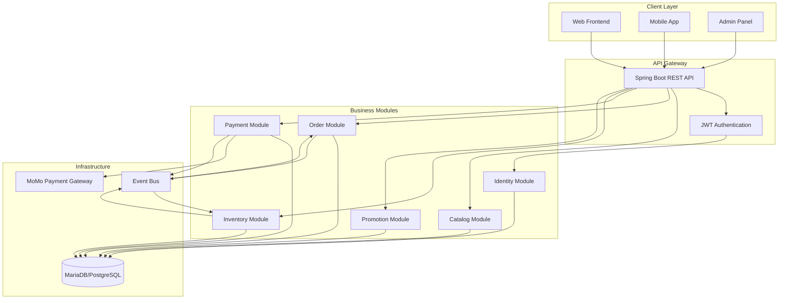
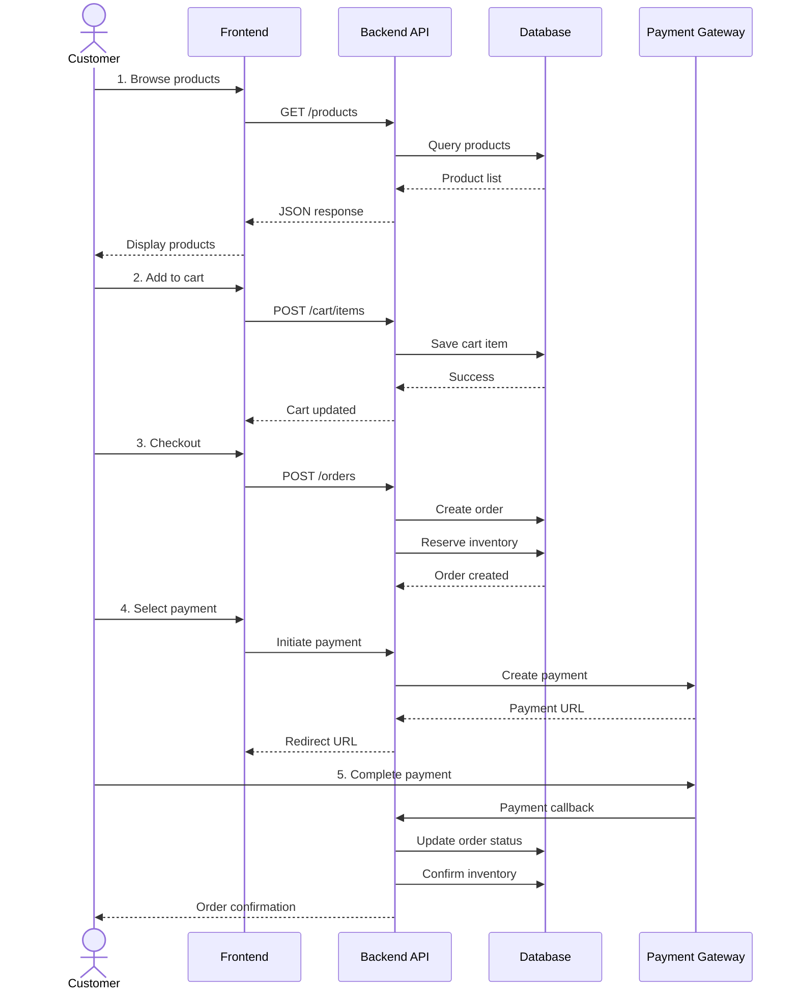
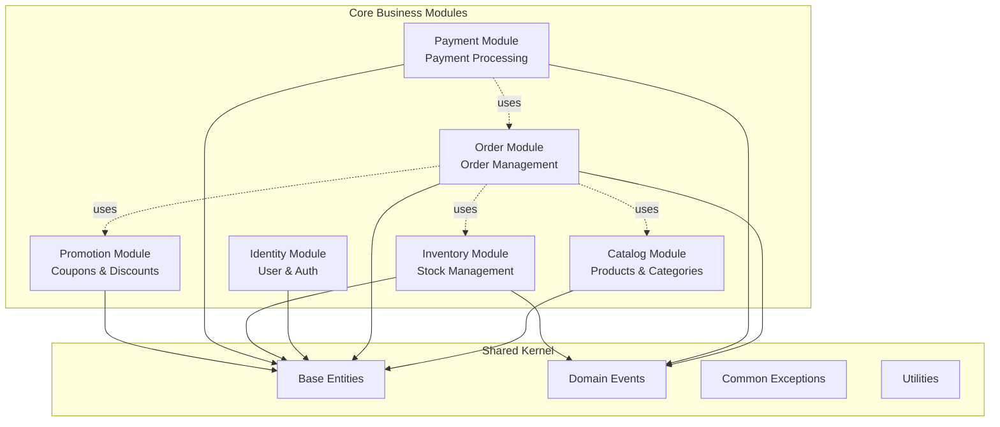

# Tổng Quan Hệ Thống - Watchify Backend

## 📋 Mục Lục

- [1. Giới Thiệu](#1-giới-thiệu)
- [2. Mục Tiêu và Phạm Vi](#2-mục-tiêu-và-phạm-vi)
- [3. Luồng Hoạt Động Tổng Quát](#3-luồng-hoạt-động-tổng-quát)
- [4. Các Domain/Module Chính](#4-các-domainmodule-chính)
- [5. Stack Công Nghệ](#5-stack-công-nghệ)

---

## 1. Giới Thiệu

**Watchify** là một hệ thống thương mại điện tử (E-commerce) chuyên về kinh doanh đồng hồ cao cấp. Backend được xây dựng dựa trên kiến trúc **Modular Monolithic**, kết hợp với các nguyên tắc **Domain-Driven Design (DDD)** để đảm bảo tính module hóa, dễ bảo trì và mở rộng.

### Đặc Điểm Chính

✅ **RESTful API** - Cung cấp API chuẩn REST cho frontend và mobile apps

✅ **JWT Authentication** - Xác thực người dùng an toàn với JSON Web Tokens

✅ **Role-based Access Control** - Phân quyền theo vai trò (Admin, Customer)

✅ **Modular Architecture** - Tổ chức code theo modules độc lập

✅ **Event-Driven** - Giao tiếp giữa modules qua domain events

✅ **Database Migration** - Quản lý schema với Flyway

✅ **API Documentation** - Tự động sinh docs với OpenAPI/Swagger

✅ **Payment Integration** - Tích hợp cổng thanh toán MoMo

---

## 2. Mục Tiêu và Phạm Vi

### 2.1. Mục Tiêu Dự Án

| Mục tiêu | Mô tả |
|----------|-------|
| **Bán hàng trực tuyến** | Cung cấp nền tảng mua bán đồng hồ trực tuyến cho khách hàng |
| **Quản lý sản phẩm** | Hệ thống quản lý catalog sản phẩm với categories, brands, variants |
| **Quản lý đơn hàng** | Xử lý đơn hàng từ cart → checkout → payment → fulfillment |
| **Quản lý tồn kho** | Theo dõi số lượng hàng tồn kho, đặt chỗ khi đặt hàng |
| **Chương trình khuyến mãi** | Hỗ trợ mã giảm giá (coupons) với nhiều loại discount |
| **Đánh giá sản phẩm** | Cho phép khách hàng review và rating sản phẩm |
| **Wishlist** | Lưu danh sách sản phẩm yêu thích |

### 2.2. Phạm Vi Chức Năng

#### 👤 Khách Hàng (Customer)
- Đăng ký, đăng nhập tài khoản
- Duyệt sản phẩm, tìm kiếm, lọc theo danh mục/thương hiệu
- Thêm sản phẩm vào giỏ hàng
- Đặt hàng và thanh toán
- Theo dõi lịch sử đơn hàng
- Đánh giá sản phẩm đã mua
- Quản lý wishlist
- Sử dụng mã giảm giá

#### 🔐 Quản Trị Viên (Admin)
- Quản lý sản phẩm (CRUD)
- Quản lý categories và brands
- Quản lý đơn hàng (xem, cập nhật trạng thái)
- Quản lý tồn kho
- Tạo và quản lý mã giảm giá
- Duyệt đánh giá sản phẩm
- Xem báo cáo và thống kê

#### 🔄 Khách (Guest)
- Duyệt sản phẩm công khai
- Tìm kiếm sản phẩm
- Xem chi tiết sản phẩm và reviews
- Đặt hàng không cần đăng nhập (guest checkout)

---

## 3. Luồng Hoạt Động Tổng Quát

### 3.1. High-Level Flow Diagram



### 3.2. User Journey - Customer



### 3.3. Luồng Dữ Liệu Chính

1. **Authentication Flow**
   - User → Login → JWT Token → Authenticated Requests

2. **Product Browsing Flow**
   - Browse/Search → Filter → Pagination → Product List → Detail View

3. **Shopping Cart Flow**
   - Add to Cart → Update Quantity → View Cart → Checkout

4. **Order Flow**
   - Create Order → Reserve Inventory → Payment → Confirm → Fulfillment

5. **Payment Flow**
   - Select Method → Create Payment → Gateway Redirect → Callback → Verify → Complete

6. **Coupon Flow**
   - Validate Coupon → Apply Discount → Calculate Final Amount → Record Usage

---

## 4. Các Domain/Module Chính

### 4.1. Module Overview



### 4.2. Chi Tiết Các Module

#### 🔐 Identity Module
**Bounded Context**: Quản lý danh tính và xác thực người dùng

**Trách nhiệm**:
- Đăng ký, đăng nhập người dùng
- Quản lý JWT tokens (access + refresh)
- Quản lý vai trò và quyền hạn (RBAC)
- Quản lý thông tin cá nhân
- Quản lý địa chỉ giao hàng/thanh toán

**Core Entities**:
- `User` - Người dùng
- `Role` - Vai trò (Admin, Customer)
- `RefreshToken` - Token làm mới
- `Address` - Địa chỉ

**Key Services**:
- `AuthService` - Xác thực
- `UserService` - Quản lý user
- `AddressService` - Quản lý địa chỉ

---

#### 📦 Catalog Module
**Bounded Context**: Quản lý catalog sản phẩm

**Trách nhiệm**:
- Quản lý sản phẩm (CRUD)
- Quản lý categories (hỗ trợ hierarchy)
- Quản lý brands
- Quản lý hình ảnh sản phẩm
- Quản lý thông tin kỹ thuật chi tiết
- Tìm kiếm và lọc sản phẩm
- Quản lý giỏ hàng
- Quản lý đánh giá sản phẩm
- Quản lý wishlist

**Core Entities**:
- `Product` - Sản phẩm
- `Category` - Danh mục
- `Brand` - Thương hiệu
- `ProductImage` - Hình ảnh
- `ProductDetail` - Chi tiết kỹ thuật
- `Cart`, `CartItem` - Giỏ hàng
- `Review` - Đánh giá
- `Wishlist` - Danh sách yêu thích

**Key Services**:
- `ProductService` - Quản lý sản phẩm
- `CategoryService` - Quản lý danh mục
- `BrandService` - Quản lý thương hiệu
- `CartService` - Quản lý giỏ hàng
- `ReviewService` - Quản lý đánh giá
- `WishlistService` - Quản lý wishlist

---

#### 📋 Order Module
**Bounded Context**: Quản lý đơn hàng

**Trách nhiệm**:
- Tạo đơn hàng (user + guest)
- Tính toán tổng tiền (bao gồm discount)
- Quản lý trạng thái đơn hàng
- Lịch sử đơn hàng
- Xử lý events liên quan đơn hàng

**Core Entities**:
- `Order` - Đơn hàng
- `OrderItem` - Chi tiết đơn hàng
- `OrderStatus` - Trạng thái (Pending, Confirmed, Processing, Shipped, Delivered, Cancelled)
- `PaymentMethod` - Phương thức thanh toán

**Key Services**:
- `OrderService` - Quản lý đơn hàng
- `OrderEventListener` - Xử lý events

---

#### 📊 Inventory Module
**Bounded Context**: Quản lý tồn kho

**Trách nhiệm**:
- Theo dõi số lượng tồn kho
- Đặt chỗ hàng khi có đơn hàng
- Xác nhận hoặc hủy đặt chỗ
- Cập nhật số lượng hàng

**Core Entities**:
- `Inventory` - Tồn kho
  - `quantity` - Tổng số lượng
  - `reservedQuantity` - Số lượng đã đặt chỗ
  - `availableQuantity` - Số lượng có thể bán (calculated)

**Key Services**:
- `InventoryService` - Quản lý tồn kho
- `InventoryEventListener` - Xử lý events

**Key Operations**:
- `reserve(productId, quantity)` - Đặt chỗ hàng
- `confirmReservation(productId, quantity)` - Xác nhận
- `releaseReservation(productId, quantity)` - Hủy đặt chỗ

---

#### 💳 Payment Module
**Bounded Context**: Xử lý thanh toán

**Trách nhiệm**:
- Tạo giao dịch thanh toán
- Tích hợp payment gateway (MoMo)
- Xử lý callback từ gateway
- Cập nhật trạng thái thanh toán
- Phát events khi thanh toán thành công/thất bại

**Core Entities**:
- `Payment` - Giao dịch thanh toán
- `PaymentStatus` - Trạng thái (Pending, Processing, Completed, Failed, Cancelled)

**Key Services**:
- `PaymentService` - Quản lý payment
- `MomoPaymentGatewayService` - Tích hợp MoMo
- `PaymentGatewayFactory` - Factory pattern

**Payment Flow**:
1. Create payment → Generate MoMo URL
2. User completes payment → MoMo callback
3. Verify signature → Update status
4. Publish `PaymentSuccessEvent` or `PaymentFailedEvent`

---

#### 🎁 Promotion Module
**Bounded Context**: Quản lý khuyến mãi

**Trách nhiệm**:
- Tạo và quản lý mã giảm giá
- Validate điều kiện áp dụng coupon
- Tính toán số tiền giảm
- Theo dõi lượt sử dụng
- Giới hạn số lần dùng (global + per user)

**Core Entities**:
- `Coupon` - Mã giảm giá
  - `discountType` - PERCENTAGE hoặc FIXED_AMOUNT
  - `discountValue` - Giá trị giảm
  - `minOrderAmount` - Đơn tối thiểu
  - `maxDiscountAmount` - Giảm tối đa
  - `usageLimit` - Giới hạn tổng
  - `perUserLimit` - Giới hạn mỗi user
- `CouponUsage` - Lịch sử sử dụng

**Key Services**:
- `CouponService` - Quản lý coupon

**Validation Rules**:
- Coupon phải active
- Trong thời gian hiệu lực
- Đơn hàng đạt giá trị tối thiểu
- Chưa vượt quá usage limit
- User chưa vượt quá per-user limit

---

### 4.3. Shared Kernel

**Shared Kernel** là phần chia sẻ giữa tất cả modules, bao gồm:

#### Domain Layer
- `BaseEntity` - Lớp cơ sở cho tất cả entities (id, createdAt, updatedAt)

#### Events
- `DomainEvent` - Interface cho domain events
- `OrderCreatedEvent`
- `PaymentSuccessEvent`, `PaymentFailedEvent`
- `InventoryReservedEvent`

#### Exceptions
- `BusinessException` - Base exception
- `ResourceNotFoundException` - 404
- `DuplicateResourceException` - 409
- `ValidationException` - 400
- `InvalidCredentialsException` - 401

#### Utilities
- `ValidationUtils` - Email, phone validation
- `SlugUtils` - Generate URL-friendly slugs

---

## 5. Stack Công Nghệ

### 5.1. Backend Framework

| Technology | Version | Purpose |
|------------|---------|---------|
| **Java** | 21 | Programming language |
| **Spring Boot** | 3.4.10 | Application framework |
| **Spring Web** | - | RESTful API |
| **Spring Data JPA** | - | Data access layer |
| **Spring Security** | 6.x | Authentication & Authorization |
| **Hibernate** | - | ORM implementation |

### 5.2. Database & Migration

| Technology | Purpose |
|------------|---------|
| **MariaDB** | Primary database (production) |
| **PostgreSQL** | Alternative database support |
| **H2** | In-memory database (testing) |
| **Flyway** | Database migration tool |

### 5.3. Security & Authentication

| Technology | Purpose |
|------------|---------|
| **JWT (JJWT)** | JSON Web Token library v0.12.3 |
| **BCrypt** | Password hashing |
| **Spring Security** | Security framework |

### 5.4. API Documentation

| Technology | Purpose |
|------------|---------|
| **SpringDoc OpenAPI** | v2.8.0 - API documentation |
| **Swagger UI** | Interactive API explorer |

### 5.5. Development Tools

| Technology | Purpose |
|------------|---------|
| **Lombok** | Reduce boilerplate code |
| **Spring DevTools** | Hot reload during development |
| **Gradle** | Build tool |

### 5.6. Testing

| Technology | Purpose |
|------------|---------|
| **JUnit 5** | Unit testing framework |
| **Spring Boot Test** | Integration testing |
| **Spring Security Test** | Security testing |

### 5.7. Third-party Integrations

| Service | Purpose |
|---------|---------|
| **MoMo API** | Payment gateway |

### 5.8. Serialization & Validation

| Technology | Purpose |
|------------|---------|
| **Jackson** | JSON serialization/deserialization |
| **Jakarta Validation** | Bean validation (JSR-380) |

---

## 6. Kiến Trúc Tổng Quan

### 6.1. Layered Architecture

```
┌─────────────────────────────────────────┐
│         Web Layer (Controllers)         │  ← REST API endpoints
├─────────────────────────────────────────┤
│    Application Layer (Services, DTOs)   │  ← Business logic
├─────────────────────────────────────────┤
│   Domain Layer (Entities, Repositories) │  ← Domain model
├─────────────────────────────────────────┤
│   Infrastructure Layer (Config, Utils)  │  ← Technical concerns
└─────────────────────────────────────────┘
```

### 6.2. Module Communication

Modules giao tiếp với nhau qua:

1. **Domain Events** (preferred) - Loose coupling
   - `ApplicationEventPublisher` để publish events
   - `@EventListener` để lắng nghe events

2. **Direct API calls** (khi cần thiết) - Tight coupling
   - Qua public interfaces trong `api` package

**Ví dụ**:
```
Order Module creates order
  → publishes OrderCreatedEvent
    → Inventory Module listens
      → reserves inventory
```

---

## 7. Nguyên Tắc Thiết Kế

### Design Principles

✅ **Single Responsibility Principle (SRP)** - Mỗi class có một trách nhiệm duy nhất

✅ **Open/Closed Principle (OCP)** - Mở để mở rộng, đóng để sửa đổi

✅ **Dependency Inversion Principle (DIP)** - Phụ thuộc vào abstraction, không phụ thuộc vào concrete

✅ **Separation of Concerns** - Tách biệt các concerns khác nhau

✅ **Don't Repeat Yourself (DRY)** - Tránh lặp code

### Architecture Patterns

- **Repository Pattern** - Data access abstraction
- **Service Layer Pattern** - Business logic encapsulation
- **DTO Pattern** - Data transfer objects
- **Factory Pattern** - Object creation (PaymentGatewayFactory)
- **Event-Driven Architecture** - Module communication
- **Specification Pattern** - Dynamic queries (ProductSpecification)

---

## 8. Kết Luận

Watchify Backend là một hệ thống E-commerce được thiết kế tốt với:

✅ Kiến trúc Modular Monolithic rõ ràng

✅ Phân tách concerns theo modules và layers

✅ Áp dụng Domain-Driven Design

✅ Event-driven communication giữa modules

✅ Security và authentication mạnh mẽ

✅ Extensive validation và error handling

✅ Well-documented APIs với OpenAPI

✅ Database migration với Flyway

✅ Third-party payment integration

Hệ thống có thể dễ dàng mở rộng bằng cách:
- Thêm modules mới
- Mở rộng domain models
- Tích hợp thêm payment gateways
- Implement caching, message queues
- Migrate sang microservices nếu cần

---

**[◀ Quay lại README](../README.md)** | **[Tiếp theo: Architecture ▶](architecture.md)**
