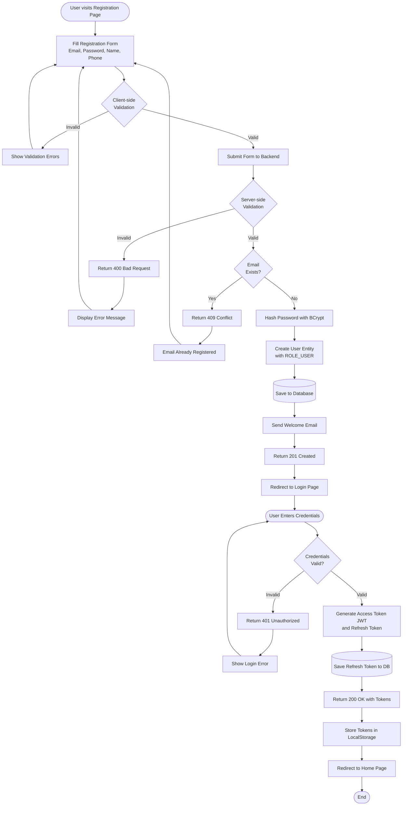
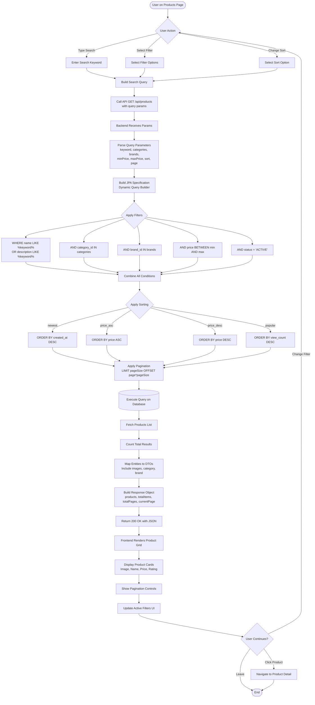
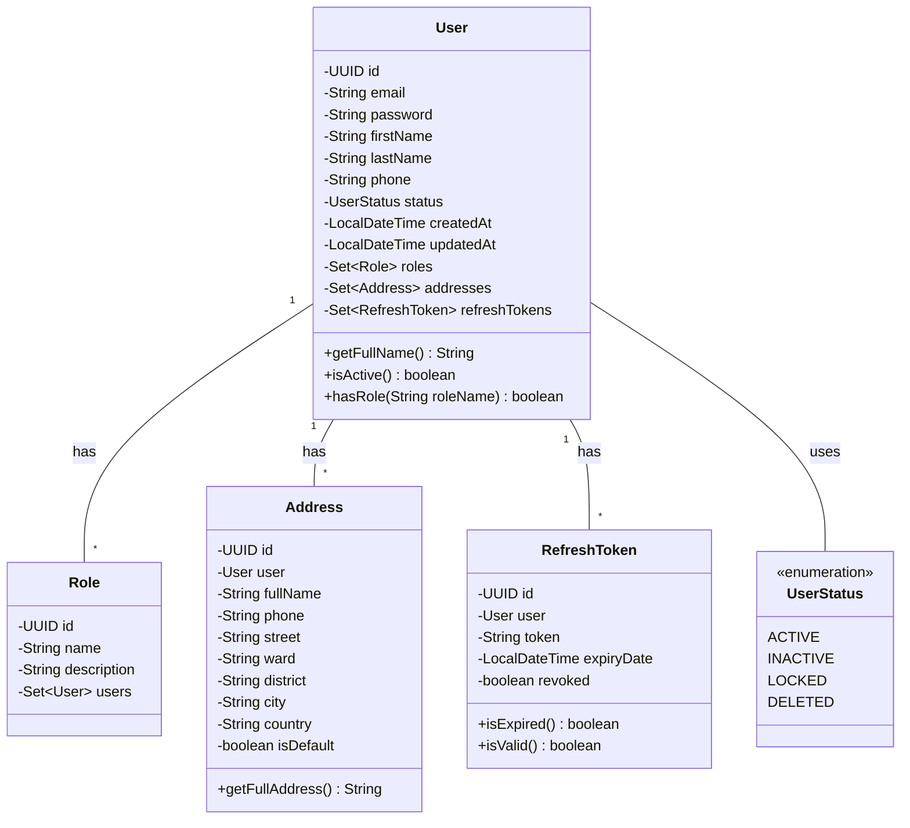
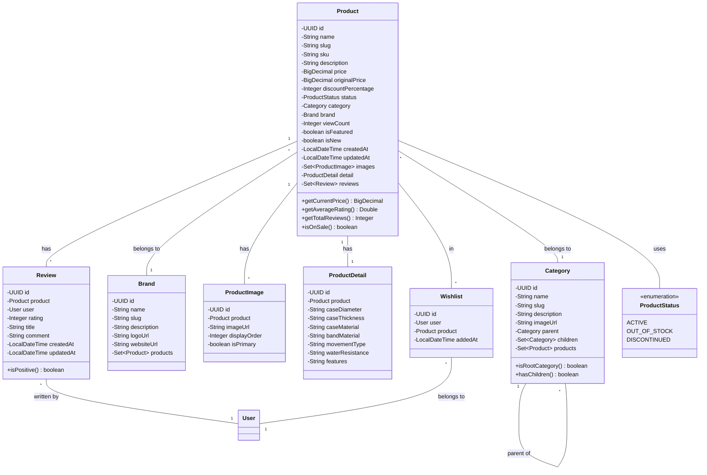
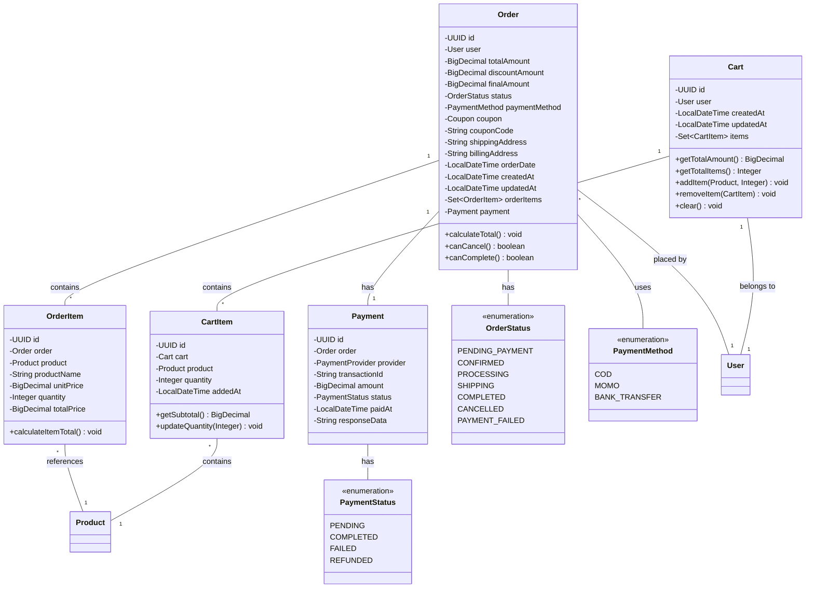
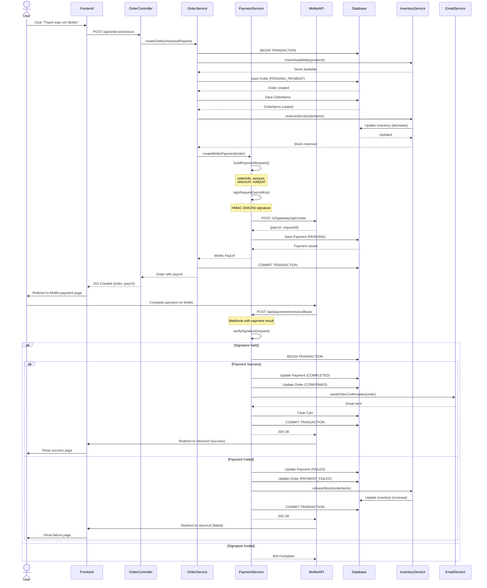

# CHƯƠNG 3: PHÂN TÍCH THIẾT KẾ

## 3.1. Mô tả chi tiết về thiết kế hệ thống

Thiết kế hệ thống Watchify được xây dựng dựa trên kiến trúc Modular Monolithic kết hợp với các nguyên tắc Domain-Driven Design, tạo nên một cấu trúc vừa đủ đơn giản để triển khai và bảo trì, vừa đủ linh hoạt để mở rộng trong tương lai. Kiến trúc này cho phép ứng dụng được phát triển như một deployable unit duy nhất nhưng vẫn duy trì ranh giới rõ ràng giữa các module nghiệp vụ, tạo điều kiện thuận lợi cho việc chuyển đổi sang microservices sau này nếu quy mô hệ thống phát triển đòi hỏi sự tách biệt cao hơn.

Toàn bộ hệ thống được phân tầng thành bốn lớp chính theo chiều dọc. Lớp API đóng vai trò là điểm tiếp xúc với bên ngoài, chứa các REST Controllers nhận request từ client, thực hiện validation đầu vào cơ bản, và trả về response dưới dạng JSON. Lớp Application chứa business logic và orchestration, nơi các service classes điều phối luồng xử lý nghiệp vụ, gọi các repository để tương tác với database, publish domain events, và sử dụng mapper để chuyển đổi giữa entities và DTOs. Lớp Domain là trái tim của hệ thống, chứa các domain entities đại diện cho các khái niệm nghiệp vụ cốt lõi, domain events mô tả các sự kiện quan trọng xảy ra trong hệ thống, và repository interfaces định nghĩa contract cho data access. Lớp Infrastructure cung cấp implementation cụ thể cho các repository interfaces, configuration cho database connection, security, và tích hợp với các external services như payment gateway.

Theo chiều ngang, hệ thống được chia thành sáu module nghiệp vụ chính, mỗi module đảm nhận một bounded context cụ thể. Module Identity quản lý toàn bộ vòng đời của người dùng từ đăng ký, xác thực, phân quyền, cho đến quản lý thông tin cá nhân và địa chỉ. Module Catalog là trung tâm quản lý sản phẩm, bao gồm các entities như Product, Category, Brand, ProductImage, ProductDetail, cùng với các chức năng tìm kiếm, lọc, và phân loại sản phẩm. Module Order đảm nhận việc quản lý vòng đời đơn hàng từ khi khách hàng tạo đơn, admin xử lý, cho đến khi hoàn thành hoặc hủy bỏ. Module Inventory theo dõi số lượng tồn kho của từng sản phẩm, cảnh báo khi hàng sắp hết, và đồng bộ với module Order để đảm bảo không bán hàng vượt quá tồn kho. Module Payment xử lý các giao dịch thanh toán, tích hợp với MoMo gateway, và ghi nhận lịch sử các transaction. Module Promotion quản lý các chương trình khuyến mãi, mã giảm giá, theo dõi số lần sử dụng và áp dụng các điều kiện giảm giá phù hợp.

Giữa các module này có sự tương tác chặt chẽ nhưng được kiểm soát thông qua các interface rõ ràng. Ví dụ, khi một đơn hàng được tạo, Order module sẽ gọi sang Catalog module để lấy thông tin chi tiết sản phẩm và giá hiện tại, gọi sang Inventory module để check và reserve số lượng hàng, gọi sang Promotion module để áp dụng mã giảm giá nếu có, và cuối cùng gọi sang Payment module để xử lý thanh toán. Toàn bộ quá trình này được orchestrate bởi OrderService trong lớp Application, đảm bảo tính nhất quán của dữ liệu thông qua database transactions.

Để đảm bảo khả năng mở rộng và bảo trì, hệ thống áp dụng nhiều design patterns quan trọng. Repository Pattern tách biệt business logic khỏi data access logic, cho phép dễ dàng thay đổi cơ chế lưu trữ mà không ảnh hưởng đến code nghiệp vụ. DTO Pattern được sử dụng để transfer data giữa các layers, tránh việc expose domain entities trực tiếp ra bên ngoài và cho phép kiểm soát chính xác dữ liệu nào được trả về. Service Layer Pattern tập trung business logic vào các service classes, giúp controllers trở nên mỏng và dễ test. Factory Pattern được sử dụng để tạo các objects phức tạp, đặc biệt trong việc construct domain entities từ DTOs. Strategy Pattern áp dụng trong payment processing, cho phép dễ dàng thêm các payment methods mới mà không cần sửa code hiện có.

## 3.2. Biểu đồ Use Case và mô tả luồng nghiệp vụ

### 3.2.1. Biểu đồ Use Case tổng quan

Biểu đồ Use Case của hệ thống Watchify mô tả các tương tác chính giữa ba actors chính là Guest (khách vãng lai), Customer (khách hàng đã đăng ký), và Admin (quản trị viên) với hệ thống. Mỗi actor có một tập hợp use cases riêng biệt tương ứng với vai trò và quyền hạn của họ trong hệ thống.

```mermaid
graph TB
    subgraph "Watchify E-commerce System"
        subgraph "Guest Use Cases"
            UC1[Browse Products]
            UC2[View Product Details]
            UC3[Search Products]
            UC4[View Product Reviews]
            UC5[Register Account]
            UC6[Login]
        end
        
        subgraph "Customer Use Cases"
            UC7[Manage Cart]
            UC8[Add to Wishlist]
            UC9[Checkout Order]
            UC10[Make Payment]
            UC11[View Order History]
            UC12[Write Review]
            UC13[Update Profile]
            UC14[Manage Addresses]
            UC15[Apply Coupon]
        end
        
        subgraph "Admin Use Cases"
            UC16[Manage Products]
            UC17[Manage Orders]
            UC18[Manage Users]
            UC19[Manage Brands]
            UC20[Manage Categories]
            UC21[Manage Reviews]
            UC22[Manage Coupons]
            UC23[View Analytics]
            UC24[Manage Inventory]
        end
    end
    
    GUEST((Guest))
    CUSTOMER((Customer))
    ADMIN((Admin))
    MOMO[MoMo Gateway]
    
    GUEST --> UC1
    GUEST --> UC2
    GUEST --> UC3
    GUEST --> UC4
    GUEST --> UC5
    GUEST --> UC6
    
    CUSTOMER --> UC7
    CUSTOMER --> UC8
    CUSTOMER --> UC9
    CUSTOMER --> UC10
    CUSTOMER --> UC11
    CUSTOMER --> UC12
    CUSTOMER --> UC13
    CUSTOMER --> UC14
    CUSTOMER --> UC15
    
    ADMIN --> UC16
    ADMIN --> UC17
    ADMIN --> UC18
    ADMIN --> UC19
    ADMIN --> UC20
    ADMIN --> UC21
    ADMIN --> UC22
    ADMIN --> UC23
    ADMIN --> UC24
    
    UC10 -.-> MOMO
```



### 3.2.2. Mô tả chi tiết các Use Case chính

**Use Case: Browse Products (Duyệt xem sản phẩm)**

Đây là use case cơ bản nhất mà bất kỳ visitor nào truy cập vào website đều có thể thực hiện. Luồng nghiệp vụ bắt đầu khi người dùng truy cập vào trang danh sách sản phẩm, có thể là trang chủ hiển thị sản phẩm nổi bật, hoặc trang danh mục cụ thể như "Đồng hồ nam" hoặc "Đồng hồ nữ". Hệ thống sẽ query database để lấy danh sách sản phẩm phù hợp với điều kiện lọc, áp dụng pagination để chỉ trả về một số lượng sản phẩm nhất định (thường là 12 hoặc 24 sản phẩm mỗi trang), và sort theo tiêu chí được chọn như mới nhất, giá tăng dần, giá giảm dần, hoặc bán chạy nhất. Mỗi sản phẩm được hiển thị với hình ảnh đại diện, tên sản phẩm, giá hiện tại, giá gốc nếu có khuyến mãi, và rating trung bình từ các đánh giá. Người dùng có thể sử dụng các bộ lọc như khoảng giá, thương hiệu, tính năng để thu hẹp kết quả tìm kiếm.

**Use Case: Checkout Order (Thanh toán đơn hàng)**

Đây là một use case phức tạp với nhiều bước và tương tác với nhiều module khác nhau. Luồng bắt đầu khi khách hàng đã đăng nhập click vào nút "Thanh toán" trong giỏ hàng. Hệ thống đầu tiên sẽ validate giỏ hàng để đảm bảo tất cả sản phẩm vẫn còn hàng và giá không thay đổi đáng kể. Nếu có sản phẩm hết hàng hoặc thay đổi giá, hệ thống sẽ thông báo cho khách hàng và yêu cầu cập nhật giỏ hàng. Tiếp theo, khách hàng chọn hoặc nhập địa chỉ giao hàng từ danh sách địa chỉ đã lưu hoặc thêm địa chỉ mới. Sau đó, khách hàng có thể nhập mã giảm giá nếu có. Hệ thống sẽ validate mã giảm giá thông qua Promotion module, kiểm tra các điều kiện như mã còn hiệu lực, chưa hết số lần sử dụng, đơn hàng đạt giá trị tối thiểu, và khách hàng chưa sử dụng quá giới hạn cho phép. Nếu mã hợp lệ, hệ thống tính toán số tiền được giảm và cập nhật tổng giá trị đơn hàng. Khách hàng sau đó chọn phương thức thanh toán, trong đó có thanh toán khi nhận hàng (COD) hoặc thanh toán qua MoMo. Nếu chọn MoMo, hệ thống sẽ tạo một payment request gửi đến MoMo gateway với thông tin đơn hàng đã được mã hóa và signed bằng secret key. MoMo sẽ trả về một payment URL để redirect khách hàng. Sau khi khách hàng hoàn tất thanh toán trên MoMo, MoMo sẽ gọi callback về hệ thống với kết quả thanh toán. Hệ thống verify signature của callback, cập nhật trạng thái payment và order, giảm số lượng inventory tương ứng, xóa giỏ hàng, và gửi email xác nhận đơn hàng cho khách hàng.

**Use Case: Manage Products (Quản lý sản phẩm)**

Use case này dành riêng cho admin và bao gồm nhiều sub-use cases như thêm sản phẩm mới, cập nhật thông tin sản phẩm, xóa sản phẩm, và quản lý hình ảnh sản phẩm. Khi admin thêm sản phẩm mới, luồng bắt đầu bằng việc điền form với các thông tin bắt buộc như tên sản phẩm, slug (được tự động generate từ tên nhưng có thể chỉnh sửa), SKU (mã sản phẩm duy nhất), mô tả chi tiết, giá bán, giá gốc, phần trăm giảm giá, chọn danh mục và thương hiệu từ dropdown, và upload ít nhất một hình ảnh sản phẩm. Ngoài ra, admin cũng cần điền các thông tin chi tiết kỹ thuật trong phần ProductDetail như đường kính mặt, độ dày, chất liệu vỏ, chất liệu dây, loại máy, độ chống nước, và các tính năng đặc biệt. Hệ thống sẽ validate tất cả các trường dữ liệu, đảm bảo slug và SKU chưa tồn tại trong database, và kiểm tra format của các giá trị số. Khi validation pass, hệ thống tạo các entities tương ứng trong database bao gồm Product, ProductDetail, ProductImage, và Inventory với số lượng ban đầu. Đối với việc cập nhật sản phẩm, admin có thể chỉnh sửa bất kỳ thông tin nào ngoại trừ ID và slug để tránh ảnh hưởng đến SEO. Việc xóa sản phẩm thực chất là soft delete, nghĩa là chỉ cập nhật trạng thái sản phẩm thành DISCONTINUED thay vì xóa khỏi database, đảm bảo tính toàn vẹn của dữ liệu lịch sử đơn hàng.

## 3.3. Biểu đồ Activity và luồng xử lý nghiệp vụ

### 3.3.1. Activity Diagram: User Registration and Authentication Flow

Biểu đồ này mô tả chi tiết quy trình đăng ký và xác thực người dùng, một trong những luồng quan trọng nhất của hệ thống vì nó quyết định tính bảo mật và trải nghiệm người dùng ban đầu.



Quy trình đăng ký bắt đầu khi người dùng truy cập trang đăng ký và điền thông tin cá nhân bao gồm email, mật khẩu, họ tên, và số điện thoại. Frontend thực hiện validation đầu tiên ngay trên client side để đảm bảo các trường không để trống, email có format hợp lệ, mật khẩu đủ mạnh với ít nhất 8 ký tự bao gồm chữ hoa, chữ thường, số và ký tự đặc biệt, và số điện thoại có format đúng. Nếu validation fail, các error messages được hiển thị ngay bên dưới các trường tương ứng mà không cần gọi server, giúp tiết kiệm bandwidth và cải thiện trải nghiệm người dùng.

Khi client-side validation pass, form được submit đến backend endpoint POST /api/auth/register. Server thực hiện validation lần thứ hai sử dụng Jakarta Validation annotations để đảm bảo dữ liệu vẫn hợp lệ, vì không thể tin tưởng hoàn toàn vào client-side validation do có thể bị bypass. Sau đó, hệ thống kiểm tra xem email đã tồn tại trong database chưa bằng cách query bảng users. Nếu email đã được đăng ký, hệ thống trả về HTTP 409 Conflict với message rõ ràng để người dùng biết và có thể thử email khác hoặc reset mật khẩu nếu quên. Nếu email chưa tồn tại, hệ thống tiến hành hash mật khẩu sử dụng BCrypt với cost factor là 12, tạo user entity mới với role mặc định là ROLE_USER, và lưu vào database. Đồng thời, một welcome email được gửi đến địa chỉ email của người dùng để xác nhận đăng ký thành công.

Sau khi đăng ký thành công, người dùng được redirect đến trang đăng nhập để tiến hành authentication. Người dùng nhập email và mật khẩu, hệ thống sẽ tìm user trong database theo email, sau đó sử dụng BCrypt để compare mật khẩu đã nhập với hash password được lưu. Nếu credentials không hợp lệ, hệ thống trả về HTTP 401 Unauthorized với message generic như "Email hoặc mật khẩu không đúng" để tránh việc tiết lộ thông tin về việc email có tồn tại hay không. Nếu credentials hợp lệ, hệ thống generate một cặp tokens gồm access token (JWT với expiration time ngắn khoảng 1 giờ) chứa thông tin user ID và roles, và refresh token (một chuỗi UUID random được lưu trong database) với expiration time dài hơn khoảng 7 ngày. Cả hai tokens được trả về cho client, client lưu vào localStorage và sử dụng access token trong header Authorization của các request tiếp theo. Khi access token hết hạn, client sẽ sử dụng refresh token để lấy access token mới mà không cần đăng nhập lại.

### 3.3.2. Activity Diagram: Product Search and Filter Flow

Luồng tìm kiếm và lọc sản phẩm là một trong những tính năng được sử dụng nhiều nhất trong hệ thống thương mại điện tử, ảnh hưởng trực tiếp đến khả năng người dùng tìm thấy sản phẩm mong muốn.



Luồng tìm kiếm và lọc được thiết kế để cung cấp trải nghiệm tương tác mượt mà và kết quả chính xác. Khi người dùng truy cập trang sản phẩm, họ có thể thực hiện ba loại hành động chính: nhập từ khóa tìm kiếm vào search box, chọn các bộ lọc như danh mục, thương hiệu, khoảng giá, hoặc thay đổi cách sắp xếp kết quả. Mỗi khi có thay đổi, frontend sẽ build query string với các parameters tương ứng và gọi API GET /api/products.

Backend nhận request và parse các query parameters bao gồm keyword cho tìm kiếm text, categories là mảng các category IDs, brands là mảng các brand IDs, minPrice và maxPrice cho khoảng giá, sort cho cách sắp xếp, và page cho phân trang. Hệ thống sử dụng JPA Specification API để build dynamic query một cách linh hoạt. Specification là một design pattern cho phép combine nhiều conditions một cách declarative và type-safe. Đối với mỗi filter được cung cấp, một Specification tương ứng được tạo ra. Ví dụ, nếu có keyword, hệ thống tạo Specification để search trong cả name và description columns sử dụng LIKE operator. Các Specifications này được combine lại bằng AND operator để tạo thành query cuối cùng.

Sau khi có complete query, hệ thống apply sorting dựa trên sort parameter. Các tùy chọn sort phổ biến bao gồm newest (sắp xếp theo ngày tạo giảm dần để hiển thị sản phẩm mới nhất trước), price_asc và price_desc cho việc sort theo giá, và popular (sort theo lượt xem để hiển thị sản phẩm được quan tâm nhiều). Pagination được apply để chỉ lấy một subset của kết quả dựa trên page number và page size, thường là 12 hoặc 24 sản phẩm mỗi trang. Query được execute trên database với các optimizations như eager fetching các relationships cần thiết để tránh N+1 query problem.

Kết quả trả về bao gồm danh sách products cùng với metadata như totalItems (tổng số sản phẩm match với filter), totalPages (tổng số trang), và currentPage. Các Product entities được map sang ProductDTOs để chỉ expose những thông tin cần thiết cho frontend và include các nested objects như images, category name, brand name. Frontend nhận response và render UI với product grid hiển thị các sản phẩm dưới dạng cards, pagination controls ở phía dưới, và update active filters để người dùng biết đang filter theo tiêu chí nào. Người dùng có thể tiếp tục thay đổi filters, click vào sản phẩm để xem chi tiết, hoặc rời khỏi trang.

### 3.3.3. Activity Diagram: Complete Order Processing Flow

Đây là luồng nghiệp vụ phức tạp nhất của hệ thống, liên quan đến nhiều modules và external services.

```mermaid
flowchart TD
    Start([User Clicks Checkout]) --> CheckAuth{User<br/>Authenticated?}
    CheckAuth -->|No| RedirectLogin[Redirect to Login]
    RedirectLogin --> End1([End])
    
    CheckAuth -->|Yes| ValidateCart[Validate Cart Items<br/>Check stock, Check prices]
    ValidateCart --> CartValid{All Items<br/>Valid?}
    
    CartValid -->|No| ShowCartErrors[Show Out of Stock<br/>or Price Changed Items]
    ShowCartErrors --> End2([End])
    
    CartValid -->|Yes| ShowCheckout[Display Checkout Page]
    ShowCheckout --> SelectAddress[User Selects/Adds<br/>Shipping Address]
    SelectAddress --> EnterCoupon{Has<br/>Coupon?}
    
    EnterCoupon -->|Yes| InputCoupon[Enter Coupon Code]
    InputCoupon --> ValidateCoupon[Call API to Validate Coupon]
    ValidateCoupon --> CouponValid{Coupon<br/>Valid?}
    
    CouponValid -->|No| ShowCouponError[Show Coupon Error]
    ShowCouponError --> EnterCoupon
    
    CouponValid -->|Yes| ApplyDiscount[Calculate Discount Amount<br/>Update Total]
    ApplyDiscount --> SelectPayment[Select Payment Method]
    EnterCoupon -->|No| SelectPayment
    
    SelectPayment --> PaymentChoice{Payment<br/>Method}
    
    PaymentChoice -->|COD| CreateOrderCOD[Create Order with<br/>PENDING_PAYMENT status]
    CreateOrderCOD --> SaveOrder1[(Save Order to DB)]
    SaveOrder1 --> CreateOrderItems1[Create Order Items]
    CreateOrderItems1 --> ReserveInventory1[Reserve Inventory<br/>Decrease stock quantity]
    ReserveInventory1 --> RecordCouponUsage1[Record Coupon Usage]
    RecordCouponUsage1 --> ClearCart1[Clear User Cart]
    ClearCart1 --> SendEmail1[Send Order Confirmation Email]
    SendEmail1 --> ShowSuccess1[Show Success Page<br/>with Order Details]
    ShowSuccess1 --> End3([End])
    
    PaymentChoice -->|MoMo| CreateOrderMoMo[Create Order with<br/>PENDING_PAYMENT status]
    CreateOrderMoMo --> SaveOrder2[(Save Order to DB)]
    SaveOrder2 --> CreateOrderItems2[Create Order Items]
    CreateOrderItems2 --> ReserveInventory2[Reserve Inventory]
    ReserveInventory2 --> BuildMoMoRequest[Build MoMo Payment Request<br/>orderInfo, amount, returnUrl, notifyUrl]
    
    BuildMoMoRequest --> SignRequest[Sign Request with<br/>HMAC-SHA256 secret key]
    SignRequest --> CallMoMoAPI[Call MoMo API<br/>POST /v2/gateway/api/create]
    
    CallMoMoAPI --> MoMoResponse{MoMo<br/>Response}
    MoMoResponse -->|Error| HandleMoMoError[Handle Error<br/>Rollback inventory]
    HandleMoMoError --> ShowPaymentError[Show Payment Error]
    ShowPaymentError --> End4([End])
    
    MoMoResponse -->|Success| GetPayUrl[Extract Payment URL<br/>from response]
    GetPayUrl --> RedirectMoMo[Redirect User to MoMo]
    RedirectMoMo --> UserPayMoMo[User Completes Payment<br/>on MoMo App/Web]
    
    UserPayMoMo --> MoMoCallback[MoMo Calls Webhook<br/>POST /api/payments/momo/callback]
    MoMoCallback --> VerifySignature[Verify Request Signature]
    VerifySignature --> SignatureValid{Signature<br/>Valid?}
    
    SignatureValid -->|No| Return403[Return 403 Forbidden]
    Return403 --> End5([End])
    
    SignatureValid -->|Yes| CheckResult{Payment<br/>Success?}
    CheckResult -->|No| UpdateOrderFailed[Update Order Status<br/>to PAYMENT_FAILED]
    UpdateOrderFailed --> ReleaseInventory[Release Reserved Inventory]
    ReleaseInventory --> Return200Fail[Return 200 OK to MoMo]
    Return200Fail --> End6([End])
    
    CheckResult -->|Yes| UpdateOrderSuccess[Update Order Status<br/>to CONFIRMED]
    UpdateOrderSuccess --> CreatePayment[Create Payment Record<br/>with transaction details]
    CreatePayment --> SavePayment[(Save Payment to DB)]
    SavePayment --> RecordCouponUsage2[Record Coupon Usage]
    RecordCouponUsage2 --> ClearCart2[Clear User Cart]
    ClearCart2 --> SendEmail2[Send Order Confirmation Email]
    SendEmail2 --> Return200Success[Return 200 OK to MoMo]
    Return200Success --> RedirectSuccess[MoMo Redirects User<br/>to Success Page]
    RedirectSuccess --> ShowSuccess2[Show Success Page<br/>with Order Details]
    ShowSuccess2 --> End7([End])
```



Quy trình xử lý đơn hàng hoàn chỉnh là một orchestration phức tạp của nhiều bước kiểm tra và xử lý. Luồng bắt đầu khi người dùng click nút "Thanh toán" trong giỏ hàng. Hệ thống đầu tiên kiểm tra authentication status, nếu người dùng chưa đăng nhập sẽ redirect đến trang login với return URL là checkout page để sau khi login sẽ quay lại. Sau khi xác thực người dùng đã đăng nhập, hệ thống validate giỏ hàng bằng cách kiểm tra từng item xem còn đủ hàng trong kho không và giá có thay đổi so với khi thêm vào giỏ không. Việc validation này rất quan trọng vì có thể có khoảng thời gian giữa lúc thêm vào giỏ và lúc thanh toán, trong đó sản phẩm có thể đã hết hàng hoặc thay đổi giá.

Nếu tất cả items trong giỏ đều valid, checkout page được hiển thị với tổng quan đơn hàng, danh sách sản phẩm, và form để nhập thông tin. Người dùng chọn địa chỉ giao hàng từ danh sách địa chỉ đã lưu hoặc nhập địa chỉ mới. Nếu có mã giảm giá, người dùng nhập vào coupon field và hệ thống gọi API để validate. Validation bao gồm kiểm tra mã có tồn tại không, còn trong thời gian hiệu lực không, chưa hết lượt sử dụng, đơn hàng đạt giá trị tối thiểu, và người dùng chưa dùng quá số lần cho phép. Nếu valid, discount amount được tính và total amount được cập nhật hiển thị cho người dùng thấy số tiền được giảm.

Tiếp theo, người dùng chọn phương thức thanh toán. Nếu chọn COD (Cash on Delivery), luồng đơn giản hơn: hệ thống tạo Order entity với status là PENDING_PAYMENT, tạo các OrderItem entities tương ứng với mỗi sản phẩm trong giỏ, giảm số lượng inventory, ghi nhận coupon usage nếu có, xóa cart, gửi email xác nhận, và hiển thị trang success. Nếu chọn thanh toán qua MoMo, luồng phức tạp hơn nhiều do cần tương tác với external payment gateway.

Khi chọn MoMo, hệ thống vẫn tạo Order với status PENDING_PAYMENT và reserve inventory trước, sau đó build MoMo payment request với các thông tin như orderInfo (mô tả đơn hàng), amount (số tiền cần thanh toán), returnUrl (URL để MoMo redirect user sau khi thanh toán), và notifyUrl (webhook URL để MoMo gọi về khi có kết quả). Request được sign bằng HMAC-SHA256 với secret key để MoMo có thể verify tính toàn vẹn. Hệ thống gọi MoMo API, nếu thành công sẽ nhận được payUrl để redirect người dùng. Người dùng thực hiện thanh toán trên app hoặc web MoMo, sau khi hoàn tất MoMo sẽ gọi webhook của hệ thống với kết quả.

Khi nhận webhook, hệ thống đầu tiên verify signature để đảm bảo request thực sự đến từ MoMo và không bị tamper. Nếu signature không hợp lệ, hệ thống reject request. Nếu hợp lệ, hệ thống kiểm tra kết quả thanh toán. Nếu thất bại, order status được update thành PAYMENT_FAILED và inventory được release. Nếu thành công, order status được update thành CONFIRMED, Payment record được tạo với transaction details từ MoMo, coupon usage được ghi nhận, cart được xóa, và email xác nhận được gửi. Trong mọi trường hợp, hệ thống phải trả về HTTP 200 OK cho MoMo để MoMo biết webhook đã được xử lý, nếu không MoMo sẽ retry nhiều lần. Cuối cùng, MoMo redirect người dùng về returnUrl với kết quả, và frontend hiển thị trang success hoặc failure tương ứng.

## 3.4. Biểu đồ Class và quan hệ giữa các entities

### 3.4.1. Class Diagram: Identity Module

Module Identity chứa các entities liên quan đến quản lý người dùng, authentication, và authorization.



Trong module Identity, entity User đóng vai trò trung tâm đại diện cho người dùng trong hệ thống. Mỗi User có một UUID làm primary key đảm bảo tính duy nhất và khó đoán hơn so với integer auto-increment. Email được sử dụng làm username cho authentication và phải unique trong toàn bộ hệ thống. Password được lưu dưới dạng hash sử dụng BCrypt, không bao giờ lưu plain text. Thông tin cá nhân bao gồm firstName, lastName, và phone number. Status của user được quản lý thông qua enum UserStatus với các giá trị ACTIVE cho user bình thường, INACTIVE cho user tạm ngừng hoạt động, LOCKED cho user bị khóa do vi phạm, và DELETED cho soft delete.

User có quan hệ many-to-many với Role thông qua bảng trung gian user_roles. Việc sử dụng role-based access control cho phép linh hoạt trong việc gán quyền, có thể dễ dàng thêm roles mới hoặc thay đổi permissions của một role mà không cần sửa code. Mỗi User có thể có nhiều Addresses, cho phép họ lưu nhiều địa chỉ giao hàng khác nhau như nhà riêng, văn phòng, nhà bố mẹ. Trong số các addresses này, có một address được đánh dấu là default để tự động điền vào form checkout. RefreshToken entities được lưu để theo dõi các refresh tokens đã issue cho user, cho phép revoke tokens khi cần thiết như khi user logout hoặc khi phát hiện security breach.

### 3.4.2. Class Diagram: Catalog Module

Module Catalog là phần phức tạp nhất về số lượng entities và relationships do đây là core business domain.



Product entity là trung tâm của module Catalog, chứa tất cả thông tin cơ bản về một sản phẩm đồng hồ. Trường slug được generate từ name và sử dụng trong URL để SEO-friendly, ví dụ "rolex-submariner-date-41mm". SKU (Stock Keeping Unit) là mã định danh duy nhất cho mỗi sản phẩm, thường do business team định nghĩa. Giá sản phẩm được lưu dưới dạng BigDecimal để đảm bảo precision khi tính toán tiền tệ, tránh rounding errors của float/double. Ngoài price hiện tại, còn có originalPrice cho trường hợp sản phẩm đang sale, và discountPercentage tự động tính từ hai giá này để hiển thị trên UI.

Product có quan hệ many-to-one với Category và Brand. Category được thiết kế theo cấu trúc tree với self-referencing relationship, cho phép tạo hierarchy như "Đồng hồ" -> "Đồng hồ nam" -> "Đồng hồ thể thao". Mỗi category có thể có một parent category và nhiều children categories. Brand đại diện cho nhà sản xuất hoặc thương hiệu như Rolex, Omega, Casio, mỗi brand có thể có nhiều products.

ProductImage entities lưu URLs của các hình ảnh sản phẩm với displayOrder để control thứ tự hiển thị và isPrimary flag để đánh dấu ảnh đại diện. ProductDetail là một one-to-one relationship chứa các thông tin kỹ thuật chi tiết đặc thù của đồng hồ như đường kính vỏ, độ dày, chất liệu, loại máy, độ chống nước. Việc tách ra entity riêng thay vì embed trong Product giúp Product entity không quá lớn và cho phép lazy loading detail chỉ khi cần thiết.

Review entities cho phép users đánh giá sản phẩm với rating từ 1 đến 5 sao và comment. Mỗi review belongs to một product và một user, đảm bảo traceability về việc ai đã viết review nào. Wishlist là bảng association giữa User và Product, cho phép users lưu các sản phẩm yêu thích để xem lại sau. Việc sử dụng separate entity thay vì collection trong User cho phép thêm metadata như addedAt timestamp.

### 3.4.3. Class Diagram: Order and Payment Modules



Order entity đại diện cho một đơn hàng với đầy đủ thông tin về người mua, sản phẩm, giá cả, và trạng thái xử lý. Mỗi Order belongs to một User và chứa nhiều OrderItems. Việc tính toán giá được chia thành ba phần: totalAmount là tổng giá các sản phẩm trước khi giảm, discountAmount là số tiền được giảm từ coupon, và finalAmount là số tiền cuối cùng khách hàng phải trả. Shipping address và billing address được lưu dưới dạng text snapshot tại thời điểm đặt hàng, thay vì reference đến Address entity, đảm bảo thông tin đơn hàng không thay đổi khi user cập nhật addresses sau này.

OrderStatus enum theo dõi vòng đời của đơn hàng qua các trạng thái: PENDING_PAYMENT khi mới tạo chưa thanh toán, CONFIRMED sau khi thanh toán thành công hoặc với COD, PROCESSING khi admin đang chuẩn bị hàng, SHIPPING khi đã giao cho đơn vị vận chuyển, COMPLETED khi khách đã nhận hàng, CANCELLED khi đơn bị hủy, và PAYMENT_FAILED khi thanh toán online thất bại.

OrderItem lưu snapshot của product information tại thời điểm đặt hàng bao gồm productName và unitPrice, thay vì chỉ reference đến Product entity. Điều này quan trọng vì giá và tên sản phẩm có thể thay đổi sau này, nhưng thông tin trong đơn hàng lịch sử phải reflect giá tại thời điểm mua. Product reference vẫn được giữ để có thể navigate đến product page hiện tại nếu cần.

Payment entity ghi nhận chi tiết giao dịch thanh toán với provider (COD, MoMo, Bank Transfer), transactionId từ payment gateway, amount thanh toán, status, timestamp, và responseData là JSON string chứa toàn bộ response từ payment provider để có thể trace và debug nếu có vấn đề.

Cart và CartItem entities quản lý giỏ hàng tạm thời của user trước khi checkout. Mỗi User có một Cart, và Cart chứa nhiều CartItems. Khi user thêm sản phẩm vào giỏ, nếu sản phẩm đã tồn tại thì chỉ update quantity, nếu chưa thì tạo CartItem mới. Cart được clear sau khi order được tạo thành công.

## 3.5. Biểu đồ Sequence và tương tác giữa các components

### 3.5.1. Sequence Diagram: MoMo Payment Processing

Biểu đồ này mô tả chi tiết interaction giữa các components trong quá trình xử lý thanh toán qua MoMo.



Sequence diagram này cho thấy rõ luồng tương tác phức tạp giữa các components trong quá trình thanh toán MoMo. Quá trình bắt đầu khi user click nút thanh toán, Frontend gửi POST request đến OrderController với thông tin checkout. Controller delegate việc xử lý cho OrderService, đây là nơi orchestrate toàn bộ business logic.

OrderService bắt đầu một database transaction để đảm bảo tính nhất quán của dữ liệu. Đầu tiên, service gọi InventoryService để check xem tất cả products trong order có đủ hàng không. Nếu không đủ, transaction sẽ rollback và trả về lỗi. Nếu đủ hàng, Order entity được tạo với status PENDING_PAYMENT và lưu vào database. Các OrderItem entities tương ứng cũng được tạo. Sau đó, InventoryService được gọi để reserve stock, nghĩa là giảm số lượng available inventory để tránh overselling trong trường hợp có nhiều orders đồng thời.

Tiếp theo, OrderService gọi PaymentService để xử lý việc tạo MoMo payment. PaymentService build payment request với các thông tin cần thiết như orderInfo (mô tả đơn hàng), amount (số tiền), returnUrl (URL để MoMo redirect user sau khi thanh toán), và notifyUrl (webhook URL). Request được sign bằng HMAC-SHA256 với secret key mà MoMo đã cung cấp khi đăng ký merchant account. Signature này đảm bảo request không bị modify trong quá trình truyền tải và chỉ có server với secret key đúng mới tạo được request hợp lệ.

PaymentService gọi MoMo API để tạo payment session, nhận về payUrl và requestId. Payment entity được tạo với status PENDING và lưu vào database cùng với requestId để có thể match với callback sau này. Transaction được commit, và payUrl được trả về cho Frontend. Frontend redirect user đến payUrl này, user thực hiện thanh toán trên trang MoMo hoặc app MoMo.

Sau khi user hoàn tất thanh toán, MoMo gọi webhook của hệ thống tại notifyUrl đã cung cấp. PaymentService nhận callback và đầu tiên verify signature để đảm bảo request thực sự từ MoMo. Nếu signature không hợp lệ, hệ thống reject với HTTP 403. Nếu hợp lệ, hệ thống kiểm tra kết quả thanh toán trong callback payload.

Nếu thanh toán thành công, một transaction mới được bắt đầu để update Payment status thành COMPLETED, Order status thành CONFIRMED, gửi email xác nhận đơn hàng, và xóa cart của user. Transaction được commit và hệ thống trả về HTTP 200 OK cho MoMo. MoMo sau đó redirect user về returnUrl với kết quả success. Nếu thanh toán thất bại, Payment và Order status được update tương ứng, và quan trọng là inventory phải được release (tăng lại số lượng) vì order không thành công. Trong mọi trường hợp, hệ thống phải trả về HTTP 200 cho MoMo để MoMo biết webhook đã được nhận và xử lý, tránh việc MoMo retry gửi nhiều lần gây duplicate processing.

### 3.5.2. Sequence Diagram: Product Review Submission

```mermaid
sequenceDiagram
    actor User
    participant Frontend
    participant ReviewController
    participant ReviewService
    participant OrderService
    participant ProductService
    participant Database
    
    User->>Frontend: Navigate to Product Page
    Frontend->>ProductService: GET /api/products/{id}
    ProductService->>Database: Find product by ID
    Database-->>ProductService: Product with reviews
    ProductService-->>Frontend: Product details
    Frontend->>User: Display product and reviews
    
    User->>Frontend: Click "Write Review"
    
    Frontend->>ReviewController: GET /api/reviews/can-review/{productId}
    ReviewController->>ReviewService: canUserReviewProduct(userId, productId)
    
    ReviewService->>OrderService: getUserCompletedOrders(userId)
    OrderService->>Database: Find completed orders for user
    
