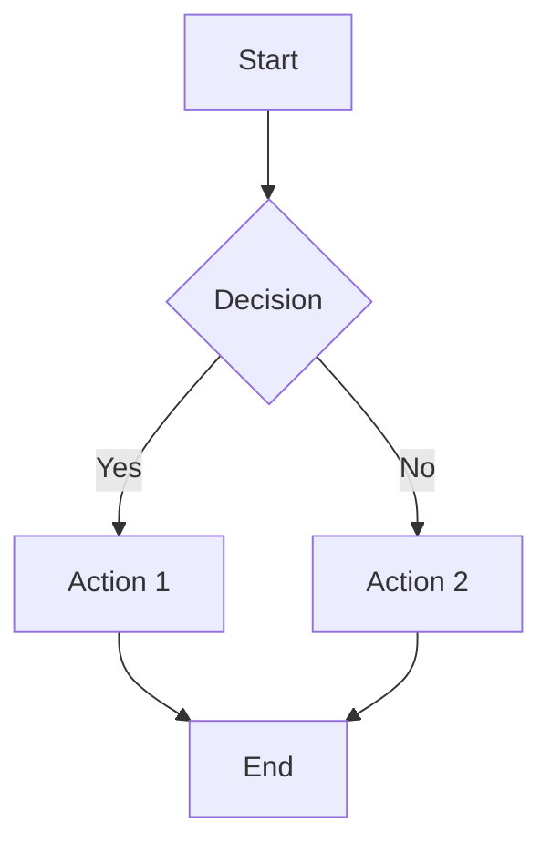

# Watchify Backend - Tài Liệu Kỹ Thuật

## 📋 Giới Thiệu

Chào mừng đến với tài liệu kỹ thuật của **Watchify Backend** - hệ thống E-commerce chuyên về bán đồng hồ cao cấp, được xây dựng với kiến trúc **Modular Monolithic** và áp dụng các nguyên tắc **Domain-Driven Design (DDD)**.

Dự án này được phát triển bởi **Nhóm 03 - DHKTPM18ATT** sử dụng Spring Boot 3.x, Spring Security, JWT Authentication và MariaDB/PostgreSQL.

---

## 🎯 Mục Tiêu Tài Liệu

Bộ tài liệu này cung cấp:

✅ **Kiến trúc hệ thống**: Mô tả chi tiết cách tổ chức module, phân tầng, và các design patterns được sử dụng

✅ **Sơ đồ trực quan**: Class diagrams, sequence diagrams, component diagrams, ERD diagrams bằng Mermaid

✅ **Chi tiết kỹ thuật**: Phân tích từng module, domain entities, services, repositories, controllers

✅ **Database schema**: Cấu trúc bảng, quan hệ, migration history

✅ **API Reference**: Danh sách đầy đủ các endpoints với request/response examples

✅ **Best Practices**: Các patterns, principles, và coding standards được áp dụng

---

## 📁 Cấu Trúc Tài Liệu

Tài liệu được tổ chức thành các file Markdown sau:

### 1. **[Overview](docs/overview.md)** - Tổng Quan Hệ Thống
- Mục tiêu và phạm vi dự án
- Luồng hoạt động tổng quát
- Các domain/module chính
- Stack công nghệ và thư viện

### 2. **[Architecture](docs/architecture.md)** - Kiến Trúc
- Kiến trúc Modular Monolithic
- Phân tầng (API, Application, Domain, Infrastructure)
- Sơ đồ kiến trúc tổng quan
- Module organization và dependencies

### 3. **[Components](docs/components.md)** - Các Thành Phần
- Danh sách tất cả modules và components
- Vai trò của từng component
- Component diagram
- Module communication

### 4. **[Class Diagram](docs/class-diagram.md)** - Sơ Đồ Class
- Domain entities và quan hệ
- Class diagrams theo module
- Design patterns trong code
- Responsibility analysis

### 5. **[Sequence Diagrams](docs/sequence-diagrams.md)** - Sơ Đồ Tuần Tự
- User authentication flow
- Product browsing và search
- Checkout process
- Payment processing
- Order fulfillment

### 6. **[Database](docs/database.md)** - Cơ Sở Dữ Liệu
- ERD diagram
- Chi tiết các bảng
- Relationships và constraints
- Migration history
- Entity-Table mapping

### 7. **[API](docs/api.md)** - API Documentation
- Danh sách endpoints đầy đủ
- Request/Response schemas
- Authentication requirements
- Sample payloads và curl examples

---

## 🚀 Cách Sử Dụng Tài Liệu

### Đọc Tuần Tự (Recommended)

Nếu bạn mới tham gia dự án, hãy đọc theo thứ tự:

1. **Overview** → Hiểu tổng quan về hệ thống
2. **Architecture** → Nắm kiến trúc và tổ chức code
3. **Components** → Tìm hiểu các module và components
4. **Class Diagram** → Hiểu domain model và entities
5. **Database** → Nắm cấu trúc database
6. **Sequence Diagrams** → Hiểu luồng xử lý nghiệp vụ
7. **API** → Tham khảo khi integrate hoặc test

### Tra Cứu Nhanh

Nếu bạn đã quen thuộc với dự án:

- Cần tìm API endpoint → Xem **[API](docs/api.md)**
- Cần hiểu về entity/table → Xem **[Database](docs/database.md)** hoặc **[Class Diagram](docs/class-diagram.md)**
- Cần hiểu flow xử lý → Xem **[Sequence Diagrams](docs/sequence-diagrams.md)**
- Cần tìm component/service → Xem **[Components](docs/components.md)**

---

## 🎨 Xem và Chỉnh Sửa Sơ Đồ

### Mermaid Diagrams

Tất cả sơ đồ trong tài liệu đều sử dụng **Mermaid** - một công cụ tạo diagram từ text-based syntax.

#### Xem trên GitHub
GitHub tự động render Mermaid diagrams trong Markdown files.

#### Xem trong VS Code
1. Cài extension: **Markdown Preview Mermaid Support**
2. Mở file `.md` và nhấn `Ctrl+Shift+V` để preview

#### Xem trực tuyến
1. Copy code block Mermaid
2. Paste vào [Mermaid Live Editor](https://mermaid.live/)
3. Chỉnh sửa và export nếu cần

#### Ví dụ cú pháp Mermaid:



### Chỉnh Sửa Tài Liệu

Tài liệu được viết bằng **Markdown**, có thể chỉnh sửa với bất kỳ text editor nào:

- **VS Code** (recommended): Hỗ trợ preview, syntax highlighting
- **Typora**: WYSIWYG Markdown editor
- **Obsidian**: Knowledge base tool

**Lưu ý**: Khi cập nhật code, nhớ cập nhật tài liệu tương ứng để đồng bộ.

---

## 🏗️ Cấu Trúc Project

```
backend/
├── src/
│   ├── main/
│   │   ├── java/fit/iuh/backend/
│   │   │   ├── BackendApplication.java      # Main application
│   │   │   ├── config/                       # Configurations
│   │   │   ├── sharedkernel/                 # Shared components
│   │   │   └── modules/                      # Business modules
│   │   │       ├── identity/                 # User & Auth
│   │   │       ├── catalog/                  # Products & Categories
│   │   │       ├── order/                    # Order management
│   │   │       ├── inventory/                # Stock management
│   │   │       ├── payment/                  # Payment processing
│   │   │       └── promotion/                # Coupons & Discounts
│   │   └── resources/
│   │       ├── application.properties        # Config
│   │       ├── openapi.yaml                  # API spec
│   │       └── db/migration/                 # Flyway migrations
│   └── test/                                 # Unit & Integration tests
├── docs/                                     # 📚 TECHNICAL DOCUMENTATION
│   ├── overview.md
│   ├── architecture.md
│   ├── components.md
│   ├── class-diagram.md
│   ├── sequence-diagrams.md
│   ├── database.md
│   └── api.md
├── build.gradle                              # Build configuration
├── Dockerfile                                # Docker image
└── README.md                                 # This file
```

---

## 🛠️ Tech Stack

| Category | Technology |
|----------|-----------|
| **Language** | Java 21 |
| **Framework** | Spring Boot 3.4.10 |
| **Security** | Spring Security 6.x + JWT |
| **Database** | MariaDB / PostgreSQL |
| **ORM** | Spring Data JPA + Hibernate |
| **Migration** | Flyway |
| **API Docs** | SpringDoc OpenAPI 3.0 |
| **Build Tool** | Gradle 8.x |
| **Code Generation** | Lombok |
| **Validation** | Jakarta Validation |
| **Payment Gateway** | MoMo API |

---

## 📞 Liên Hệ

- **Team**: Nhóm 03 - DHKTPM18ATT
- **Project**: Watchify E-commerce System
- **Email**: admin@watchify.com

---

## 📝 License

Copyright © 2024 Watchify Team. All rights reserved.

