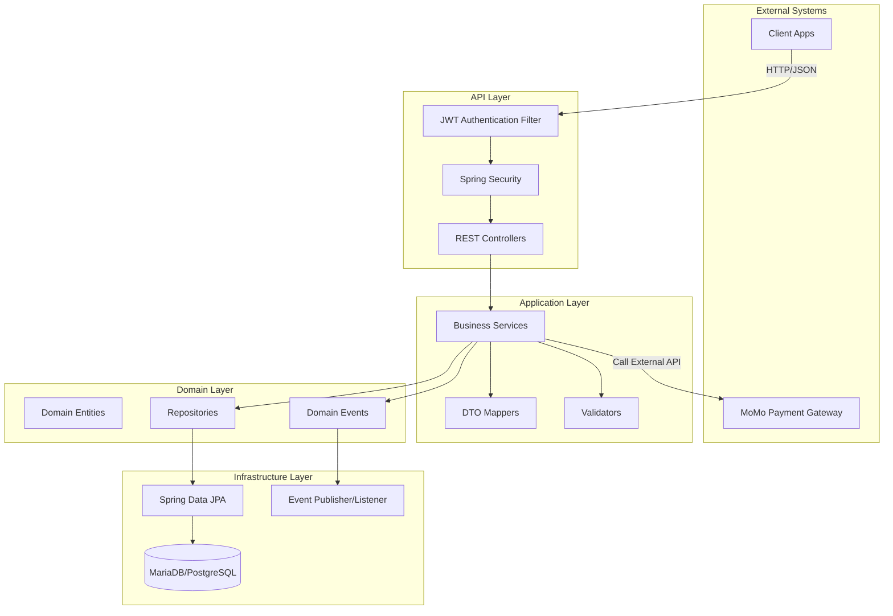
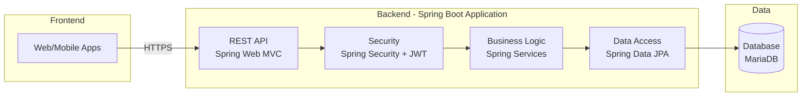
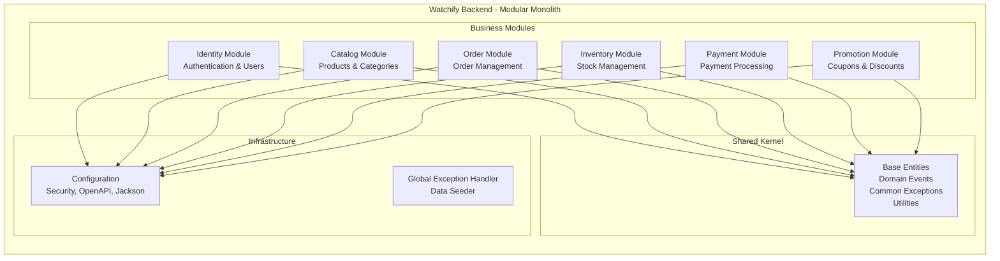
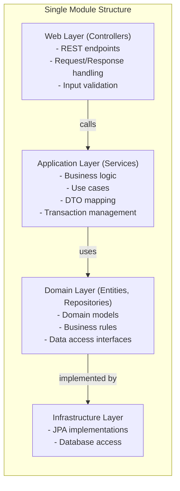
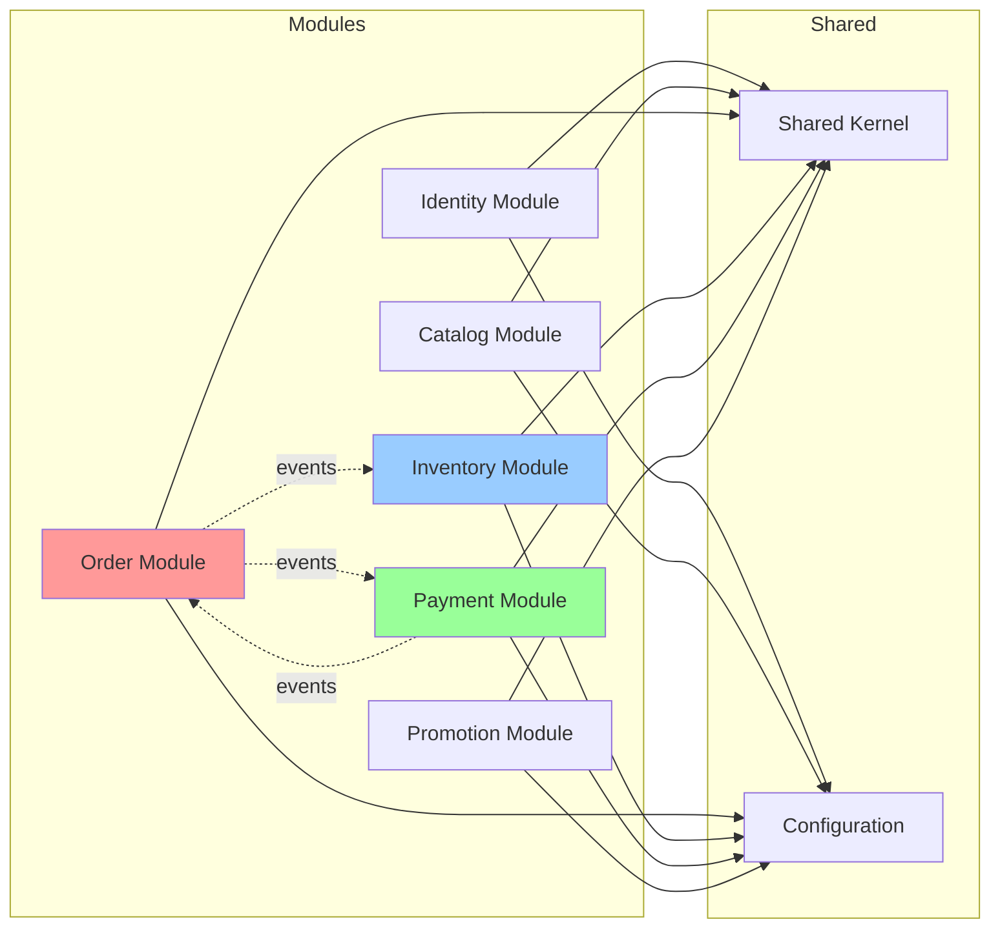
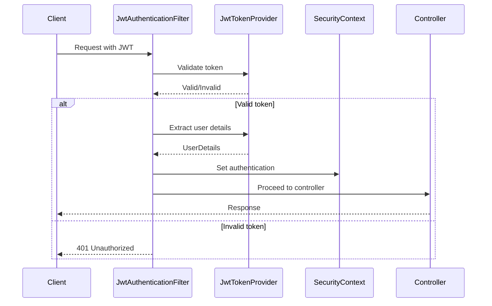
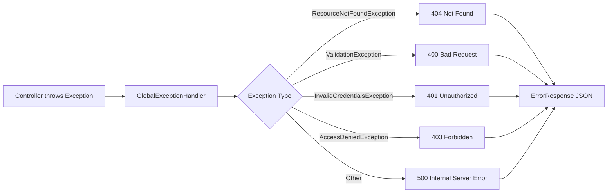
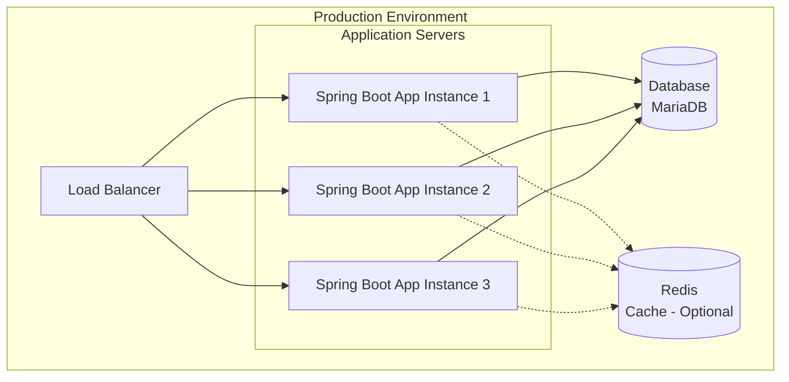
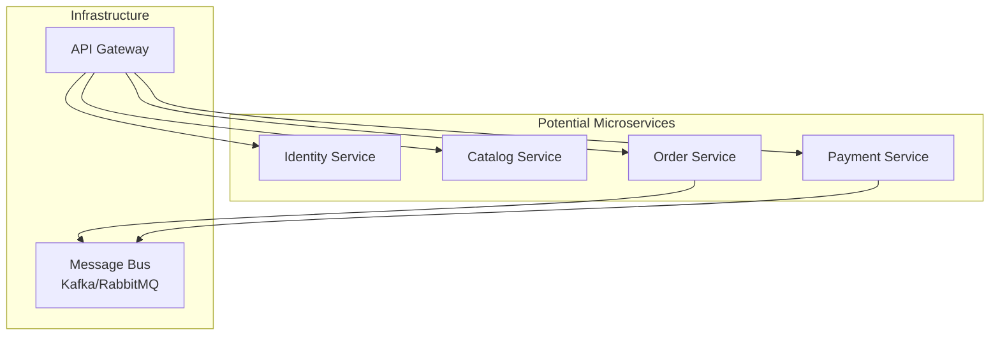

# Kiến Trúc Hệ Thống - Watchify Backend

## 📋 Mục Lục

- [1. Tổng Quan Kiến Trúc](#1-tổng-quan-kiến-trúc)
- [2. Modular Monolithic Architecture](#2-modular-monolithic-architecture)
- [3. Phân Tầng (Layered Architecture)](#3-phân-tầng-layered-architecture)
- [4. Module Organization](#4-module-organization)
- [5. Dependency Management](#5-dependency-management)
- [6. Design Patterns](#6-design-patterns)
- [7. Cross-Cutting Concerns](#7-cross-cutting-concerns)

---

## 1. Tổng Quan Kiến Trúc

### 1.1. Architectural Style

Watchify Backend áp dụng **Modular Monolithic Architecture** - một kiến trúc kết hợp ưu điểm của cả Monolithic và Microservices:

✅ **Đơn giản deployment** như Monolithic (single deployable unit)

✅ **Module hóa** như Microservices (clear boundaries, independent modules)

✅ **Dễ phát triển ban đầu** (shared database, no network overhead)

✅ **Dễ migrate** sang Microservices sau này nếu cần

### 1.2. High-Level Architecture Diagram



### 1.3. Technology Stack Mapping



---

## 2. Modular Monolithic Architecture

### 2.1. Module Structure

Hệ thống được chia thành **6 modules** chính, mỗi module tương ứng với một **Bounded Context** trong Domain-Driven Design:



### 2.2. Package Structure

```
fit.iuh.backend/
│
├── BackendApplication.java                 # Main application class
│
├── config/                                  # Application-wide configuration
│   ├── SecurityConfig.java                 # Spring Security configuration
│   ├── OpenApiConfig.java                  # Swagger/OpenAPI configuration
│   ├── JacksonConfig.java                  # JSON serialization config
│   ├── DataSeeder.java                     # Development data seeding
│   ├── GlobalExceptionHandler.java         # Centralized exception handling
│   └── security/
│       ├── JwtTokenProvider.java           # JWT token generation/validation
│       └── JwtAuthenticationFilter.java    # JWT filter
│
├── sharedkernel/                           # Shared across all modules
│   ├── domain/
│   │   └── BaseEntity.java                # Base class for all entities
│   ├── exception/
│   │   ├── BusinessException.java         # Base business exception
│   │   ├── ResourceNotFoundException.java
│   │   ├── DuplicateResourceException.java
│   │   ├── ValidationException.java
│   │   └── ErrorResponse.java             # Standard error response DTO
│   ├── event/
│   │   ├── DomainEvent.java              # Base domain event interface
│   │   ├── OrderCreatedEvent.java
│   │   ├── PaymentSuccessEvent.java
│   │   └── InventoryReservedEvent.java
│   └── util/
│       ├── ValidationUtils.java           # Email, phone validation
│       └── SlugUtils.java                 # URL slug generation
│
└── modules/                                # Business modules (Bounded Contexts)
    │
    ├── identity/                           # Identity & Access Management
    │   ├── domain/
    │   │   ├── entity/
    │   │   │   ├── User.java
    │   │   │   ├── Role.java
    │   │   │   ├── RefreshToken.java
    │   │   │   ├── Address.java
    │   │   │   └── UserStatus.java (enum)
    │   │   └── repository/
    │   │       ├── UserRepository.java
    │   │       ├── RoleRepository.java
    │   │       ├── RefreshTokenRepository.java
    │   │       └── AddressRepository.java
    │   ├── application/
    │   │   ├── service/
    │   │   │   ├── AuthService.java
    │   │   │   ├── UserService.java
    │   │   │   └── AddressService.java
    │   │   ├── dto/
    │   │   │   ├── LoginRequest.java
    │   │   │   ├── LoginResponse.java
    │   │   │   ├── RegisterRequest.java
    │   │   │   ├── UserDto.java
    │   │   │   └── AddressDto.java
    │   │   └── mapper/
    │   │       ├── UserMapper.java
    │   │       └── AddressMapper.java
    │   └── web/
    │       └── controller/
    │           ├── AuthController.java
    │           ├── UserController.java
    │           └── AddressController.java
    │
    ├── catalog/                            # Product Catalog
    │   ├── domain/
    │   │   ├── entity/
    │   │   │   ├── Product.java
    │   │   │   ├── Category.java
    │   │   │   ├── Brand.java
    │   │   │   ├── ProductImage.java
    │   │   │   ├── ProductDetail.java
    │   │   │   ├── Cart.java
    │   │   │   ├── CartItem.java
    │   │   │   ├── Review.java
    │   │   │   ├── Wishlist.java
    │   │   │   └── ProductStatus.java (enum)
    │   │   └── repository/
    │   │       ├── ProductRepository.java
    │   │       ├── CategoryRepository.java
    │   │       ├── BrandRepository.java
    │   │       ├── CartRepository.java
    │   │       ├── ReviewRepository.java
    │   │       └── WishlistRepository.java
    │   ├── application/
    │   │   ├── service/
    │   │   │   ├── ProductService.java
    │   │   │   ├── CategoryService.java
    │   │   │   ├── BrandService.java
    │   │   │   ├── CartService.java
    │   │   │   ├── ReviewService.java
    │   │   │   └── WishlistService.java
    │   │   ├── dto/
    │   │   │   ├── ProductDto.java
    │   │   │   ├── ProductListResponse.java
    │   │   │   ├── CategoryDto.java
    │   │   │   ├── BrandDto.java
    │   │   │   ├── CartDto.java
    │   │   │   ├── ReviewDto.java
    │   │   │   └── WishlistDto.java
    │   │   ├── mapper/
    │   │   │   ├── ProductMapper.java
    │   │   │   └── ... (other mappers)
    │   │   └── specification/
    │   │       └── ProductSpecification.java  # Dynamic filtering
    │   └── web/
    │       └── controller/
    │           ├── ProductController.java
    │           ├── CategoryController.java
    │           ├── BrandController.java
    │           ├── CartController.java
    │           ├── ReviewController.java
    │           └── WishlistController.java
    │
    ├── order/                              # Order Management
    │   ├── domain/
    │   │   ├── entity/
    │   │   │   ├── Order.java
    │   │   │   ├── OrderItem.java
    │   │   │   ├── OrderStatus.java (enum)
    │   │   │   └── PaymentMethod.java (enum)
    │   │   └── repository/
    │   │       └── OrderRepository.java
    │   ├── application/
    │   │   ├── service/
    │   │   │   ├── OrderService.java
    │   │   │   └── OrderEventListener.java
    │   │   ├── dto/
    │   │   │   ├── OrderDto.java
    │   │   │   ├── CreateOrderRequest.java
    │   │   │   └── GuestOrderRequest.java
    │   │   └── mapper/
    │   │       └── OrderMapper.java
    │   └── web/
    │       └── controller/
    │           └── OrderController.java
    │
    ├── inventory/                          # Inventory Management
    │   ├── domain/
    │   │   ├── entity/
    │   │   │   └── Inventory.java
    │   │   └── repository/
    │   │       └── InventoryRepository.java
    │   ├── application/
    │   │   ├── service/
    │   │   │   ├── InventoryService.java
    │   │   │   └── InventoryEventListener.java
    │   │   └── dto/
    │   │       └── InventoryDto.java
    │   └── web/
    │       └── controller/
    │           └── InventoryController.java
    │
    ├── payment/                            # Payment Processing
    │   ├── domain/
    │   │   ├── entity/
    │   │   │   ├── Payment.java
    │   │   │   └── PaymentStatus.java (enum)
    │   │   └── repository/
    │   │       └── PaymentRepository.java
    │   ├── application/
    │   │   ├── service/
    │   │   │   ├── PaymentService.java
    │   │   │   ├── PaymentGatewayService.java (interface)
    │   │   │   ├── MomoPaymentGatewayService.java
    │   │   │   └── PaymentGatewayFactory.java
    │   │   ├── dto/
    │   │   │   ├── PaymentDto.java
    │   │   │   └── momo/
    │   │   │       ├── MomoPaymentRequest.java
    │   │   │       └── MomoPaymentResponse.java
    │   │   └── mapper/
    │   │       └── PaymentMapper.java
    │   └── web/
    │       └── controller/
    │           └── PaymentController.java
    │
    └── promotion/                          # Promotions & Coupons
        ├── domain/
        │   ├── entity/
        │   │   ├── Coupon.java
        │   │   ├── CouponUsage.java
        │   │   └── DiscountType.java (enum)
        │   └── repository/
        │       ├── CouponRepository.java
        │       └── CouponUsageRepository.java
        ├── application/
        │   ├── service/
        │   │   └── CouponService.java
        │   ├── dto/
        │   │   ├── CouponDto.java
        │   │   ├── ValidateCouponRequest.java
        │   │   └── ValidateCouponResponse.java
        │   └── mapper/
        │       └── CouponMapper.java
        └── web/
            └── controller/
                └── CouponController.java
```

---

## 3. Phân Tầng (Layered Architecture)

Mỗi module được tổ chức theo **Layered Architecture** với 3 tầng chính:

### 3.1. Layer Diagram



### 3.2. Trách Nhiệm Từng Layer

#### 🌐 Web Layer (Presentation Layer)
**Package**: `web.controller`

**Trách nhiệm**:
- Nhận HTTP requests từ client
- Validate input data (`@Valid`)
- Gọi Application Services
- Map domain objects → DTOs
- Trả về HTTP responses (JSON)
- Xử lý HTTP status codes

**Annotations**:
- `@RestController` - Đánh dấu REST controller
- `@RequestMapping` - Define base path
- `@GetMapping`, `@PostMapping`, etc. - HTTP methods
- `@Valid` - Validate request body
- `@PreAuthorize` - Role-based authorization

**Ví dụ**:
```java
@RestController
@RequestMapping("/api/v1/products")
public class ProductController {
    
    private final ProductService productService;
    
    @GetMapping
    public ResponseEntity<Page<ProductDto>> getProducts(
        @RequestParam(required = false) String search,
        Pageable pageable
    ) {
        Page<ProductDto> products = productService.getProducts(search, pageable);
        return ResponseEntity.ok(products);
    }
    
    @PostMapping
    @PreAuthorize("hasRole('ADMIN')")
    public ResponseEntity<ProductDto> createProduct(
        @Valid @RequestBody ProductDto request
    ) {
        ProductDto created = productService.createProduct(request);
        return ResponseEntity.status(HttpStatus.CREATED).body(created);
    }
}
```

---

#### 🔧 Application Layer (Service Layer)
**Package**: `application.service`, `application.dto`, `application.mapper`

**Trách nhiệm**:
- Implement business logic
- Orchestrate domain objects
- Transaction management (`@Transactional`)
- Publish/Listen domain events
- Validate business rules
- Map entities ↔ DTOs

**Annotations**:
- `@Service` - Spring service bean
- `@Transactional` - Transaction boundary
- `@EventListener` - Listen to domain events

**Ví dụ**:
```java
@Service
@RequiredArgsConstructor
public class OrderService {
    
    private final OrderRepository orderRepository;
    private final InventoryService inventoryService;
    private final ApplicationEventPublisher eventPublisher;
    
    @Transactional
    public OrderDto createOrder(CreateOrderRequest request, User user) {
        // 1. Validate business rules
        validateOrderRequest(request);
        
        // 2. Create domain object
        Order order = buildOrder(request, user);
        
        // 3. Reserve inventory
        for (OrderItem item : order.getItems()) {
            inventoryService.reserve(item.getProduct().getId(), item.getQuantity());
        }
        
        // 4. Save order
        Order savedOrder = orderRepository.save(order);
        
        // 5. Publish domain event
        eventPublisher.publishEvent(new OrderCreatedEvent(savedOrder.getId()));
        
        // 6. Map to DTO and return
        return OrderMapper.toDto(savedOrder);
    }
}
```

---

#### 🏛️ Domain Layer (Business Layer)
**Package**: `domain.entity`, `domain.repository`

**Trách nhiệm**:
- Define domain models (Entities)
- Encapsulate business rules in entities
- Define repository interfaces
- Domain events

**Annotations**:
- `@Entity` - JPA entity
- `@Table` - Map to database table
- `@Id`, `@GeneratedValue` - Primary key
- `@ManyToOne`, `@OneToMany`, etc. - Relationships
- `@Enumerated` - Enum mapping

**Ví dụ Entity**:
```java
@Entity
@Table(name = "products")
@Getter
@Setter
@NoArgsConstructor
public class Product extends BaseEntity {
    
    @Column(nullable = false)
    private String name;
    
    @Column(unique = true, nullable = false)
    private String slug;
    
    @Column(nullable = false)
    private BigDecimal price;
    
    @Enumerated(EnumType.STRING)
    private ProductStatus status;
    
    @ManyToOne(fetch = FetchType.LAZY)
    @JoinColumn(name = "category_id")
    private Category category;
    
    // Business methods
    public boolean isAvailable() {
        return status == ProductStatus.ACTIVE;
    }
    
    public boolean isOnSale() {
        return discountPercentage != null && discountPercentage > 0;
    }
    
    public BigDecimal getDiscountAmount() {
        if (!isOnSale()) return BigDecimal.ZERO;
        return price.multiply(BigDecimal.valueOf(discountPercentage))
                   .divide(BigDecimal.valueOf(100));
    }
}
```

**Repository Interface**:
```java
public interface ProductRepository extends JpaRepository<Product, UUID> {
    
    Optional<Product> findBySlug(String slug);
    
    List<Product> findByCategoryId(UUID categoryId);
    
    @Query("SELECT p FROM Product p WHERE p.status = :status")
    Page<Product> findByStatus(ProductStatus status, Pageable pageable);
}
```

---

#### 🔩 Infrastructure Layer
**Package**: Root `config/`, JPA implementations (auto-generated)

**Trách nhiệm**:
- Technical configurations
- Database access implementation (Spring Data JPA)
- External service integrations
- Security configuration
- Exception handling

**Components**:
- `SecurityConfig` - Spring Security setup
- `JwtTokenProvider` - JWT utilities
- `GlobalExceptionHandler` - Centralized error handling
- `OpenApiConfig` - Swagger configuration
- JPA repository implementations (auto by Spring Data)

---

## 4. Module Organization

### 4.1. Module Isolation Principles

Để đảm bảo module independence, các nguyên tắc sau được áp dụng:

#### ✅ Strong Module Boundaries
- Mỗi module có package riêng biệt
- Không access trực tiếp vào internal classes của module khác
- Chỉ expose public APIs qua `api` package (nếu cần)

#### ✅ Loose Coupling via Events
- Modules giao tiếp qua Domain Events
- Sử dụng `ApplicationEventPublisher` và `@EventListener`
- Tránh direct dependencies giữa modules

#### ✅ Shared Kernel
- Common code được đặt trong `sharedkernel`
- Base entities, exceptions, utilities
- Không chứa business logic cụ thể

### 4.2. Module Dependency Graph



**Legend**:
- Solid lines (→): Direct dependency
- Dashed lines (-.→): Event-based communication

### 4.3. Cross-Module Communication

#### Cách 1: Domain Events (Preferred) ✅

**Ưu điểm**: Loose coupling, scalable, testable

**Example**:
```java
// Order Module - Publish event
@Service
public class OrderService {
    @Autowired
    private ApplicationEventPublisher eventPublisher;
    
    @Transactional
    public Order createOrder(...) {
        Order order = orderRepository.save(newOrder);
        eventPublisher.publishEvent(new OrderCreatedEvent(order.getId()));
        return order;
    }
}

// Inventory Module - Listen to event
@Component
public class InventoryEventListener {
    
    @EventListener
    @Transactional
    public void handleOrderCreated(OrderCreatedEvent event) {
        // Reserve inventory for order
        inventoryService.reserveForOrder(event.getOrderId());
    }
}
```

#### Cách 2: Direct API Call (Khi cần thiết) ⚠️

**Khi nào dùng**: Khi cần synchronous response, transaction consistency

**Example**:
```java
// Order Module calls Inventory Module directly
@Service
public class OrderService {
    @Autowired
    private InventoryService inventoryService; // Direct dependency
    
    @Transactional
    public Order createOrder(...) {
        // Check stock availability
        boolean inStock = inventoryService.checkAvailability(productId, quantity);
        if (!inStock) {
            throw new OutOfStockException();
        }
        // ... create order
    }
}
```

---

## 5. Dependency Management

### 5.1. Dependency Injection

Sử dụng **Constructor Injection** (best practice):

```java
@Service
@RequiredArgsConstructor  // Lombok generates constructor
public class ProductService {
    
    private final ProductRepository productRepository;
    private final CategoryRepository categoryRepository;
    private final ProductMapper productMapper;
    
    // Constructor injection automatically by Spring
    // No need for @Autowired
}
```

### 5.2. Circular Dependency Prevention

Tránh circular dependencies bằng cách:

1. **Event-driven communication** thay vì direct calls
2. **Interface segregation** - Define clear contracts
3. **Dependency inversion** - Depend on abstractions

---

## 6. Design Patterns

### 6.1. Patterns Used in Architecture

#### 1. Repository Pattern

**Mục đích**: Abstraction cho data access layer

```java
public interface ProductRepository extends JpaRepository<Product, UUID> {
    Optional<Product> findBySlug(String slug);
}
```

#### 2. Service Layer Pattern

**Mục đích**: Encapsulate business logic

```java
@Service
public class ProductService {
    public ProductDto createProduct(ProductDto dto) {
        // Business logic here
    }
}
```

#### 3. DTO Pattern

**Mục đích**: Transfer data between layers, hide internal structure

```java
@Data
public class ProductDto {
    private UUID id;
    private String name;
    private BigDecimal price;
    // Only expose what client needs
}
```

#### 4. Mapper Pattern

**Mục đích**: Convert between Entity ↔ DTO

```java
public class ProductMapper {
    public static ProductDto toDto(Product entity) {
        // Mapping logic
    }
    
    public static Product toEntity(ProductDto dto) {
        // Mapping logic
    }
}
```

#### 5. Specification Pattern

**Mục đích**: Dynamic query building

```java
public class ProductSpecification {
    public static Specification<Product> hasName(String name) {
        return (root, query, cb) -> cb.like(root.get("name"), "%" + name + "%");
    }
}
```

#### 6. Factory Pattern

**Mục đích**: Create objects based on type

```java
@Component
public class PaymentGatewayFactory {
    public PaymentGatewayService getGateway(String type) {
        return switch(type) {
            case "MOMO" -> momoGatewayService;
            case "VNPAY" -> vnpayGatewayService;
            default -> throw new IllegalArgumentException();
        };
    }
}
```

#### 7. Observer Pattern (Event-Driven)

**Mục đích**: Decouple modules via events

```java
// Publisher
eventPublisher.publishEvent(new OrderCreatedEvent(orderId));

// Subscriber
@EventListener
public void handleOrderCreated(OrderCreatedEvent event) {
    // React to event
}
```

---

## 7. Cross-Cutting Concerns

### 7.1. Security



**Configuration**:
- `SecurityConfig` - Define security rules
- `JwtTokenProvider` - Generate & validate JWT
- `JwtAuthenticationFilter` - Intercept requests
- `@PreAuthorize` - Method-level security

### 7.2. Exception Handling



### 7.3. Transaction Management

```java
@Service
public class OrderService {
    
    @Transactional  // All operations in single transaction
    public Order createOrder(...) {
        Order order = orderRepository.save(newOrder);
        inventoryService.reserve(...);  // If this fails, order is rolled back
        eventPublisher.publishEvent(...);
        return order;
    }
}
```

### 7.4. Validation

**Multiple validation layers**:

1. **DTO Validation** - Jakarta Validation
   ```java
   @Data
   public class RegisterRequest {
       @NotBlank
       @Email
       private String email;
       
       @NotBlank
       @Size(min = 8)
       private String password;
   }
   ```

2. **Business Validation** - In services
   ```java
   if (coupon.getUsedCount() >= coupon.getUsageLimit()) {
       throw new ValidationException("Coupon usage limit exceeded");
   }
   ```

3. **Database Constraints** - In entities
   ```java
   @Column(unique = true, nullable = false)
   private String email;
   ```

### 7.5. Logging

```java
@Slf4j  // Lombok annotation
@Service
public class ProductService {
    
    public Product createProduct(ProductDto dto) {
        log.info("Creating product: {}", dto.getName());
        try {
            // ... logic
            log.debug("Product created with ID: {}", product.getId());
        } catch (Exception e) {
            log.error("Failed to create product", e);
            throw e;
        }
    }
}
```

---

## 8. Deployment Architecture

### 8.1. Current: Monolithic Deployment



**Benefits**:
- Simple deployment
- Easy debugging
- Low latency (no network calls between modules)
- Single database transaction

### 8.2. Future: Microservices Migration Path



**Migration strategy**:
1. Extract modules thành separate services
2. Implement API Gateway
3. Replace events with message queue
4. Separate databases (per service)

---

## 9. Architectural Decisions

### 9.1. Why Modular Monolith?

| Decision | Rationale |
|----------|-----------|
| **Modular Monolith over Microservices** | Đơn giản hóa deployment, testing, debugging cho giai đoạn đầu |
| **Event-driven communication** | Chuẩn bị sẵn cho migration sang Microservices |
| **Shared database** | Đơn giản hóa transactions, consistency |
| **JWT Authentication** | Stateless, scalable authentication |
| **REST API** | Industry standard, easy integration |
| **OpenAPI Documentation** | Contract-first API design |

### 9.2. Trade-offs

| Aspect | Benefit | Trade-off |
|--------|---------|-----------|
| **Modular Monolith** | Simple deployment | Harder to scale specific modules |
| **Shared Database** | ACID transactions | Coupling between modules |
| **Synchronous REST** | Simple, standard | Not suitable for long-running tasks |
| **JWT** | Stateless | Cannot revoke tokens easily |

---

## 10. Kết Luận

Kiến trúc Watchify Backend được thiết kế với các đặc điểm:

✅ **Modular** - Modules độc lập, rõ ràng boundaries

✅ **Layered** - Separation of concerns theo layers

✅ **Event-driven** - Loose coupling giữa modules

✅ **Scalable** - Có thể mở rộng theo chiều ngang (horizontal scaling)

✅ **Maintainable** - Code organization tốt, dễ maintain

✅ **Testable** - Clear dependencies, easy to mock

✅ **Evolvable** - Dễ migrate sang Microservices nếu cần

Kiến trúc này phù hợp cho:
- Team vừa và nhỏ
- Dự án trong giai đoạn phát triển đầu
- Yêu cầu time-to-market nhanh
- Có thể scale sau này

---

**[◀ Quay lại Overview](overview.md)** | **[Tiếp theo: Components ▶](components.md)**
