# Sơ Đồ Class - Watchify Backend

## 📋 Mục Lục

- [1. Tổng Quan](#1-tổng-quan)
- [2. Shared Kernel Classes](#2-shared-kernel-classes)
- [3. Identity Module Classes](#3-identity-module-classes)
- [4. Catalog Module Classes](#4-catalog-module-classes)
- [5. Order Module Classes](#5-order-module-classes)
- [6. Inventory Module Classes](#6-inventory-module-classes)
- [7. Payment Module Classes](#7-payment-module-classes)
- [8. Promotion Module Classes](#8-promotion-module-classes)
- [9. Design Patterns Analysis](#9-design-patterns-analysis)

---

## 1. Tổng Quan

Class diagrams mô tả cấu trúc domain model của hệ thống, bao gồm:
- **Entities**: Domain objects với identity
- **Value Objects**: Immutable objects without identity (enums)
- **Relationships**: Association, composition, inheritance
- **Responsibilities**: Methods và behaviors

### 1.1. Class Diagram Legend

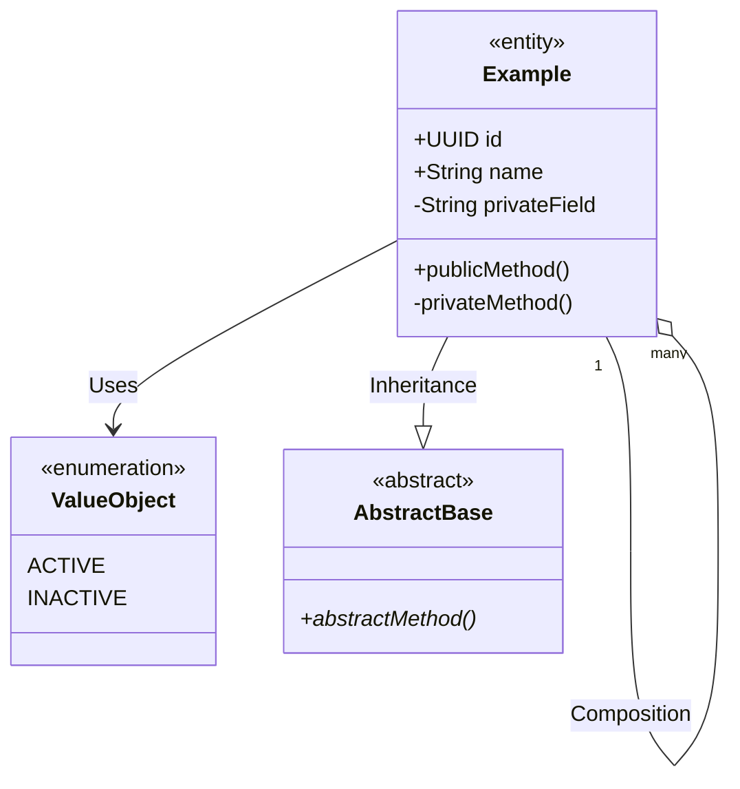

---

## 2. Shared Kernel Classes

### 2.1. Base Entity

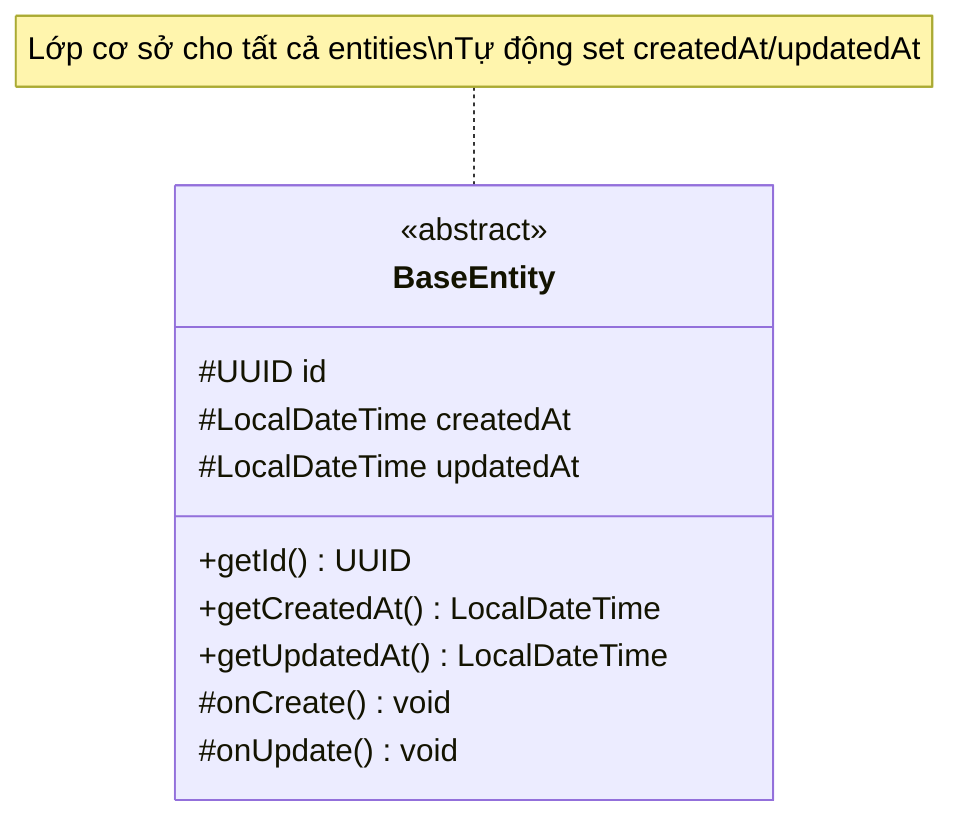

**Trách nhiệm**:
- Cung cấp primary key (UUID) cho tất cả entities
- Tự động tracking thời gian tạo/cập nhật
- Lifecycle callbacks với `@PrePersist`, `@PreUpdate`

**Attributes**:
- `id`: UUID - Primary key, tự động sinh
- `createdAt`: LocalDateTime - Thời điểm tạo
- `updatedAt`: LocalDateTime - Thời điểm cập nhật cuối

---

### 2.2. Domain Events

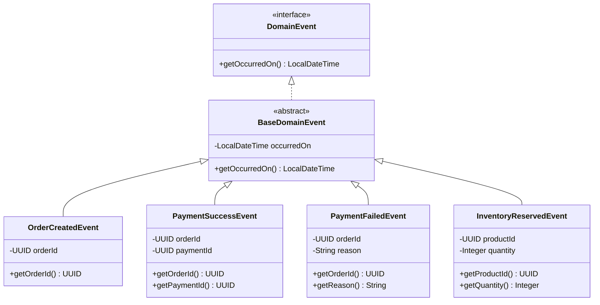

**Design Pattern**: Observer Pattern (Event-Driven Architecture)

**Trách nhiệm**:
- Decoupling giữa các modules
- Async communication
- Event sourcing capability

---

### 2.3. Common Exceptions

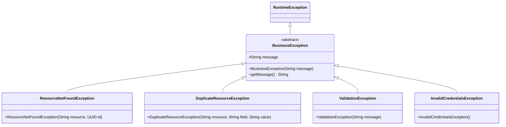

---

## 3. Identity Module Classes

### 3.1. Core Domain Model

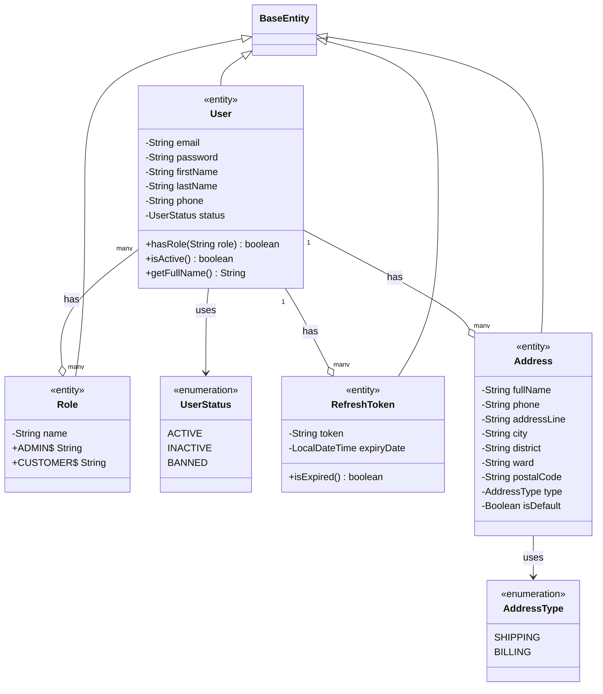

### 3.2. User Entity Details

**Trách nhiệm**:
- Quản lý thông tin người dùng
- Xác thực credentials
- Quản lý roles và permissions
- Quản lý trạng thái account

**Key Methods**:

| Method | Return | Description |
|--------|--------|-------------|
| `hasRole(String role)` | `boolean` | Kiểm tra user có role không |
| `isActive()` | `boolean` | Kiểm tra account có active không |
| `getFullName()` | `String` | Ghép firstName + lastName |

**Relationships**:
- ManyToMany với `Role` - Một user có nhiều roles
- OneToMany với `Address` - Một user có nhiều addresses
- OneToMany với `RefreshToken` - Một user có nhiều refresh tokens (multi-device)

---

## 4. Catalog Module Classes

### 4.1. Product Domain Model

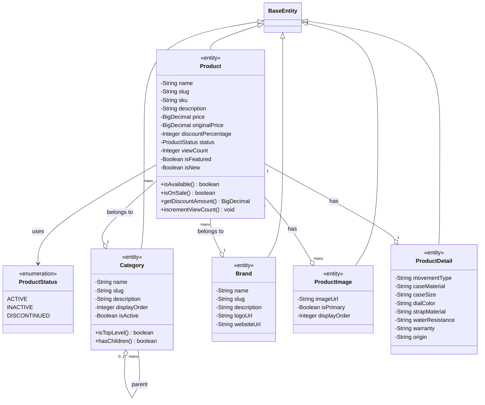

### 4.2. Product Entity Details

**Trách nhiệm**:
- Quản lý thông tin sản phẩm
- Tính toán giá và discount
- Tracking view count
- Quản lý trạng thái (active, inactive, discontinued)

**Key Business Methods**:

```java
// Kiểm tra sản phẩm có sẵn bán không
public boolean isAvailable() {
    return status == ProductStatus.ACTIVE;
}

// Kiểm tra đang có sale không
public boolean isOnSale() {
    return discountPercentage != null && discountPercentage > 0;
}

// Tính số tiền được giảm
public BigDecimal getDiscountAmount() {
    if (!isOnSale()) return BigDecimal.ZERO;
    return price.multiply(BigDecimal.valueOf(discountPercentage))
               .divide(BigDecimal.valueOf(100), 2, RoundingMode.HALF_UP);
}

// Tăng view count
public void incrementViewCount() {
    this.viewCount = (this.viewCount == null ? 0 : this.viewCount) + 1;
}
```

**Attributes Analysis**:

| Attribute | Type | Purpose | Business Rule |
|-----------|------|---------|---------------|
| `slug` | String | SEO-friendly URL | Unique, lowercase, hyphens |
| `sku` | String | Stock Keeping Unit | Unique identifier |
| `price` | BigDecimal | Giá hiện tại | Must be > 0 |
| `originalPrice` | BigDecimal | Giá gốc (trước sale) | >= price |
| `discountPercentage` | Integer | % giảm giá | 0-100 |
| `isFeatured` | Boolean | Sản phẩm nổi bật | For homepage |
| `isNew` | Boolean | Sản phẩm mới | For "New Arrivals" |

---

### 4.3. Cart & Shopping

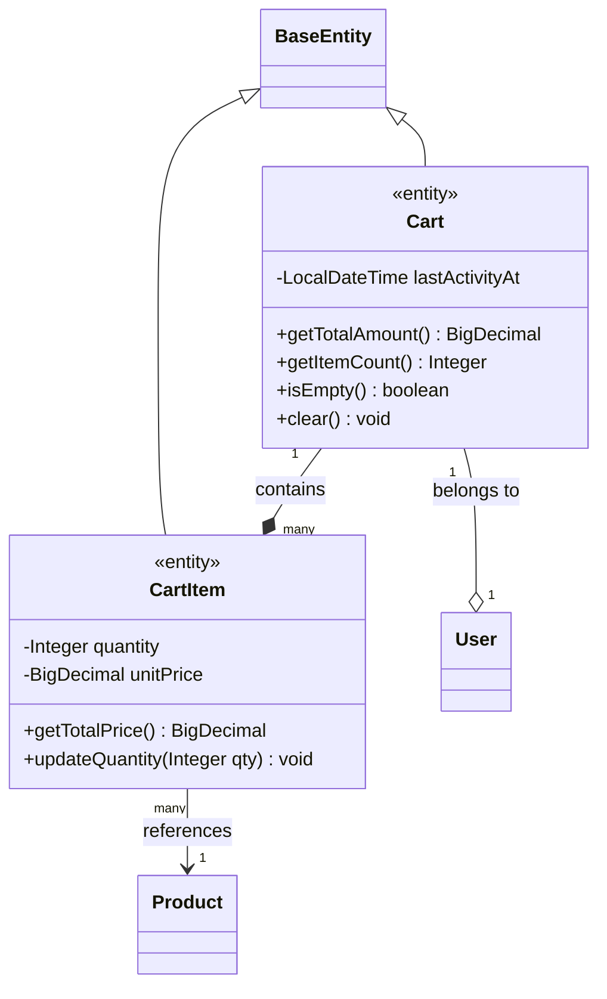

**Cart Entity**:

```java
// Tính tổng tiền giỏ hàng
public BigDecimal getTotalAmount() {
    return items.stream()
        .map(CartItem::getTotalPrice)
        .reduce(BigDecimal.ZERO, BigDecimal::add);
}

// Đếm số items
public Integer getItemCount() {
    return items.stream()
        .mapToInt(CartItem::getQuantity)
        .sum();
}
```

**CartItem Entity**:

```java
// Tính tổng tiền item
public BigDecimal getTotalPrice() {
    return unitPrice.multiply(BigDecimal.valueOf(quantity));
}

// Cập nhật số lượng
public void updateQuantity(Integer qty) {
    if (qty <= 0) {
        throw new ValidationException("Quantity must be positive");
    }
    this.quantity = qty;
}
```

---

### 4.4. Review & Wishlist

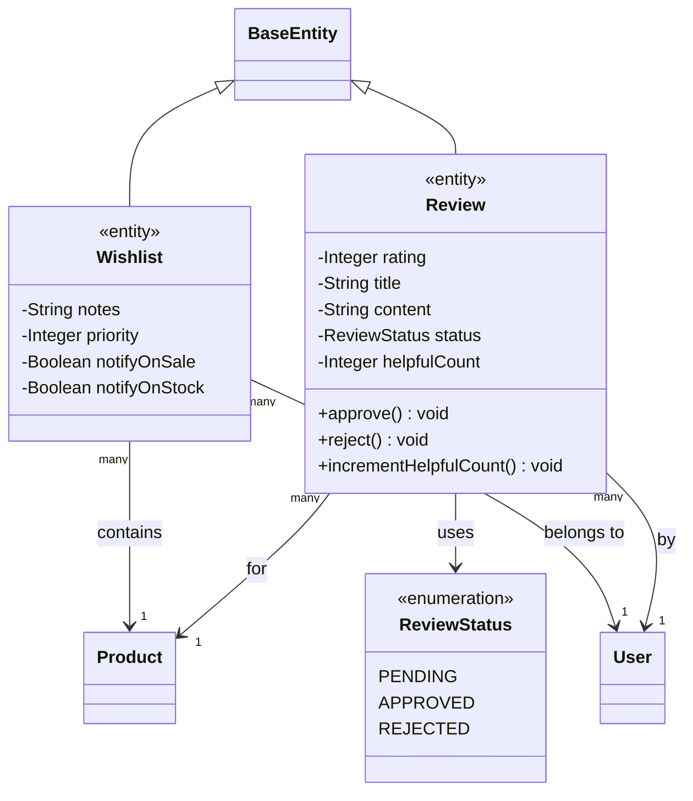

**Review Entity**:
- **rating**: 1-5 stars
- **status**: PENDING (mặc định) → APPROVED/REJECTED (admin action)
- **helpfulCount**: Số người thấy review hữu ích

**Wishlist Entity**:
- **priority**: 1 (cao) → 5 (thấp)
- **notifyOnSale**: Thông báo khi có sale
- **notifyOnStock**: Thông báo khi có hàng trở lại

---

## 5. Order Module Classes

### 5.1. Order Domain Model

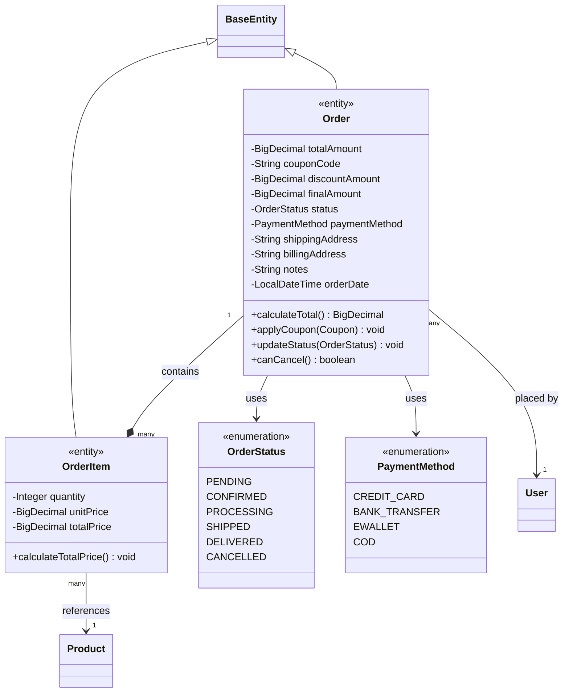

### 5.2. Order Entity Details

**Trách nhiệm**:
- Quản lý thông tin đơn hàng
- Tính toán tổng tiền (bao gồm discount)
- Quản lý trạng thái lifecycle
- Apply coupon và tính discount

**Key Methods**:

```java
// Tính tổng tiền trước discount
public BigDecimal calculateTotal() {
    return items.stream()
        .map(OrderItem::getTotalPrice)
        .reduce(BigDecimal.ZERO, BigDecimal::add);
}

// Áp dụng coupon
public void applyCoupon(Coupon coupon) {
    BigDecimal discount = coupon.calculateDiscount(this.totalAmount);
    this.couponCode = coupon.getCode();
    this.discountAmount = discount;
    this.finalAmount = this.totalAmount.subtract(discount);
}

// Cập nhật trạng thái
public void updateStatus(OrderStatus newStatus) {
    if (!isValidTransition(this.status, newStatus)) {
        throw new ValidationException("Invalid status transition");
    }
    this.status = newStatus;
}

// Kiểm tra có thể cancel không
public boolean canCancel() {
    return status == OrderStatus.PENDING || 
           status == OrderStatus.CONFIRMED;
}
```

**Order Status State Machine**:

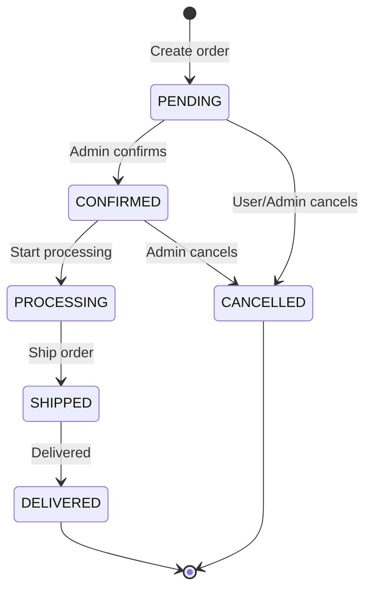

**Amount Calculation**:
```
totalAmount = sum(orderItems.totalPrice)
discountAmount = coupon.calculateDiscount(totalAmount)
finalAmount = totalAmount - discountAmount
```

---

## 6. Inventory Module Classes

### 6.1. Inventory Domain Model

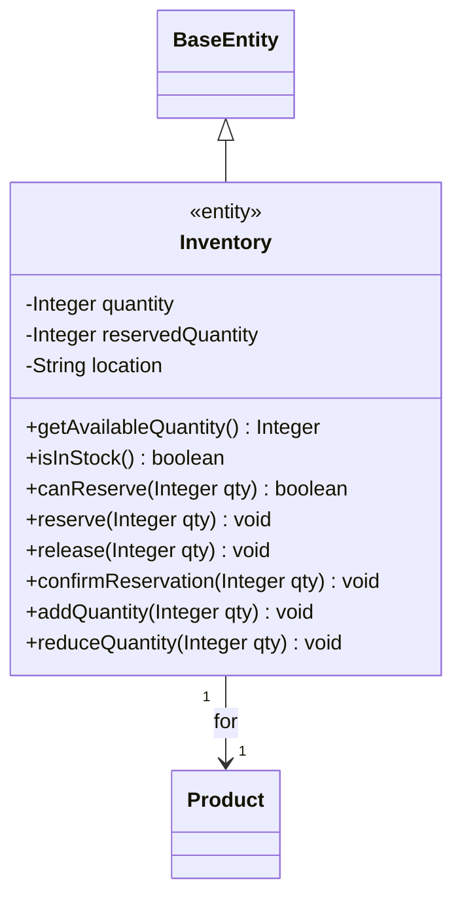

### 6.2. Inventory Entity Details

**Trách nhiệm**:
- Tracking số lượng hàng tồn kho
- Quản lý đặt chỗ (reservation) khi có đơn hàng
- Xác nhận hoặc hủy đặt chỗ
- Cập nhật số lượng hàng

**Key Attributes**:
- `quantity`: Tổng số lượng trong kho
- `reservedQuantity`: Số lượng đã đặt chỗ (pending orders)
- `availableQuantity`: = quantity - reservedQuantity (calculated)

**Business Logic**:

```java
// Số lượng có thể bán
public Integer getAvailableQuantity() {
    return quantity - reservedQuantity;
}

// Kiểm tra còn hàng
public boolean isInStock() {
    return getAvailableQuantity() > 0;
}

// Kiểm tra có thể đặt chỗ không
public boolean canReserve(Integer qty) {
    return getAvailableQuantity() >= qty;
}

// Đặt chỗ hàng (khi tạo order)
public void reserve(Integer qty) {
    if (!canReserve(qty)) {
        throw new InsufficientStockException();
    }
    this.reservedQuantity += qty;
}

// Xác nhận đặt chỗ (khi thanh toán thành công)
public void confirmReservation(Integer qty) {
    this.quantity -= qty;
    this.reservedQuantity -= qty;
}

// Hủy đặt chỗ (khi hủy order hoặc thanh toán thất bại)
public void release(Integer qty) {
    this.reservedQuantity -= qty;
}
```

**Inventory Reservation Flow**:

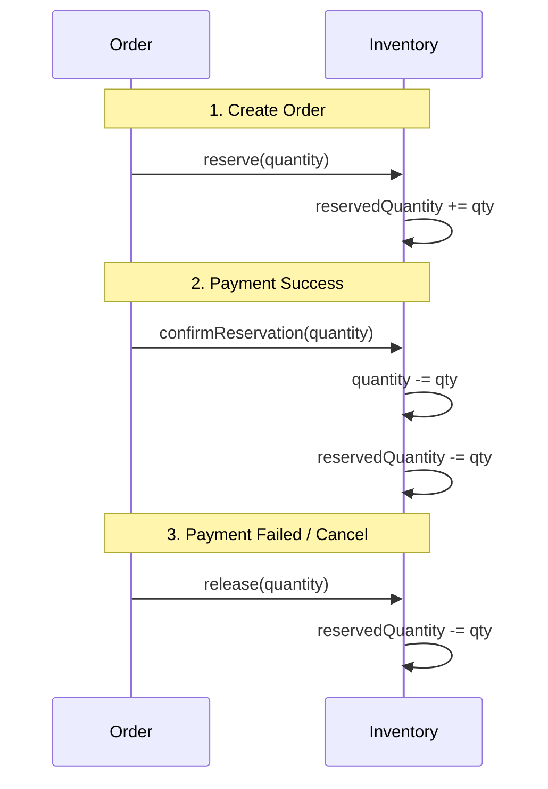

---

## 7. Payment Module Classes

### 7.1. Payment Domain Model

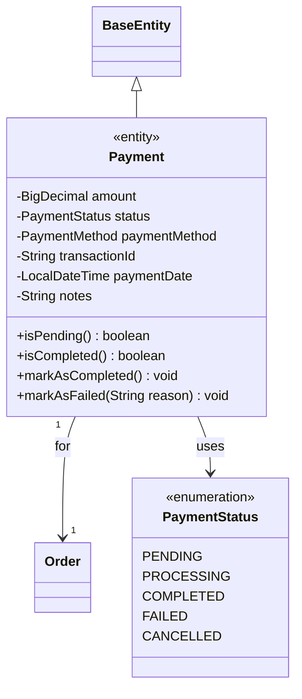

### 7.2. Payment Gateway Services

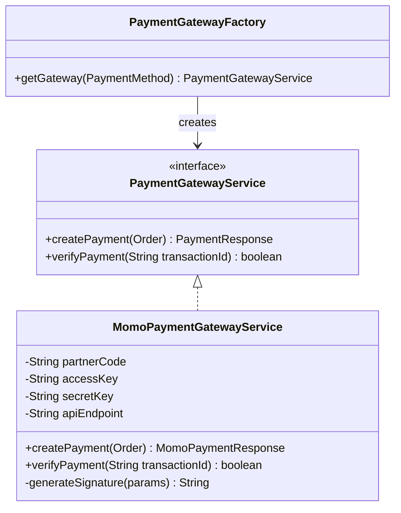

**Design Pattern**: Factory Pattern

**Trách nhiệm**:
- Abstract payment gateway integration
- Support multiple payment providers
- Handle payment verification

---

## 8. Promotion Module Classes

### 8.1. Coupon Domain Model

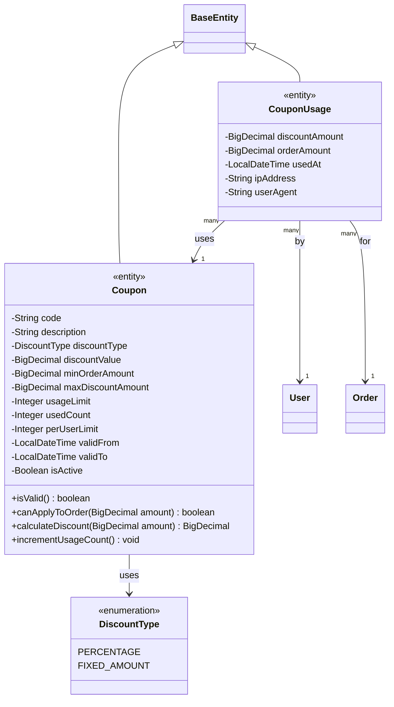

### 8.2. Coupon Entity Details

**Trách nhiệm**:
- Quản lý mã giảm giá
- Validate điều kiện áp dụng
- Tính toán số tiền giảm
- Tracking usage

**Key Business Logic**:

```java
// Kiểm tra coupon có hợp lệ không
public boolean isValid() {
    LocalDateTime now = LocalDateTime.now();
    return isActive 
        && now.isAfter(validFrom) 
        && now.isBefore(validTo)
        && (usageLimit == null || usedCount < usageLimit);
}

// Kiểm tra có thể apply cho đơn hàng không
public boolean canApplyToOrder(BigDecimal orderAmount) {
    if (!isValid()) return false;
    if (minOrderAmount != null && orderAmount.compareTo(minOrderAmount) < 0) {
        return false;
    }
    return true;
}

// Tính số tiền giảm
public BigDecimal calculateDiscount(BigDecimal orderAmount) {
    BigDecimal discount;
    
    if (discountType == DiscountType.PERCENTAGE) {
        discount = orderAmount.multiply(discountValue)
                             .divide(BigDecimal.valueOf(100), 2, RoundingMode.HALF_UP);
    } else { // FIXED_AMOUNT
        discount = discountValue;
    }
    
    // Apply max discount limit
    if (maxDiscountAmount != null && discount.compareTo(maxDiscountAmount) > 0) {
        discount = maxDiscountAmount;
    }
    
    return discount;
}

// Tăng số lần sử dụng
public void incrementUsageCount() {
    this.usedCount++;
}
```

**Discount Type Examples**:

| Type | Value | Order Amount | Min Amount | Max Discount | Result |
|------|-------|--------------|------------|--------------|--------|
| PERCENTAGE | 10% | $100 | $50 | $20 | $10 |
| PERCENTAGE | 20% | $200 | $100 | $30 | $30 (capped) |
| FIXED_AMOUNT | $15 | $100 | $50 | - | $15 |

---

## 9. Design Patterns Analysis

### 9.1. Patterns Used in Domain Model

#### 1. **Entity Pattern**
- All domain objects extend `BaseEntity`
- Have identity (UUID)
- Mutable state
- Persisted to database

#### 2. **Value Object Pattern**
- Enums: `OrderStatus`, `PaymentStatus`, `DiscountType`
- Immutable
- No identity
- Compared by value

#### 3. **Aggregate Pattern**
- `Order` is aggregate root
  - Contains `OrderItem` (aggregate members)
  - Consistency boundary
  - Transactional boundary

- `Cart` is aggregate root
  - Contains `CartItem`

#### 4. **Repository Pattern**
- Each entity has a repository interface
- Abstract data access
- Defined in domain layer, implemented in infrastructure

#### 5. **Domain Event Pattern**
- `OrderCreatedEvent`, `PaymentSuccessEvent`
- Decoupling between modules
- Asynchronous communication

#### 6. **Strategy Pattern**
- `PaymentGatewayService` interface
- Multiple implementations: `MomoPaymentGatewayService`, etc.
- Runtime selection via `PaymentGatewayFactory`

#### 7. **State Pattern**
- Order status transitions
- Payment status lifecycle
- Review status workflow

---

### 9.2. SOLID Principles Compliance

#### Single Responsibility Principle (SRP) ✅
- `Product` - Chỉ quản lý product data
- `ProductService` - Chỉ xử lý product business logic
- `ProductRepository` - Chỉ xử lý product data access

#### Open/Closed Principle (OCP) ✅
- `PaymentGatewayService` - Open for extension (new gateways), closed for modification

#### Liskov Substitution Principle (LSP) ✅
- All entities có thể thay thế `BaseEntity`
- All payment gateways có thể thay thế `PaymentGatewayService`

#### Interface Segregation Principle (ISP) ✅
- Repositories chỉ expose methods cần thiết
- Services có focused interfaces

#### Dependency Inversion Principle (DIP) ✅
- Services depend on Repository interfaces, not concrete implementations
- Payment system depends on `PaymentGatewayService` interface

---

### 9.3. Domain-Driven Design (DDD) Concepts

#### Bounded Contexts
- **Identity Context**: Users, roles, authentication
- **Catalog Context**: Products, categories, brands
- **Order Context**: Orders, order items
- **Payment Context**: Payments, transactions
- **Promotion Context**: Coupons, discounts

#### Aggregates
- `Order` + `OrderItem`
- `Cart` + `CartItem`
- `Product` + `ProductImage` + `ProductDetail`

#### Entities vs Value Objects
- **Entities**: User, Product, Order (have identity)
- **Value Objects**: OrderStatus, PaymentMethod, DiscountType (compared by value)

#### Domain Events
- `OrderCreatedEvent`
- `PaymentSuccessEvent`
- `InventoryReservedEvent`

#### Repositories
- One repository per aggregate root
- Query methods specific to domain needs

---

## 10. Class Relationships Summary

### 10.1. Relationship Types

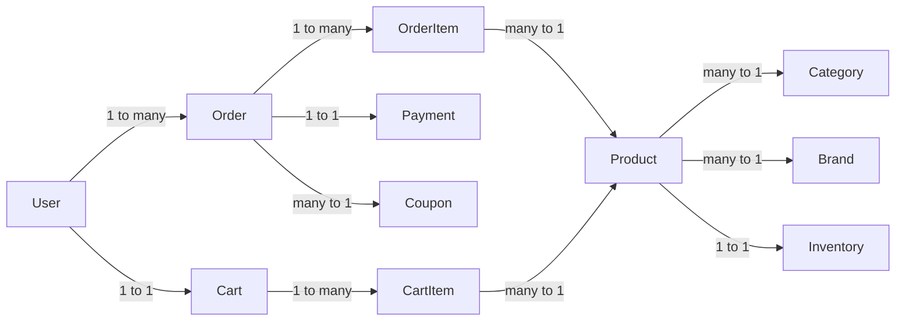

### 10.2. Key Relationships

| Entity 1 | Relationship | Entity 2 | Type |
|----------|--------------|----------|------|
| User | 1 : N | Order | Association |
| Order | 1 : N | OrderItem | Composition |
| Order | 1 : 1 | Payment | Association |
| Product | N : 1 | Category | Association |
| Product | N : 1 | Brand | Association |
| Product | 1 : 1 | Inventory | Association |
| Cart | 1 : N | CartItem | Composition |
| User | N : M | Role | Association |

---

## 11. Kết Luận

Domain model của Watchify được thiết kế với:

✅ **Rich domain model** - Entities chứa business logic, không chỉ là data containers

✅ **Clear responsibilities** - Mỗi class có trách nhiệm rõ ràng (SRP)

✅ **Encapsulation** - Business rules được encapsulate trong entities

✅ **Relationships** - Quan hệ giữa entities được định nghĩa rõ ràng

✅ **Validation** - Business rules được validate trong domain layer

✅ **Design patterns** - Áp dụng nhiều design patterns phù hợp

✅ **DDD principles** - Tuân thủ Domain-Driven Design concepts

Điểm mạnh của class design:
- Expressive domain model
- Business logic gần với data
- Dễ test (business logic trong entities)
- Type-safe với enums

---

**[◀ Quay lại Architecture](architecture.md)** | **[Tiếp theo: Components ▶](components.md)**
