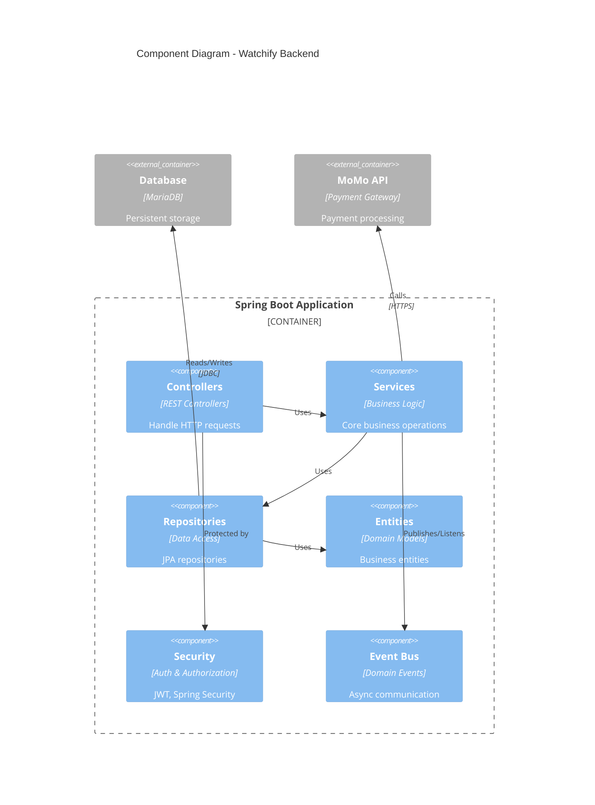
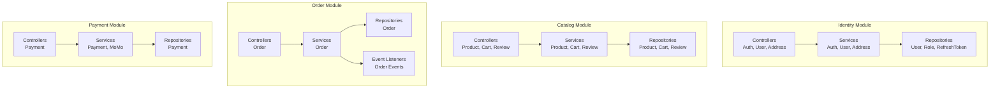
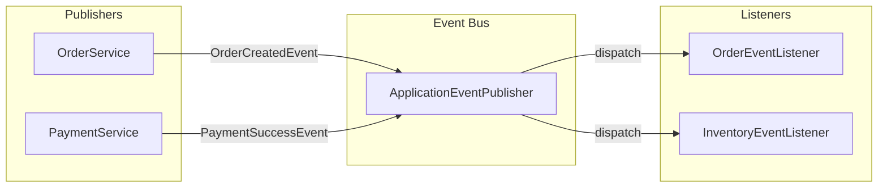
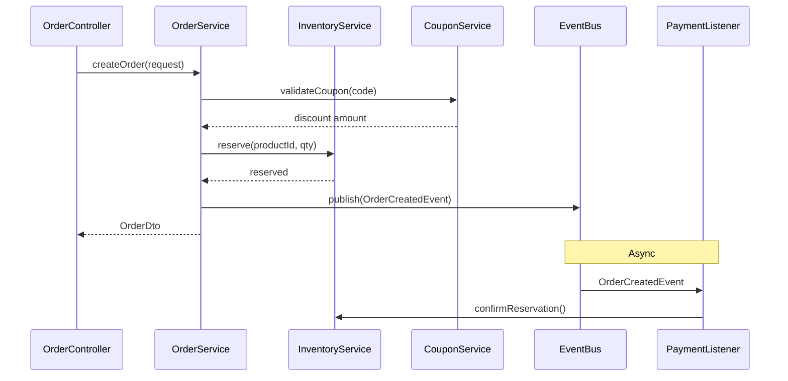
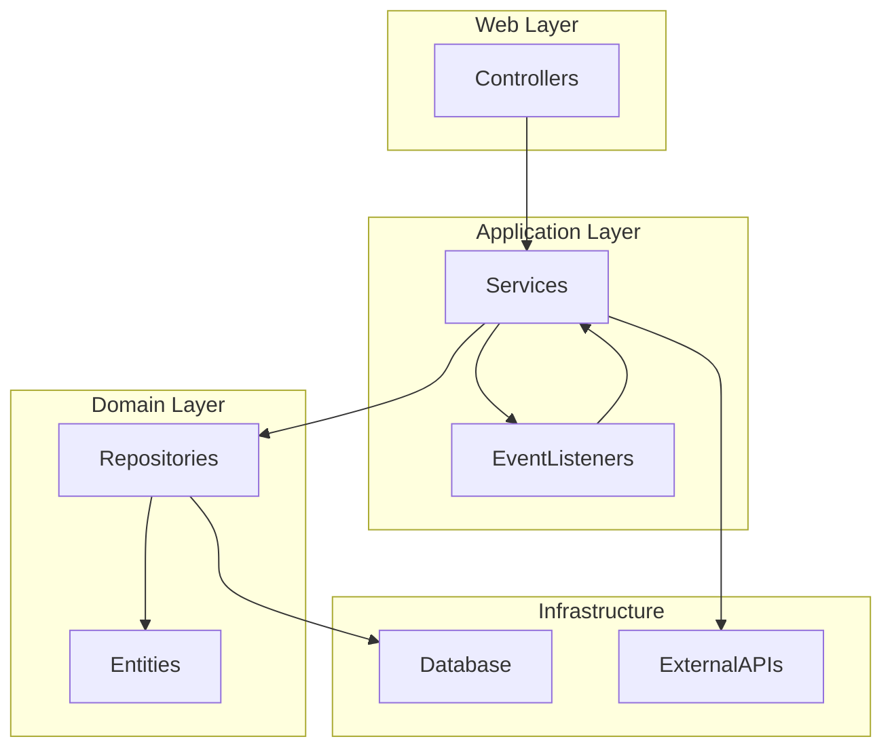

# Components - Watchify Backend

## 📋 Mục Lục

- [1. Tổng Quan](#1-tổng-quan)
- [2. Component Diagram](#2-component-diagram)
- [3. Identity Module Components](#3-identity-module-components)
- [4. Catalog Module Components](#4-catalog-module-components)
- [5. Order Module Components](#5-order-module-components)
- [6. Inventory Module Components](#6-inventory-module-components)
- [7. Payment Module Components](#7-payment-module-components)
- [8. Promotion Module Components](#8-promotion-module-components)
- [9. Shared Components](#9-shared-components)

---

## 1. Tổng Quan

Document này mô tả chi tiết các components trong từng module của hệ thống, bao gồm:
- **Controllers** - REST API endpoints
- **Services** - Business logic
- **Repositories** - Data access
- **DTOs** - Data transfer objects
- **Mappers** - Entity ↔ DTO conversion
- **Event Listeners** - Event handlers

---

## 2. Component Diagram

### 2.1. System-Level Component Diagram



### 2.2. Module Component Overview



---

## 3. Identity Module Components

### 3.1. Controllers

#### AuthController
```java
@RestController
@RequestMapping("/api/v1/auth")
```

| Endpoint | Method | Description | Auth Required |
|----------|--------|-------------|---------------|
| `/register` | POST | Đăng ký tài khoản mới | ❌ |
| `/login` | POST | Đăng nhập | ❌ |
| `/refresh` | POST | Refresh access token | ❌ |
| `/logout` | POST | Đăng xuất | ✅ |
| `/me` | GET | Thông tin user hiện tại | ✅ |

**Responsibilities**:
- Xử lý authentication requests
- Validate credentials
- Generate JWT tokens
- Return user information

---

#### UserController
```java
@RestController
@RequestMapping("/api/v1/users")
```

| Endpoint | Method | Description | Role |
|----------|--------|-------------|------|
| `/me` | PUT | Cập nhật profile | USER |
| `/me/password` | PUT | Đổi mật khẩu | USER |
| `/{id}` | GET | Xem user (admin) | ADMIN |
| `/` | GET | Danh sách users | ADMIN |

---

#### CartController
```java
@RestController
@RequestMapping("/api/v1/cart")
```

| Endpoint | Method | Description |
|----------|--------|-------------|
| `/` | GET | Xem giỏ hàng |
| `/items` | POST | Thêm vào giỏ |
| `/items/{productId}` | PUT | Cập nhật số lượng |
| `/items/{productId}` | DELETE | Xóa khỏi giỏ |
| `/clear` | DELETE | Xóa toàn bộ giỏ |

---

### 3.2. Services

#### AuthService

**Trách nhiệm**:
- Đăng ký user mới
- Xác thực credentials
- Generate JWT tokens (access + refresh)
- Quản lý refresh tokens
- Logout

**Key Methods**:
```java
RegisterResponse register(RegisterRequest request)
LoginResponse login(LoginRequest request)
LoginResponse refreshAccessToken(String refreshToken)
void logout(String userId)
UserDto getCurrentUser(String userId)
```

**Dependencies**:
- `UserRepository`
- `RoleRepository`
- `RefreshTokenRepository`
- `PasswordEncoder`
- `JwtTokenProvider`

---

#### UserService

**Trách nhiệm**:
- Quản lý thông tin user
- Cập nhật profile
- Đổi mật khẩu
- Quản lý địa chỉ

**Key Methods**:
```java
UserDto getUserById(UUID id)
UserDto updateProfile(UUID id, UserDto dto)
void changePassword(UUID id, ChangePasswordRequest request)
List<AddressDto> getAddresses(UUID userId)
AddressDto addAddress(UUID userId, AddressDto dto)
```

---

### 3.3. Repositories

```java
public interface UserRepository extends JpaRepository<User, UUID> {
    Optional<User> findByEmail(String email);
    boolean existsByEmail(String email);
}

public interface RoleRepository extends JpaRepository<Role, UUID> {
    Optional<Role> findByName(String name);
}

public interface RefreshTokenRepository extends JpaRepository<RefreshToken, UUID> {
    Optional<RefreshToken> findByToken(String token);
    void deleteByUser(User user);
}

public interface AddressRepository extends JpaRepository<Address, UUID> {
    List<Address> findByUserId(UUID userId);
}
```

---

### 3.4. DTOs

```java
// Request DTOs
@Data
class LoginRequest {
    @NotBlank @Email
    private String email;
    
    @NotBlank
    private String password;
}

@Data
class RegisterRequest {
    @NotBlank @Email
    private String email;
    
    @NotBlank @Size(min = 8)
    private String password;
    
    @NotBlank
    private String firstName;
    
    @NotBlank
    private String lastName;
}

// Response DTOs
@Data
class LoginResponse {
    private String accessToken;
    private String refreshToken;
    private String tokenType = "Bearer";
    private UserDto user;
}

@Data
class UserDto {
    private UUID id;
    private String email;
    private String firstName;
    private String lastName;
    private String phone;
    private String status;
    private List<String> roles;
}
```

---

## 4. Catalog Module Components

### 4.1. Controllers

#### ProductController

| Endpoint | Method | Description | Auth |
|----------|--------|-------------|------|
| `/api/v1/products` | GET | Danh sách sản phẩm | ❌ |
| `/api/v1/products/{id}` | GET | Chi tiết sản phẩm | ❌ |
| `/api/v1/products/slug/{slug}` | GET | Sản phẩm theo slug | ❌ |
| `/api/v1/products/search` | GET | Tìm kiếm | ❌ |
| `/api/v1/products/featured` | GET | Sản phẩm nổi bật | ❌ |
| `/api/v1/products` | POST | Tạo sản phẩm | ADMIN |
| `/api/v1/products/{id}` | PUT | Cập nhật | ADMIN |
| `/api/v1/products/{id}` | DELETE | Xóa | ADMIN |

**Query Parameters** (GET `/products`):
- `search`: Tìm kiếm theo tên
- `categoryId`: Lọc theo category
- `brandId`: Lọc theo brand
- `minPrice`, `maxPrice`: Lọc theo giá
- `status`: Lọc theo trạng thái
- `sort`: Sắp xếp (price, name, createdAt)
- `page`, `size`: Pagination

---

#### CategoryController

| Endpoint | Method | Description | Auth |
|----------|--------|-------------|------|
| `/api/v1/categories` | GET | Danh sách categories | ❌ |
| `/api/v1/categories/{id}` | GET | Chi tiết category | ❌ |
| `/api/v1/categories` | POST | Tạo category | ADMIN |

---

#### ReviewController

| Endpoint | Method | Description | Auth |
|----------|--------|-------------|------|
| `/api/v1/products/{id}/reviews` | GET | Xem reviews | ❌ |
| `/api/v1/products/{id}/reviews` | POST | Viết review | USER |
| `/api/v1/reviews/{id}/approve` | PUT | Duyệt review | ADMIN |
| `/api/v1/reviews/{id}/helpful` | POST | +1 helpful | USER |

---

#### WishlistController

| Endpoint | Method | Description |
|----------|--------|-------------|
| `/api/v1/wishlist` | GET | Xem wishlist |
| `/api/v1/wishlist/{productId}` | POST | Thêm vào wishlist |
| `/api/v1/wishlist/{productId}` | DELETE | Xóa khỏi wishlist |

---

### 4.2. Services

#### ProductService

**Trách nhiệm**:
- CRUD sản phẩm
- Tìm kiếm và lọc (sử dụng Specification)
- Pagination
- Increment view count
- Quản lý images và details

**Key Methods**:
```java
Page<ProductDto> getProducts(ProductFilter filter, Pageable pageable)
ProductDto getProductById(UUID id)
ProductDto getProductBySlug(String slug)
ProductDto createProduct(ProductDto dto)
ProductDto updateProduct(UUID id, ProductDto dto)
void deleteProduct(UUID id)
void incrementViewCount(UUID id)
List<ProductDto> getFeaturedProducts()
List<ProductDto> getNewProducts()
```

**ProductSpecification**:
```java
public class ProductSpecification {
    public static Specification<Product> hasName(String name) { ... }
    public static Specification<Product> hasCategoryId(UUID categoryId) { ... }
    public static Specification<Product> hasBrandId(UUID brandId) { ... }
    public static Specification<Product> hasPriceBetween(BigDecimal min, BigDecimal max) { ... }
    public static Specification<Product> hasStatus(ProductStatus status) { ... }
}
```

---

#### CartService

**Trách nhiệm**:
- Quản lý giỏ hàng
- Thêm/xóa/cập nhật items
- Tính tổng tiền
- Sync với database

**Key Methods**:
```java
CartDto getCart(UUID userId)
CartDto addItem(UUID userId, UUID productId, Integer quantity)
CartDto updateItemQuantity(UUID userId, UUID productId, Integer quantity)
void removeItem(UUID userId, UUID productId)
void clearCart(UUID userId)
```

---

### 4.3. Repositories

```java
public interface ProductRepository extends JpaRepository<Product, UUID>,
                                            JpaSpecificationExecutor<Product> {
    Optional<Product> findBySlug(String slug);
    List<Product> findByCategoryId(UUID categoryId);
    List<Product> findByIsFeaturedTrue();
    List<Product> findByIsNewTrue();
    
    @Query("SELECT p FROM Product p WHERE p.status = :status")
    Page<Product> findByStatus(ProductStatus status, Pageable pageable);
}

public interface CategoryRepository extends JpaRepository<Category, UUID> {
    Optional<Category> findBySlug(String slug);
    List<Category> findByParentIdIsNull(); // Top-level categories
    List<Category> findByParentId(UUID parentId); // Sub-categories
}

public interface CartRepository extends JpaRepository<Cart, UUID> {
    Optional<Cart> findByUserId(UUID userId);
}

public interface CartItemRepository extends JpaRepository<CartItem, UUID> {
    Optional<CartItem> findByCartIdAndProductId(UUID cartId, UUID productId);
    List<CartItem> findByCartId(UUID cartId);
}
```

---

## 5. Order Module Components

### 5.1. Controllers

#### OrderController

| Endpoint | Method | Description | Auth |
|----------|--------|-------------|------|
| `/api/v1/orders` | GET | Lịch sử đơn hàng | USER |
| `/api/v1/orders/{id}` | GET | Chi tiết đơn | USER |
| `/api/v1/orders` | POST | Tạo đơn từ cart | USER |
| `/api/v1/orders/guest` | POST | Đơn guest | ❌ |
| `/api/v1/orders/all` | GET | All orders | ADMIN |
| `/api/v1/orders/{id}/status` | PUT | Cập nhật status | ADMIN |
| `/api/v1/orders/{id}/cancel` | PUT | Hủy đơn | USER |

---

### 5.2. Services

#### OrderService

**Trách nhiệm**:
- Tạo đơn hàng từ cart
- Guest checkout
- Apply coupon
- Reserve inventory
- Publish OrderCreatedEvent
- Cập nhật order status
- Xử lý payment success event

**Key Methods**:
```java
@Transactional
OrderDto createDirect(CreateOrderRequest request, User user) {
    // 1. Validate request
    // 2. Apply coupon if present
    // 3. Create order
    // 4. Reserve inventory
    // 5. Clear cart
    // 6. Publish OrderCreatedEvent
    // 7. Return OrderDto
}

@Transactional
OrderDto createGuestOrder(GuestOrderRequest request) {
    // Similar to createDirect but without user
}

OrderDto updateOrderStatus(UUID id, OrderStatus status) {
    // Validate status transition
    // Update status
    // Publish events if needed
}

List<OrderDto> getUserOrders(UUID userId, Pageable pageable)
OrderDto getOrderById(UUID orderId, UUID userId)
```

---

#### OrderEventListener

**Trách nhiệm**:
- Listen to PaymentSuccessEvent
- Confirm inventory reservation
- Update order status to CONFIRMED

```java
@Component
class OrderEventListener {
    
    @EventListener
    @Transactional
    public void handlePaymentSuccess(PaymentSuccessEvent event) {
        Order order = orderRepository.findById(event.getOrderId()).orElseThrow();
        order.setStatus(OrderStatus.CONFIRMED);
        orderRepository.save(order);
        
        // Confirm inventory
        for (OrderItem item : order.getItems()) {
            inventoryService.confirmReservation(item.getProduct().getId(), item.getQuantity());
        }
    }
}
```

---

### 5.3. DTOs

```java
@Data
class CreateOrderRequest {
    private UUID couponId; // Optional
    private PaymentMethod paymentMethod;
    private UUID shippingAddressId;
    private UUID billingAddressId;
    private String notes;
}

@Data
class GuestOrderRequest {
    private List<OrderItemRequest> items;
    private String guestEmail;
    private String guestName;
    private String guestPhone;
    private String shippingAddress;
    private PaymentMethod paymentMethod;
}

@Data
class OrderDto {
    private UUID id;
    private String orderNumber;
    private BigDecimal totalAmount;
    private BigDecimal discountAmount;
    private BigDecimal finalAmount;
    private String status;
    private List<OrderItemDto> items;
    private LocalDateTime orderDate;
}
```

---

## 6. Inventory Module Components

### 6.1. Services

#### InventoryService

**Trách nhiệm**:
- Check stock availability
- Reserve inventory
- Confirm reservation
- Release reservation
- Add/reduce quantity

**Key Methods**:
```java
InventoryDto getInventoryByProductId(UUID productId)
boolean isInStock(UUID productId, Integer quantity)
void reserve(UUID productId, Integer quantity)
void confirmReservation(UUID productId, Integer quantity)
void releaseReservation(UUID productId, Integer quantity)
void addQuantity(UUID productId, Integer quantity)
void reduceQuantity(UUID productId, Integer quantity)
```

---

#### InventoryEventListener

```java
@Component
class InventoryEventListener {
    
    @EventListener
    @Transactional
    public void handleOrderCreated(OrderCreatedEvent event) {
        Order order = orderRepository.findById(event.getOrderId()).orElseThrow();
        for (OrderItem item : order.getItems()) {
            inventoryService.reserve(item.getProduct().getId(), item.getQuantity());
        }
    }
}
```

---

## 7. Payment Module Components

### 7.1. Services

#### PaymentService

**Trách nhiệm**:
- Create payment
- Process payment callback
- Verify payment
- Update payment status
- Publish payment events

**Key Methods**:
```java
PaymentDto createPayment(UUID orderId)
PaymentDto processPaymentReturn(Map<String, String> params)
void processPaymentIPN(UUID orderId, Map<String, String> params)
```

---

#### MomoPaymentGatewayService

**Trách nhiệm**:
- Tích hợp MoMo API
- Generate payment URL
- Verify signature
- Process callback

```java
@Service
class MomoPaymentGatewayService implements PaymentGatewayService {
    
    public MomoPaymentResponse createPayment(Order order) {
        // 1. Build request
        // 2. Generate signature
        // 3. Call MoMo API
        // 4. Return payment URL
    }
    
    public boolean verifyPayment(Map<String, String> params) {
        // Verify signature
    }
}
```

---

#### PaymentGatewayFactory

```java
@Component
class PaymentGatewayFactory {
    
    private final MomoPaymentGatewayService momoGateway;
    
    public PaymentGatewayService getGateway(PaymentMethod method) {
        return switch(method) {
            case EWALLET -> momoGateway;
            default -> throw new UnsupportedOperationException();
        };
    }
}
```

---

## 8. Promotion Module Components

### 8.1. Services

#### CouponService

**Trách nhiệm**:
- Validate coupon
- Calculate discount
- Apply coupon to order
- Track usage
- CRUD coupons

**Key Methods**:
```java
ValidateCouponResponse validateCoupon(String code, UUID userId, BigDecimal orderAmount)
BigDecimal calculateDiscount(UUID couponId, BigDecimal orderAmount)
void applyCouponToOrder(UUID couponId, UUID orderId, UUID userId)
List<CouponDto> getActiveCoupons()
CouponDto createCoupon(CouponDto dto)
```

**Validation Logic**:
```java
public ValidateCouponResponse validateCoupon(String code, UUID userId, BigDecimal amount) {
    Coupon coupon = couponRepository.findByCode(code)
        .orElseThrow(() -> new ResourceNotFoundException("Coupon not found"));
    
    // Check if valid
    if (!coupon.isValid()) {
        return ValidateCouponResponse.invalid("Coupon expired or inactive");
    }
    
    // Check min order amount
    if (!coupon.canApplyToOrder(amount)) {
        return ValidateCouponResponse.invalid("Order amount too low");
    }
    
    // Check per-user limit
    long userUsageCount = couponUsageRepository.countByUserIdAndCouponId(userId, coupon.getId());
    if (coupon.getPerUserLimit() != null && userUsageCount >= coupon.getPerUserLimit()) {
        return ValidateCouponResponse.invalid("Usage limit exceeded");
    }
    
    BigDecimal discount = coupon.calculateDiscount(amount);
    return ValidateCouponResponse.valid(discount);
}
```

---

## 9. Shared Components

### 9.1. Configuration Components

#### SecurityConfig
- Configure Spring Security
- JWT authentication filter
- CORS configuration
- Endpoint authorization rules

#### JwtTokenProvider
- Generate access/refresh tokens
- Parse and validate tokens
- Extract user details from token

#### GlobalExceptionHandler
- Centralized exception handling
- Map exceptions to HTTP status codes
- Return standardized error responses

#### OpenApiConfig
- Configure Swagger UI
- API documentation
- Security scheme (Bearer token)

---

### 9.2. Event Bus



---

## 10. Component Communication

### 10.1. Inter-Module Communication



### 10.2. Component Dependencies



---

## 11. Kết Luận

Hệ thống Watchify được tổ chức thành các components rõ ràng:

✅ **Controllers** - Thin layer, chỉ handle HTTP

✅ **Services** - Rich business logic, orchestration

✅ **Repositories** - Data access abstraction

✅ **DTOs** - Clean API contracts

✅ **Event Listeners** - Async processing, decoupling

✅ **Utilities** - Shared functionality

Ưu điểm của component organization:
- Clear separation of concerns
- Easy to test individual components
- Loose coupling via events
- Reusable components
- Scalable architecture

---

**[◀ Quay lại Class Diagram](class-diagram.md)** | **[Tiếp theo: Sequence Diagrams ▶](sequence-diagrams.md)**
