```mermaid
graph TB
    subgraph "Client Layer"
        WEB[Web Browser<br/>React/Next.js]
        MOBILE[Mobile App<br/>React Native]
        ADMIN[Admin Dashboard<br/>React]
    end

    subgraph "API Gateway Layer"
        NGINX[Nginx Reverse Proxy<br/>Load Balancer]
    end

    subgraph "Application Layer - Spring Boot Backend"
        
        subgraph "Web Layer (Controllers)"
            AUTH_CTRL[AuthController<br/>/api/v1/auth]
            USER_CTRL[UserController<br/>/api/v1/users]
            PROD_CTRL[ProductController<br/>/api/v1/products]
            CART_CTRL[CartController<br/>/api/v1/cart]
            ORDER_CTRL[OrderController<br/>/api/v1/orders]
            PAY_CTRL[PaymentController<br/>/api/v1/payments]
            COUPON_CTRL[CouponController<br/>/api/v1/coupons]
            REVIEW_CTRL[ReviewController<br/>/api/v1/reviews]
            WISH_CTRL[WishlistController<br/>/api/v1/wishlist]
        end

        subgraph "Security Layer"
            JWT[JWT Filter<br/>Token Validation]
            SECURITY[Spring Security<br/>Role-based Access]
        end

        subgraph "Service Layer (Business Logic)"
            direction TB
            
            subgraph "Identity Module"
                AUTH_SVC[AuthService<br/>- Register/Login<br/>- Token Management]
                USER_SVC[UserService<br/>- User Management<br/>- Profile Update]
                JWT_PROV[JwtTokenProvider<br/>- Generate Tokens<br/>- Validate Tokens]
            end

            subgraph "Catalog Module"
                PROD_SVC[ProductService<br/>- Product CRUD<br/>- Search/Filter]
                CART_SVC[CartService<br/>- Cart Management<br/>- Item Operations]
                REVIEW_SVC[ReviewService<br/>- Review Management<br/>- Rating Calculation]
                WISH_SVC[WishlistService<br/>- Wishlist CRUD<br/>- Notifications]
            end

            subgraph "Order Module"
                ORDER_SVC[OrderService<br/>- Order Creation<br/>- Status Management<br/>- Guest Orders]
            end

            subgraph "Inventory Module"
                INV_SVC[InventoryService<br/>- Stock Management<br/>- Reservation<br/>- Restock Alerts]
                INV_HANDLER[OrderEventHandler<br/>- Listen to Order Events<br/>- Update Stock]
            end

            subgraph "Payment Module"
                PAY_SVC[PaymentService<br/>- Payment Creation<br/>- Gateway Integration]
                MOMO[MoMoGateway<br/>- Create Payment URL<br/>- Verify Signature<br/>- Handle Callback]
            end

            subgraph "Promotion Module"
                COUPON_SVC[CouponService<br/>- Coupon Validation<br/>- Usage Tracking<br/>- Discount Calculation]
            end
        end

        subgraph "Domain Layer (Entities & Business Rules)"
            direction TB
            
            subgraph "Identity Domain"
                USER_ENT[User Entity<br/>- Credentials<br/>- Roles<br/>- Status]
                ADDR_ENT[Address Entity<br/>- Shipping/Billing]
                TOKEN_ENT[RefreshToken Entity<br/>- Token Storage]
            end

            subgraph "Catalog Domain"
                PROD_ENT[Product Entity<br/>- Details<br/>- Pricing<br/>- Status]
                CAT_ENT[Category Entity<br/>- Hierarchy]
                BRAND_ENT[Brand Entity<br/>- Metadata]
                CART_ENT[Cart Entity<br/>- User Cart<br/>- Items]
                REVIEW_ENT[Review Entity<br/>- Rating<br/>- Approval]
                WISH_ENT[Wishlist Entity<br/>- User Wishlist]
            end

            subgraph "Order Domain"
                ORDER_ENT[Order Entity<br/>- Order Details<br/>- Status Workflow]
                ORDER_ITEM[OrderItem Entity<br/>- Product Snapshot]
            end

            subgraph "Inventory Domain"
                INV_ENT[Inventory Entity<br/>- Stock Quantity<br/>- Reservations]
                STOCK_ENT[StockMovement Entity<br/>- Movement History]
            end

            subgraph "Payment Domain"
                PAY_ENT[Payment Entity<br/>- Transaction Info<br/>- Gateway Details]
            end

            subgraph "Promotion Domain"
                COUPON_ENT[Coupon Entity<br/>- Discount Rules<br/>- Validity Period]
                USAGE_ENT[CouponUsage Entity<br/>- Usage Tracking]
            end
        end

        subgraph "Repository Layer (Data Access)"
            USER_REPO[(UserRepository)]
            PROD_REPO[(ProductRepository)]
            CART_REPO[(CartRepository)]
            ORDER_REPO[(OrderRepository)]
            INV_REPO[(InventoryRepository)]
            PAY_REPO[(PaymentRepository)]
            COUPON_REPO[(CouponRepository)]
            REVIEW_REPO[(ReviewRepository)]
            WISH_REPO[(WishlistRepository)]
        end

        subgraph "Event Bus (Spring ApplicationEventPublisher)"
            EVENT_BUS[Event Publisher/Listener<br/>- OrderCreatedEvent<br/>- OrderCancelledEvent<br/>- OrderConfirmedEvent]
        end
    end

    subgraph "Data Layer"
        DB[(MariaDB/PostgreSQL<br/>Relational Database<br/>- Users, Products<br/>- Orders, Payments<br/>- Inventory, Coupons)]
    end

    subgraph "External Services"
        MOMO_API[MoMo Payment Gateway<br/>- Payment Processing<br/>- IPN Callbacks]
        EMAIL[Email Service<br/>SMTP/SendGrid<br/>- Notifications]
        STORAGE[Cloud Storage<br/>S3/Cloudinary<br/>- Product Images]
    end

    subgraph "Infrastructure"
        FLYWAY[Flyway<br/>Database Migration<br/>Version Control]
        SWAGGER[Swagger/OpenAPI<br/>API Documentation]
    end

    %% Client to Gateway
    WEB --> NGINX
    MOBILE --> NGINX
    ADMIN --> NGINX

    %% Gateway to Controllers
    NGINX --> AUTH_CTRL
    NGINX --> USER_CTRL
    NGINX --> PROD_CTRL
    NGINX --> CART_CTRL
    NGINX --> ORDER_CTRL
    NGINX --> PAY_CTRL
    NGINX --> COUPON_CTRL
    NGINX --> REVIEW_CTRL
    NGINX --> WISH_CTRL

    %% Security Filter
    NGINX -.->|JWT Validation| JWT
    JWT --> SECURITY
    SECURITY --> AUTH_CTRL
    SECURITY --> USER_CTRL
    SECURITY --> CART_CTRL
    SECURITY --> ORDER_CTRL

    %% Controllers to Services
    AUTH_CTRL --> AUTH_SVC
    USER_CTRL --> USER_SVC
    PROD_CTRL --> PROD_SVC
    CART_CTRL --> CART_SVC
    ORDER_CTRL --> ORDER_SVC
    PAY_CTRL --> PAY_SVC
    COUPON_CTRL --> COUPON_SVC
    REVIEW_CTRL --> REVIEW_SVC
    WISH_CTRL --> WISH_SVC

    %% Services to Services (Cross-module communication)
    AUTH_SVC --> JWT_PROV
    ORDER_SVC --> INV_SVC
    ORDER_SVC --> PAY_SVC
    ORDER_SVC --> COUPON_SVC
    CART_SVC --> PROD_SVC
    PAY_SVC --> MOMO

    %% Services to Entities
    AUTH_SVC --> USER_ENT
    AUTH_SVC --> TOKEN_ENT
    USER_SVC --> USER_ENT
    USER_SVC --> ADDR_ENT
    PROD_SVC --> PROD_ENT
    PROD_SVC --> CAT_ENT
    PROD_SVC --> BRAND_ENT
    CART_SVC --> CART_ENT
    ORDER_SVC --> ORDER_ENT
    ORDER_SVC --> ORDER_ITEM
    INV_SVC --> INV_ENT
    INV_SVC --> STOCK_ENT
    PAY_SVC --> PAY_ENT
    COUPON_SVC --> COUPON_ENT
    COUPON_SVC --> USAGE_ENT
    REVIEW_SVC --> REVIEW_ENT
    WISH_SVC --> WISH_ENT

    %% Entities to Repositories
    USER_ENT --> USER_REPO
    PROD_ENT --> PROD_REPO
    CART_ENT --> CART_REPO
    ORDER_ENT --> ORDER_REPO
    INV_ENT --> INV_REPO
    PAY_ENT --> PAY_REPO
    COUPON_ENT --> COUPON_REPO
    REVIEW_ENT --> REVIEW_REPO
    WISH_ENT --> WISH_REPO

    %% Repositories to Database
    USER_REPO --> DB
    PROD_REPO --> DB
    CART_REPO --> DB
    ORDER_REPO --> DB
    INV_REPO --> DB
    PAY_REPO --> DB
    COUPON_REPO --> DB
    REVIEW_REPO --> DB
    WISH_REPO --> DB

    %% Event-Driven Communication
    ORDER_SVC -.->|Publish Events| EVENT_BUS
    EVENT_BUS -.->|Subscribe| INV_HANDLER
    INV_HANDLER --> INV_SVC

    %% External Service Integration
    PAY_SVC --> MOMO_API
    ORDER_SVC -.->|Send Notifications| EMAIL
    PROD_SVC --> STORAGE

    %% Infrastructure
    DB -.->|Managed by| FLYWAY
    NGINX -.->|Serves| SWAGGER

    %% Styling
    classDef clientStyle fill:#e1f5ff,stroke:#01579b,stroke-width:2px
    classDef gatewayStyle fill:#fff3e0,stroke:#e65100,stroke-width:2px
    classDef controllerStyle fill:#f3e5f5,stroke:#4a148c,stroke-width:2px
    classDef securityStyle fill:#ffebee,stroke:#b71c1c,stroke-width:2px
    classDef serviceStyle fill:#e8f5e9,stroke:#1b5e20,stroke-width:2px
    classDef entityStyle fill:#fff9c4,stroke:#f57f17,stroke-width:2px
    classDef repoStyle fill:#e0f2f1,stroke:#004d40,stroke-width:2px
    classDef dbStyle fill:#fce4ec,stroke:#880e4f,stroke-width:3px
    classDef externalStyle fill:#f1f8e9,stroke:#33691e,stroke-width:2px
    classDef eventStyle fill:#e8eaf6,stroke:#1a237e,stroke-width:2px

    class WEB,MOBILE,ADMIN clientStyle
    class NGINX gatewayStyle
    class AUTH_CTRL,USER_CTRL,PROD_CTRL,CART_CTRL,ORDER_CTRL,PAY_CTRL,COUPON_CTRL,REVIEW_CTRL,WISH_CTRL controllerStyle
    class JWT,SECURITY securityStyle
    class AUTH_SVC,USER_SVC,PROD_SVC,CART_SVC,ORDER_SVC,INV_SVC,PAY_SVC,COUPON_SVC,REVIEW_SVC,WISH_SVC,JWT_PROV,MOMO,INV_HANDLER serviceStyle
    class USER_ENT,PROD_ENT,CART_ENT,ORDER_ENT,INV_ENT,PAY_ENT,COUPON_ENT,REVIEW_ENT,WISH_ENT,ADDR_ENT,TOKEN_ENT,CAT_ENT,BRAND_ENT,ORDER_ITEM,STOCK_ENT,USAGE_ENT entityStyle
    class USER_REPO,PROD_REPO,CART_REPO,ORDER_REPO,INV_REPO,PAY_REPO,COUPON_REPO,REVIEW_REPO,WISH_REPO repoStyle
    class DB dbStyle
    class MOMO_API,EMAIL,STORAGE,FLYWAY,SWAGGER externalStyle
    class EVENT_BUS eventStyle
```

---

## Giải thích Kiến trúc

### **1. Layered Architecture (Kiến trúc phân lớp)**

```
Client Layer → API Gateway → Web Layer → Service Layer → Domain Layer → Repository Layer → Data Layer
```

#### **Web Layer (Controllers)**
- Nhận HTTP requests từ clients
- Validation input data
- Gọi Service layer
- Trả về HTTP responses (DTOs)

#### **Service Layer**
- Business logic implementation
- Transaction management
- Cross-module communication
- Event publishing

#### **Domain Layer**
- Core business entities
- Business rules và validations
- Domain events
- Aggregate roots

#### **Repository Layer**
- Data access abstraction
- Spring Data JPA repositories
- Query methods

#### **Data Layer**
- MariaDB/PostgreSQL database
- Managed by Flyway migrations

### **2. Modular Monolithic Architecture**

#### **6 Bounded Contexts:**

1. **Identity Module** - User authentication, authorization, profile management
2. **Catalog Module** - Products, categories, brands, cart, reviews, wishlist
3. **Order Module** - Order processing, guest orders, status workflow
4. **Inventory Module** - Stock management, reservations, movements
5. **Payment Module** - Payment processing, MoMo gateway integration
6. **Promotion Module** - Coupons, discounts, usage tracking

### **3. Event-Driven Communication**

```
OrderService → OrderCreatedEvent → Event Bus → OrderEventHandler → InventoryService
```

- Loose coupling giữa modules
- Asynchronous processing
- Scalability trong tương lai (dễ chuyển sang microservices)

### **4. Security Architecture**

```
Request → Nginx → JWT Filter → Spring Security → Controller
```

- JWT-based authentication
- Role-based access control (RBAC)
- Stateless sessions
- Access token (24h) + Refresh token (7 days)

### **5. External Integrations**

- **MoMo Payment Gateway**: E-wallet payment processing
- **Email Service**: Order notifications, password reset
- **Cloud Storage**: Product image hosting

### **6. Design Patterns Used**

- **Repository Pattern**: Data access abstraction
- **Service Layer Pattern**: Business logic encapsulation
- **DTO Pattern**: Data transfer between layers
- **Factory Pattern**: Entity creation
- **Event-Driven Pattern**: Module decoupling
- **Strategy Pattern**: Payment gateway selection

### **7. Technology Stack**

| Layer | Technology |
|-------|-----------|
| Backend Framework | Spring Boot 3.4.10 |
| Language | Java 21 |
| Security | Spring Security + JWT |
| ORM | Spring Data JPA + Hibernate |
| Database | MariaDB/PostgreSQL |
| Migration | Flyway |
| API Documentation | SpringDoc OpenAPI (Swagger) |
| Build Tool | Gradle |
| Payment Gateway | MoMo API |

---

**Note**: Mermaid diagram có thể được render trực tiếp trong Markdown viewers hỗ trợ Mermaid (GitHub, GitLab, VS Code với extension).
