# Sequence Diagrams - Watchify Backend

## 📋 Mục Lục

- [1. Authentication Flows](#1-authentication-flows)
- [2. Product & Catalog Flows](#2-product--catalog-flows)
- [3. Shopping Cart Flows](#3-shopping-cart-flows)
- [4. Order & Checkout Flows](#4-order--checkout-flows)
- [5. Payment Processing Flows](#5-payment-processing-flows)
- [6. Coupon & Promotion Flows](#6-coupon--promotion-flows)
- [7. Event-Driven Flows](#7-event-driven-flows)

---

## 1. Authentication Flows

### 1.1. User Registration

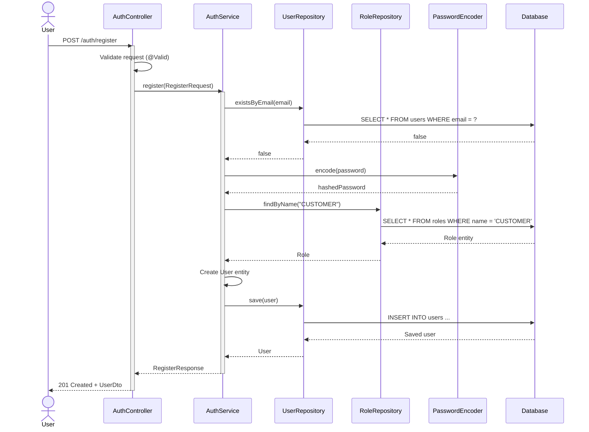

**Error Cases**:
- Email already exists → 409 Conflict
- Validation errors → 400 Bad Request

---

### 1.2. User Login & JWT Generation

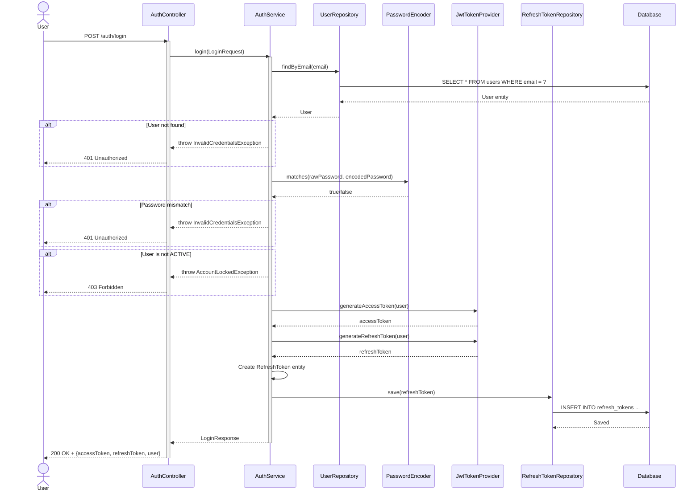

---

### 1.3. Refresh Token Flow

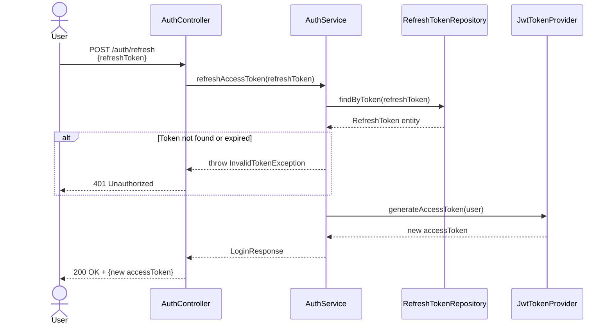

---

### 1.4. Authenticated Request Flow

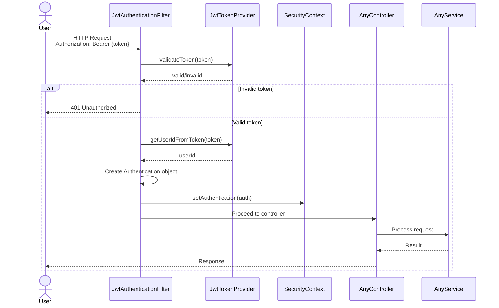

---

## 2. Product & Catalog Flows

### 2.1. Browse Products with Filters

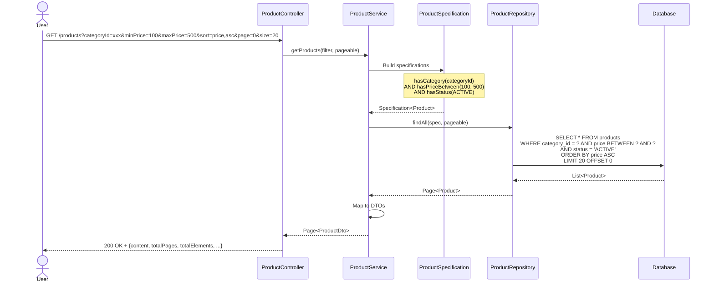

---

### 2.2. View Product Detail

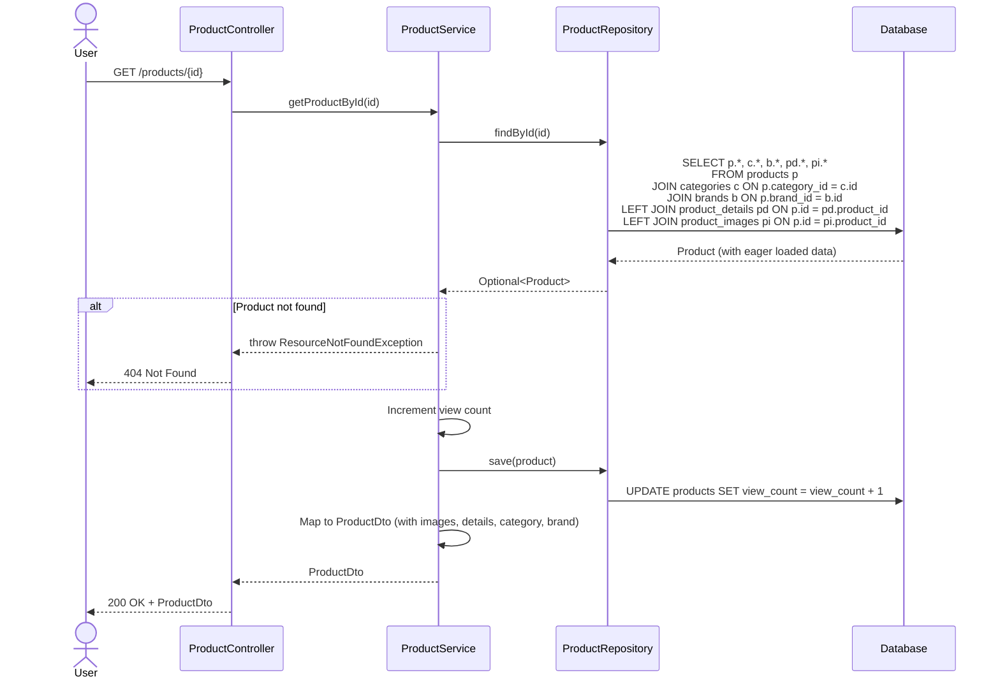

---

## 3. Shopping Cart Flows

### 3.1. Add Product to Cart

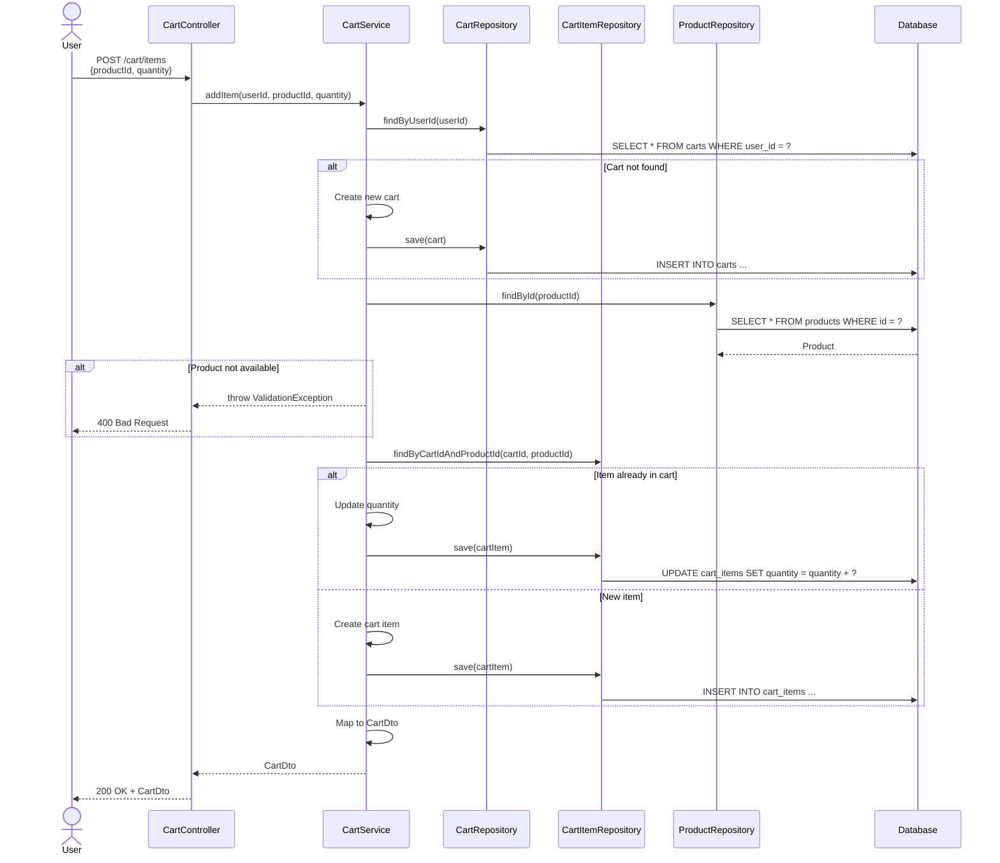

---

## 4. Order & Checkout Flows

### 4.1. Create Order from Cart (Authenticated User)

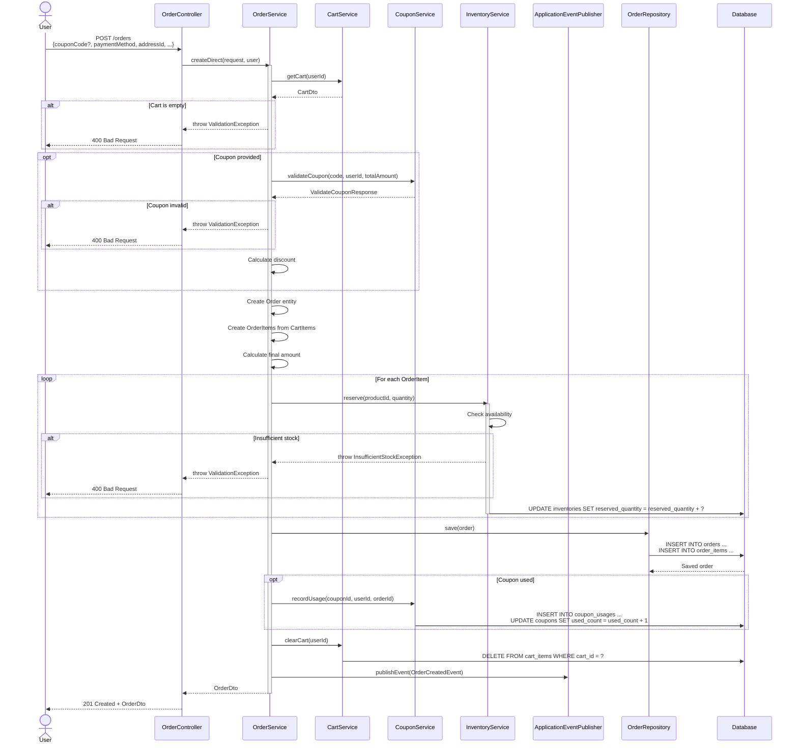

---

### 4.2. Guest Checkout

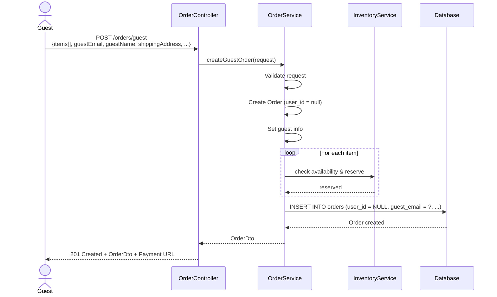

---

## 5. Payment Processing Flows

### 5.1. MoMo Payment Flow

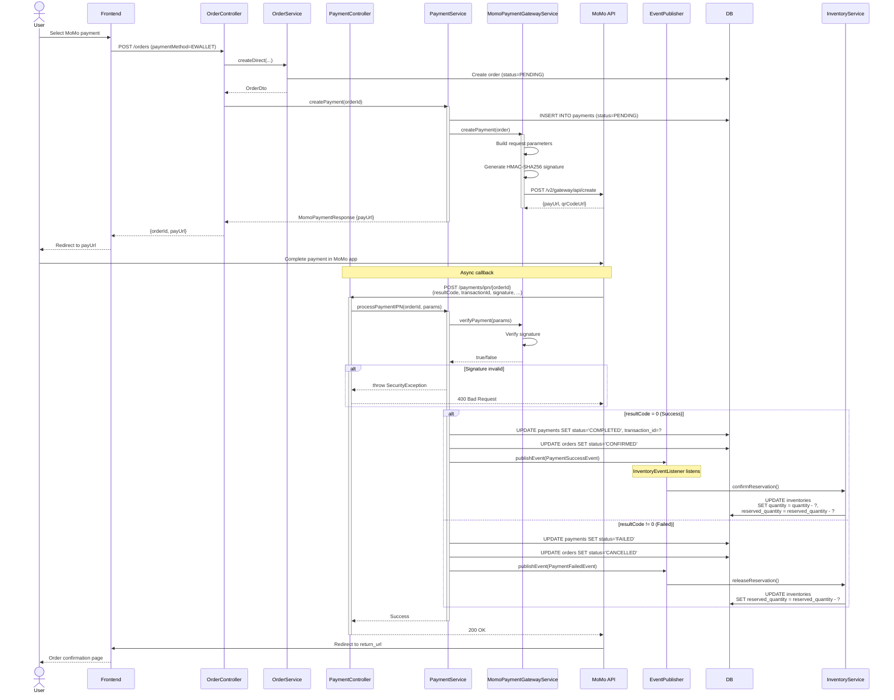

---

### 5.2. Payment Callback (Return URL)

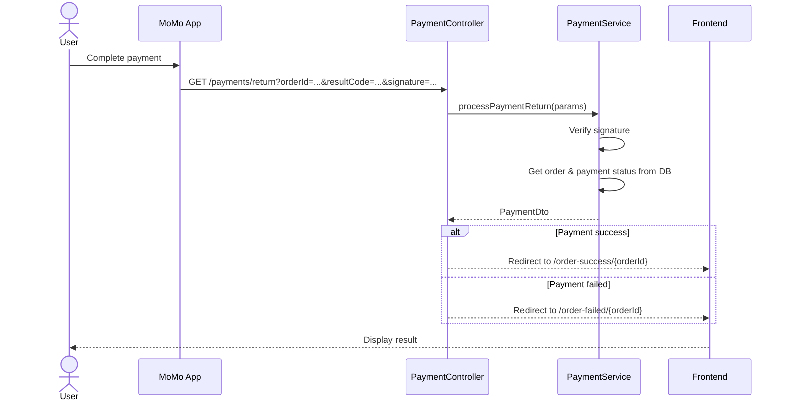

---

## 6. Coupon & Promotion Flows

### 6.1. Validate Coupon

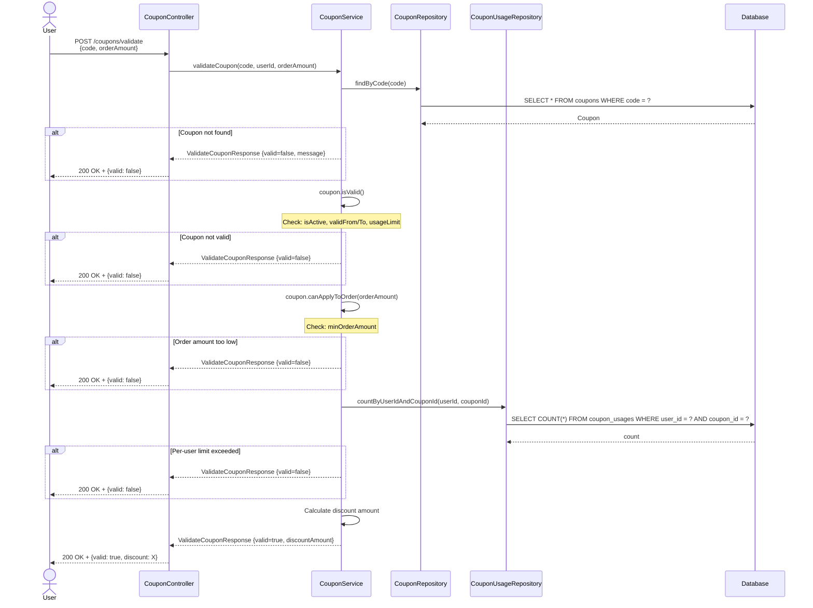

---

## 7. Event-Driven Flows

### 7.1. Order Created Event Flow

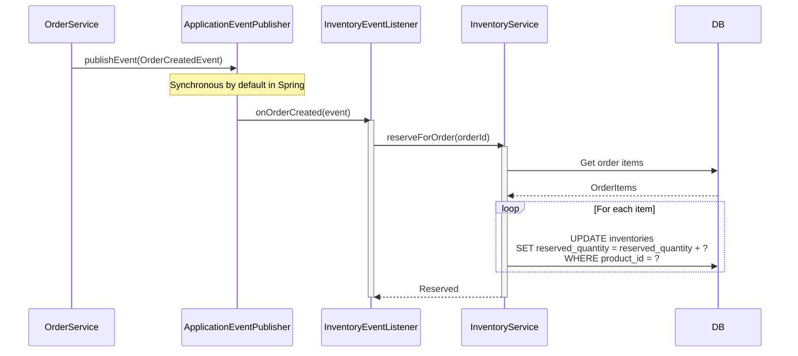

---

### 7.2. Payment Success Event Flow

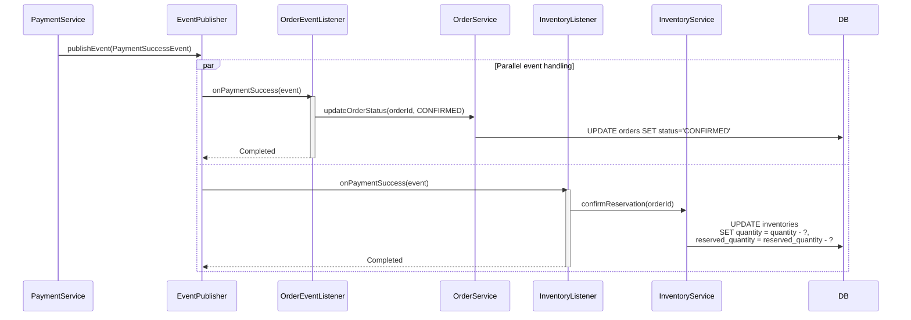

---

### 7.3. Payment Failed Event Flow

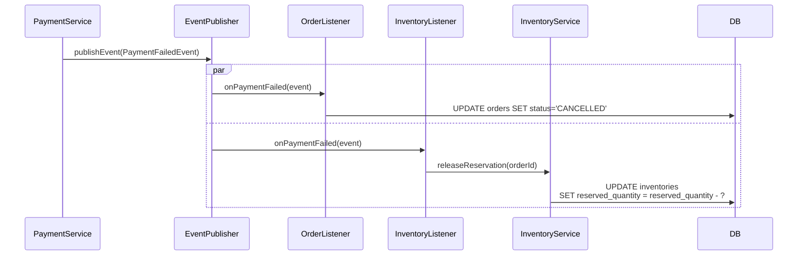

---

## 8. Review & Wishlist Flows

### 8.1. Submit Product Review

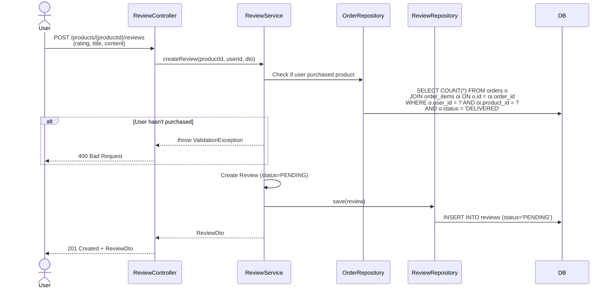

---

## 9. Kết Luận

Sequence diagrams mô tả các flows quan trọng:

✅ **Authentication**: Registration, login, JWT refresh

✅ **Product Browsing**: Filter, search, view details

✅ **Shopping**: Add to cart, update cart

✅ **Checkout**: Create order, apply coupon, reserve inventory

✅ **Payment**: MoMo integration, callback handling, event publishing

✅ **Promotions**: Validate and apply coupons

✅ **Event-Driven**: Async processing với domain events

Các flows được thiết kế với:
- Error handling
- Transaction boundaries
- Event-driven architecture
- Security validation
- Business rule enforcement

---

**[◀ Quay lại Components](components.md)** | **[Tiếp theo: Database ▶](database.md)**
