# CHƯƠNG 3: PHÂN TÍCH THIẾT KẾ - ĐẶC TẢ USE CASE

## 3.2. Biểu đồ Use Case và đặc tả chi tiết

### 3.2.1. Biểu đồ Use Case tổng quan

```plantuml
@startuml
left to right direction
skinparam actorStyle awesome

actor "Guest" as Guest
actor "Customer" as Customer
actor "Admin" as Admin
actor "MoMo Gateway" as MoMo
rectangle "Watchify E-commerce System" {
  
  package "Authentication & Profile" {
    usecase (UC01: Register Account) as UC01
    usecase (UC02: Login) as UC02
    usecase (UC03: Logout) as UC03
    usecase (UC04: View Profile) as UC04
    usecase (UC05: Update Profile) as UC05
    usecase (UC06: Change Password) as UC06
  }
  
  package "Product Browsing" {
    usecase (UC07: Browse Products) as UC07
    usecase (UC08: View Product Details) as UC08
    usecase (UC09: Search Products) as UC09
    usecase (UC10: Filter by Category) as UC10
    usecase (UC11: Filter by Brand) as UC11
    usecase (UC12: View Featured Products) as UC12
    usecase (UC13: View New Products) as UC13
  }
  
  package "Reviews" {
    usecase (UC14: View Product Reviews) as UC14
    usecase (UC15: Write Review) as UC15
    usecase (UC16: Mark Review Helpful) as UC16
    usecase (UC17: View My Reviews) as UC17
  }
  
  package "Shopping Cart" {
    usecase (UC18: View Cart) as UC18
    usecase (UC19: Add to Cart) as UC19
    usecase (UC20: Update Cart Item) as UC20
    usecase (UC21: Remove from Cart) as UC21
    usecase (UC22: Clear Cart) as UC22
  }
  
  package "Wishlist" {
    usecase (UC23: View Wishlist) as UC23
    usecase (UC24: Add to Wishlist) as UC24
    usecase (UC25: Remove from Wishlist) as UC25
    usecase (UC26: Update Wishlist Preferences) as UC26
  }
  
  package "Address Management" {
    usecase (UC27: View Addresses) as UC27
    usecase (UC28: Add Address) as UC28
    usecase (UC29: Update Address) as UC29
    usecase (UC30: Delete Address) as UC30
    usecase (UC31: Set Default Address) as UC31
  }
  
  package "Order & Payment" {
    usecase (UC32: Checkout Order) as UC32
    usecase (UC33: Apply Coupon) as UC33
    usecase (UC34: Make Payment) as UC34
    usecase (UC35: View Order History) as UC35
    usecase (UC36: View Order Details) as UC36
  }
  
  package "Admin - Product Management" {
    usecase (UC37: View All Products) as UC37
    usecase (UC38: Create Product) as UC38
    usecase (UC39: Update Product) as UC39
    usecase (UC40: Delete Product) as UC40
  }
  
  package "Admin - Category Management" {
    usecase (UC41: View All Categories) as UC41
    usecase (UC42: Create Category) as UC42
    usecase (UC43: Update Category) as UC43
    usecase (UC44: Delete Category) as UC44
  }
  
  package "Admin - Brand Management" {
    usecase (UC45: View All Brands) as UC45
    usecase (UC46: Create Brand) as UC46
    usecase (UC47: Update Brand) as UC47
    usecase (UC48: Delete Brand) as UC48
    usecase (UC49: Toggle Brand Visibility) as UC49
  }
  
  package "Admin - Order Management" {
    usecase (UC50: View All Orders) as UC50
    usecase (UC51: View Order Details) as UC51
    usecase (UC52: Update Order Status) as UC52
  }
  
  package "Admin - User Management" {
    usecase (UC53: View All Users) as UC53
    usecase (UC54: Lock User Account) as UC54
    usecase (UC55: Unlock User Account) as UC55
    usecase (UC56: Toggle User Lock) as UC56
  }
  
  package "Admin - Review Management" {
    usecase (UC57: View All Reviews) as UC57
    usecase (UC58: View Pending Reviews) as UC58
    usecase (UC59: Approve Review) as UC59
    usecase (UC60: Reject Review) as UC60
  }
  
  package "Admin - Coupon Management" {
    usecase (UC61: View All Coupons) as UC61
    usecase (UC62: Create Coupon) as UC62
    usecase (UC63: Update Coupon) as UC63
    usecase (UC64: Delete Coupon) as UC64
    usecase (UC65: Toggle Coupon Status) as UC65
    usecase (UC66: View Coupon Statistics) as UC66
  }
  
  package "Admin - Analytics & Inventory" {
    usecase (UC67: View Dashboard Analytics) as UC67
    usecase (UC68: Manage Inventory) as UC68
    usecase (UC69: View Inventory Status) as UC69
  }
}

' Guest relationships
Guest --> UC01
Guest --> UC02
Guest --> UC07
Guest --> UC08
Guest --> UC09
Guest --> UC10
Guest --> UC11
Guest --> UC12
Guest --> UC13
Guest --> UC14

' Customer relationships (inherits from Guest)
Customer --> UC03
Customer --> UC04
Customer --> UC05
Customer --> UC06
Customer --> UC15
Customer --> UC16
Customer --> UC17
Customer --> UC18
Customer --> UC19
Customer --> UC20
Customer --> UC21
Customer --> UC22
Customer --> UC23
Customer --> UC24
Customer --> UC25
Customer --> UC26
Customer --> UC27
Customer --> UC28
Customer --> UC29
Customer --> UC30
Customer --> UC31
Customer --> UC32
Customer --> UC33
Customer --> UC34
Customer --> UC35
Customer --> UC36

' Admin relationships
Admin --> UC37
Admin --> UC38
Admin --> UC39
Admin --> UC40
Admin --> UC41
Admin --> UC42
Admin --> UC43
Admin --> UC44
Admin --> UC45
Admin --> UC46
Admin --> UC47
Admin --> UC48
Admin --> UC49
Admin --> UC50
Admin --> UC51
Admin --> UC52
Admin --> UC53
Admin --> UC54
Admin --> UC55
Admin --> UC56
Admin --> UC57
Admin --> UC58
Admin --> UC59
Admin --> UC60
Admin --> UC61
Admin --> UC62
Admin --> UC63
Admin --> UC64
Admin --> UC65
Admin --> UC66
Admin --> UC67
Admin --> UC68
Admin --> UC69

' External system
UC34 ..> MoMo : <<communicate>>

@enduml
```

### 3.2.2. Bảng tổng hợp các Use Cases

| ID | Tên Use Case | Actor | Mức độ ưu tiên | Mô tả ngắn |
|---|---|---|---|---|
| UC01 | Register Account | Guest | Cao | Đăng ký tài khoản mới |
| UC02 | Login | Guest | Cao | Đăng nhập vào hệ thống |
| UC03 | Logout | Customer | Trung bình | Đăng xuất khỏi hệ thống |
| UC04 | View Profile | Customer | Trung bình | Xem thông tin cá nhân |
| UC05 | Update Profile | Customer | Trung bình | Cập nhật thông tin cá nhân |
| UC06 | Change Password | Customer | Trung bình | Đổi mật khẩu |
| UC07 | Browse Products | Guest | Cao | Duyệt danh sách sản phẩm |
| UC08 | View Product Details | Guest | Cao | Xem chi tiết sản phẩm |
| UC09 | Search Products | Guest | Cao | Tìm kiếm sản phẩm |
| UC10 | Filter by Category | Guest | Trung bình | Lọc sản phẩm theo danh mục |
| UC11 | Filter by Brand | Guest | Trung bình | Lọc sản phẩm theo thương hiệu |
| UC12 | View Featured Products | Guest | Trung bình | Xem sản phẩm nổi bật |
| UC13 | View New Products | Guest | Trung bình | Xem sản phẩm mới |
| UC14 | View Product Reviews | Guest | Trung bình | Xem đánh giá sản phẩm |
| UC15 | Write Review | Customer | Cao | Viết đánh giá sản phẩm |
| UC16 | Mark Review Helpful | Customer | Thấp | Đánh dấu đánh giá hữu ích |
| UC17 | View My Reviews | Customer | Thấp | Xem các đánh giá của tôi |
| UC18 | View Cart | Customer | Cao | Xem giỏ hàng |
| UC19 | Add to Cart | Customer | Cao | Thêm sản phẩm vào giỏ |
| UC20 | Update Cart Item | Customer | Cao | Cập nhật số lượng trong giỏ |
| UC21 | Remove from Cart | Customer | Cao | Xóa sản phẩm khỏi giỏ |
| UC22 | Clear Cart | Customer | Thấp | Xóa toàn bộ giỏ hàng |
| UC23 | View Wishlist | Customer | Trung bình | Xem danh sách yêu thích |
| UC24 | Add to Wishlist | Customer | Trung bình | Thêm vào yêu thích |
| UC25 | Remove from Wishlist | Customer | Trung bình | Xóa khỏi yêu thích |
| UC26 | Update Wishlist Preferences | Customer | Thấp | Cập nhật tùy chọn yêu thích |
| UC27 | View Addresses | Customer | Trung bình | Xem danh sách địa chỉ |
| UC28 | Add Address | Customer | Cao | Thêm địa chỉ mới |
| UC29 | Update Address | Customer | Trung bình | Cập nhật địa chỉ |
| UC30 | Delete Address | Customer | Trung bình | Xóa địa chỉ |
| UC31 | Set Default Address | Customer | Trung bình | Đặt địa chỉ mặc định |
| UC32 | Checkout Order | Customer | Cao | Thanh toán đơn hàng |
| UC33 | Apply Coupon | Customer | Cao | Áp dụng mã giảm giá |
| UC34 | Make Payment | Customer | Cao | Thực hiện thanh toán |
| UC35 | View Order History | Customer | Cao | Xem lịch sử đơn hàng |
| UC36 | View Order Details | Customer | Cao | Xem chi tiết đơn hàng |
| UC37 | View All Products | Admin | Cao | Xem danh sách sản phẩm (Admin) |
| UC38 | Create Product | Admin | Cao | Tạo sản phẩm mới |
| UC39 | Update Product | Admin | Cao | Cập nhật sản phẩm |
| UC40 | Delete Product | Admin | Cao | Xóa sản phẩm |
| UC41 | View All Categories | Admin | Trung bình | Xem danh sách danh mục |
| UC42 | Create Category | Admin | Trung bình | Tạo danh mục mới |
| UC43 | Update Category | Admin | Trung bình | Cập nhật danh mục |
| UC44 | Delete Category | Admin | Trung bình | Xóa danh mục |
| UC45 | View All Brands | Admin | Trung bình | Xem danh sách thương hiệu |
| UC46 | Create Brand | Admin | Trung bình | Tạo thương hiệu mới |
| UC47 | Update Brand | Admin | Trung bình | Cập nhật thương hiệu |
| UC48 | Delete Brand | Admin | Trung bình | Xóa thương hiệu |
| UC49 | Toggle Brand Visibility | Admin | Thấp | Bật/Tắt hiển thị thương hiệu |
| UC50 | View All Orders | Admin | Cao | Xem tất cả đơn hàng |
| UC51 | View Order Details | Admin | Cao | Xem chi tiết đơn hàng (Admin) |
| UC52 | Update Order Status | Admin | Cao | Cập nhật trạng thái đơn hàng |
| UC53 | View All Users | Admin | Trung bình | Xem danh sách người dùng |
| UC54 | Lock User Account | Admin | Trung bình | Khóa tài khoản người dùng |
| UC55 | Unlock User Account | Admin | Trung bình | Mở khóa tài khoản |
| UC56 | Toggle User Lock | Admin | Trung bình | Bật/Tắt khóa tài khoản |
| UC57 | View All Reviews | Admin | Trung bình | Xem tất cả đánh giá |
| UC58 | View Pending Reviews | Admin | Cao | Xem đánh giá chờ duyệt |
| UC59 | Approve Review | Admin | Cao | Phê duyệt đánh giá |
| UC60 | Reject Review | Admin | Cao | Từ chối đánh giá |
| UC61 | View All Coupons | Admin | Trung bình | Xem danh sách mã giảm giá |
| UC62 | Create Coupon | Admin | Cao | Tạo mã giảm giá mới |
| UC63 | Update Coupon | Admin | Trung bình | Cập nhật mã giảm giá |
| UC64 | Delete Coupon | Admin | Trung bình | Xóa mã giảm giá |
| UC65 | Toggle Coupon Status | Admin | Thấp | Bật/Tắt mã giảm giá |
| UC66 | View Coupon Statistics | Admin | Trung bình | Xem thống kê mã giảm giá |
| UC67 | View Dashboard Analytics | Admin | Cao | Xem bảng thống kê tổng quan |
| UC68 | Manage Inventory | Admin | Cao | Quản lý tồn kho |
| UC69 | View Inventory Status | Admin | Cao | Xem trạng thái tồn kho |

---

## 3.2.3. Đặc tả chi tiết các Use Cases

### UC01: Register Account (Đăng ký tài khoản)

#### Đặc tả Use Case

| Thành phần | Mô tả |
|---|---|
| **Use Case ID** | UC01 |
| **Tên Use Case** | Register Account (Đăng ký tài khoản) |
| **Actor** | Guest |
| **Mô tả** | Người dùng chưa có tài khoản đăng ký tài khoản mới để trở thành Customer |
| **Tiền điều kiện** | - Người dùng chưa đăng nhập<br>- Email chưa được sử dụng trong hệ thống |
| **Hậu điều kiện** | - Tài khoản mới được tạo với role CUSTOMER<br>- Thông tin được lưu vào database<br>- Người dùng có thể đăng nhập |
| **Luồng chính** | 1. Guest truy cập trang đăng ký<br>2. Hệ thống hiển thị form đăng ký<br>3. Guest nhập thông tin: email, password, confirm password, họ tên, số điện thoại<br>4. Guest click nút "Đăng ký"<br>5. Hệ thống validate dữ liệu đầu vào<br>6. Hệ thống kiểm tra email chưa tồn tại<br>7. Hệ thống mã hóa password bằng BCrypt<br>8. Hệ thống tạo User entity với role CUSTOMER<br>9. Hệ thống lưu vào database<br>10. Hệ thống hiển thị thông báo thành công<br>11. Hệ thống chuyển hướng đến trang đăng nhập |
| **Luồng thay thế** | **3a. Dữ liệu không hợp lệ**<br>&nbsp;&nbsp;1. Hệ thống hiển thị lỗi validation (email sai format, password < 6 ký tự, confirm password không khớp)<br>&nbsp;&nbsp;2. Quay lại bước 3<br><br>**6a. Email đã tồn tại**<br>&nbsp;&nbsp;1. Hệ thống hiển thị thông báo "Email đã được sử dụng"<br>&nbsp;&nbsp;2. Quay lại bước 3<br><br>**9a. Lỗi database**<br>&nbsp;&nbsp;1. Hệ thống hiển thị thông báo lỗi<br>&nbsp;&nbsp;2. Rollback transaction<br>&nbsp;&nbsp;3. Quay lại bước 3 |
| **Ngoại lệ** | - Mất kết nối database<br>- Server error |

#### Activity Diagram

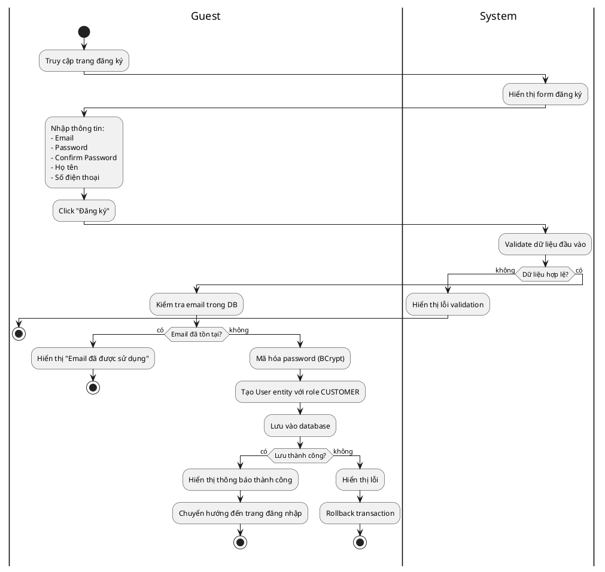

#### Sequence Diagram

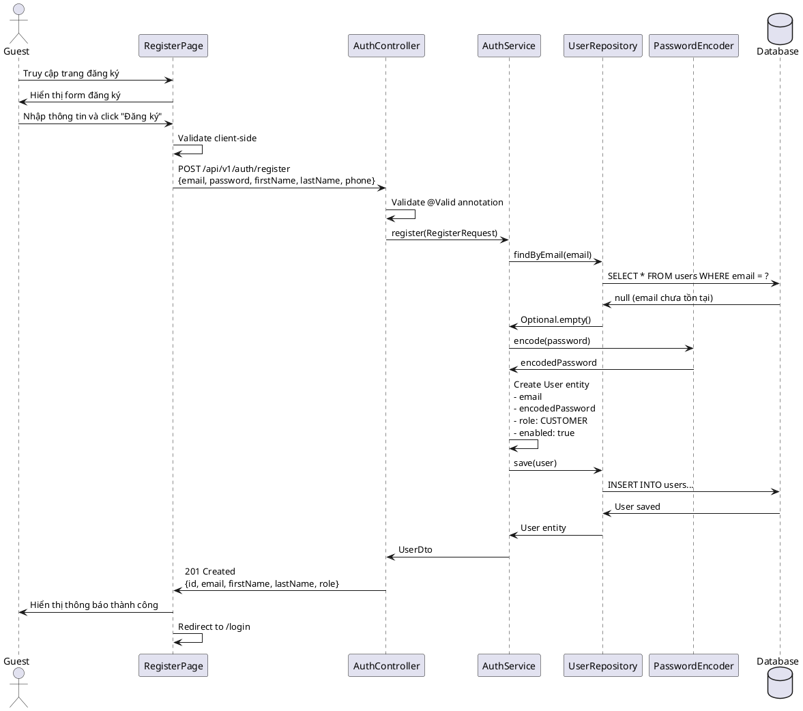

---

### UC02: Login (Đăng nhập)

#### Đặc tả Use Case

| Thành phần | Mô tả |
|---|---|
| **Use Case ID** | UC02 |
| **Tên Use Case** | Login (Đăng nhập) |
| **Actor** | Guest |
| **Mô tả** | Người dùng đăng nhập vào hệ thống bằng email và password |
| **Tiền điều kiện** | - Người dùng đã có tài khoản<br>- Tài khoản chưa bị khóa |
| **Hậu điều kiện** | - Người dùng nhận được JWT access token và refresh token<br>- Session được tạo<br>- Người dùng được chuyển đến trang tương ứng với role |
| **Luồng chính** | 1. Guest truy cập trang đăng nhập<br>2. Hệ thống hiển thị form đăng nhập<br>3. Guest nhập email và password<br>4. Guest click nút "Đăng nhập"<br>5. Hệ thống validate dữ liệu<br>6. Hệ thống xác thực thông tin đăng nhập<br>7. Hệ thống generate JWT access token (expires 1h)<br>8. Hệ thống generate refresh token (expires 7 days)<br>9. Hệ thống lưu refresh token vào database<br>10. Hệ thống trả về tokens và user info<br>11. Client lưu tokens vào localStorage<br>12. Hệ thống chuyển hướng theo role (Admin -> Dashboard, Customer -> Home) |
| **Luồng thay thế** | **3a. Dữ liệu không hợp lệ**<br>&nbsp;&nbsp;1. Hệ thống hiển thị lỗi validation<br>&nbsp;&nbsp;2. Quay lại bước 3<br><br>**6a. Email không tồn tại hoặc password sai**<br>&nbsp;&nbsp;1. Hệ thống hiển thị "Email hoặc mật khẩu không đúng"<br>&nbsp;&nbsp;2. Quay lại bước 3<br><br>**6b. Tài khoản bị khóa**<br>&nbsp;&nbsp;1. Hệ thống hiển thị "Tài khoản đã bị khóa"<br>&nbsp;&nbsp;2. Kết thúc |
| **Ngoại lệ** | - Mất kết nối database<br>- JWT generation failed |

#### Activity Diagram

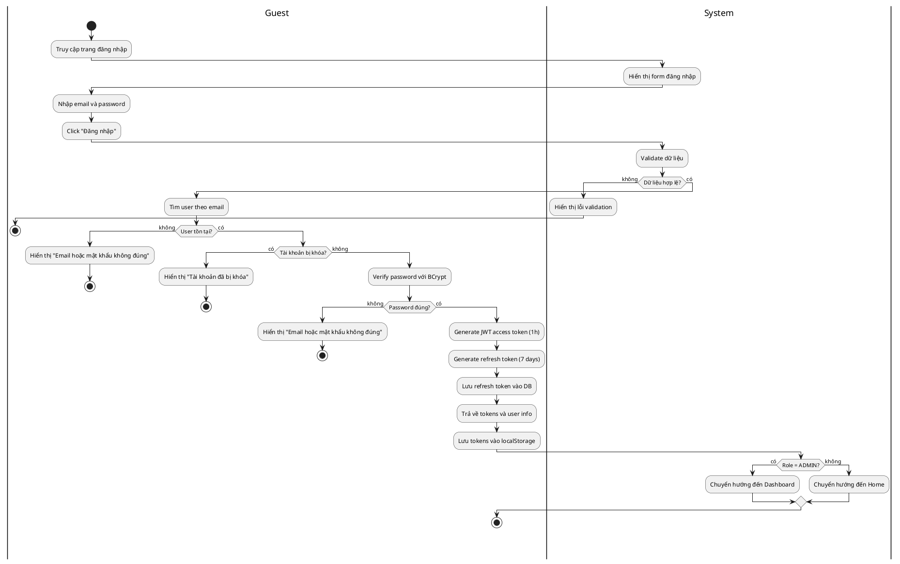

#### Sequence Diagram

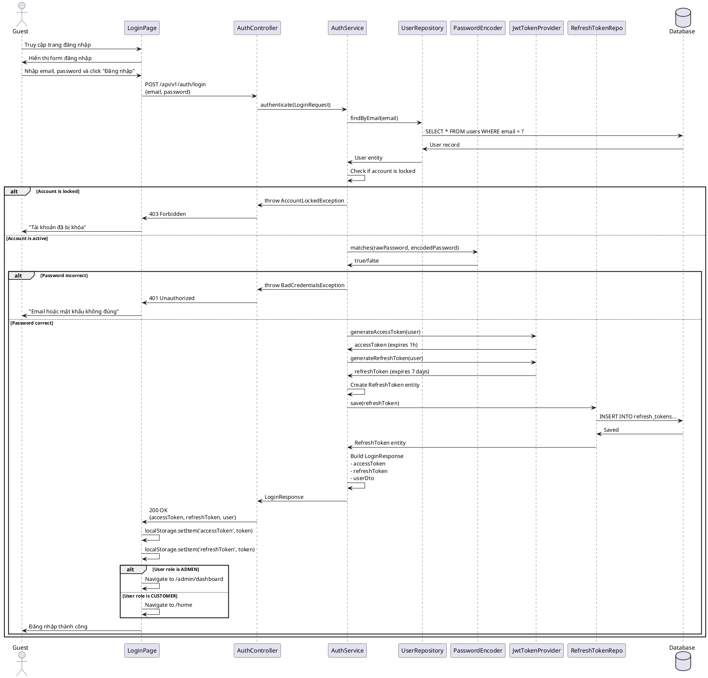

---

### UC03: Logout (Đăng xuất)

#### Đặc tả Use Case

| Thành phần | Mô tả |
|---|---|
| **Use Case ID** | UC03 |
| **Tên Use Case** | Logout (Đăng xuất) |
| **Actor** | Customer |
| **Mô tả** | Người dùng đăng xuất khỏi hệ thống |
| **Tiền điều kiện** | - Người dùng đã đăng nhập<br>- Có refresh token hợp lệ |
| **Hậu điều kiện** | - Refresh token bị xóa khỏi database<br>- Access token và refresh token bị xóa khỏi client<br>- Session kết thúc |
| **Luồng chính** | 1. Customer click nút "Đăng xuất"<br>2. Hệ thống gửi request với refresh token<br>3. Hệ thống xóa refresh token khỏi database<br>4. Hệ thống trả về thành công<br>5. Client xóa tokens khỏi localStorage<br>6. Hệ thống chuyển hướng về trang login |
| **Luồng thay thế** | **3a. Refresh token không tồn tại**<br>&nbsp;&nbsp;1. Hệ thống vẫn trả về thành công<br>&nbsp;&nbsp;2. Tiếp tục bước 5 |
| **Ngoại lệ** | - Mất kết nối database |

#### Activity Diagram

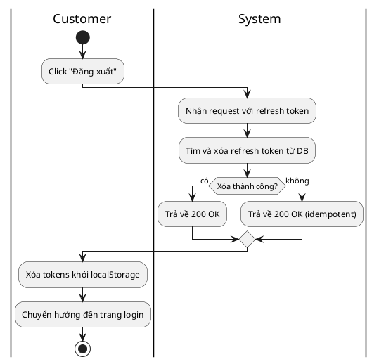

#### Sequence Diagram

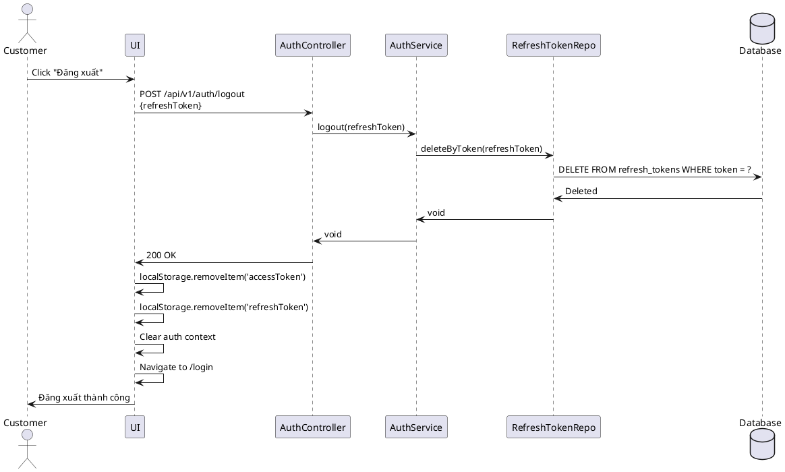

---

### UC07: Browse Products (Duyệt sản phẩm)

#### Đặc tả Use Case

| Thành phần | Mô tả |
|---|---|
| **Use Case ID** | UC07 |
| **Tên Use Case** | Browse Products (Duyệt sản phẩm) |
| **Actor** | Guest, Customer |
| **Mô tả** | Người dùng xem danh sách sản phẩm với các tùy chọn lọc và sắp xếp |
| **Tiền điều kiện** | Không có |
| **Hậu điều kiện** | Danh sách sản phẩm được hiển thị theo tiêu chí |
| **Luồng chính** | 1. User truy cập trang danh sách sản phẩm<br>2. Hệ thống hiển thị các bộ lọc (category, brand, price range, sort)<br>3. Hệ thống query database với pagination (page=0, size=12)<br>4. Hệ thống trả về danh sách sản phẩm kèm metadata (total, pages)<br>5. Hệ thống hiển thị sản phẩm dạng grid<br>6. User có thể chọn các bộ lọc<br>7. Hệ thống cập nhật danh sách theo bộ lọc<br>8. User có thể chuyển trang<br>9. Hệ thống load trang mới |
| **Luồng thay thế** | **4a. Không có sản phẩm nào**<br>&nbsp;&nbsp;1. Hệ thống hiển thị "Không tìm thấy sản phẩm"<br>&nbsp;&nbsp;2. Hiển thị gợi ý sản phẩm khác |
| **Ngoại lệ** | - Mất kết nối database<br>- Server error |

#### Activity Diagram

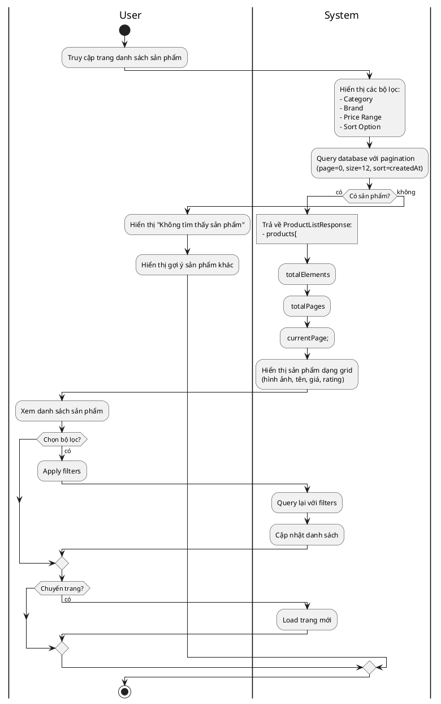

#### Sequence Diagram

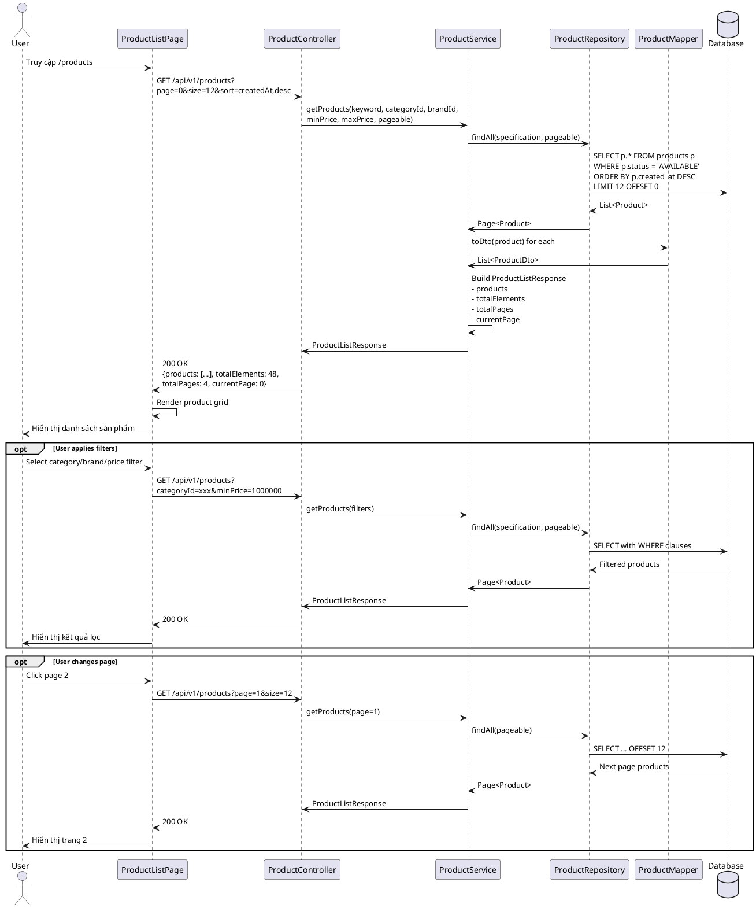

---

### UC08: View Product Details (Xem chi tiết sản phẩm)

#### Đặc tả Use Case

| Thành phần | Mô tả |
|---|---|
| **Use Case ID** | UC08 |
| **Tên Use Case** | View Product Details (Xem chi tiết sản phẩm) |
| **Actor** | Guest, Customer |
| **Mô tả** | Người dùng xem thông tin chi tiết của một sản phẩm |
| **Tiền điều kiện** | Sản phẩm tồn tại trong hệ thống |
| **Hậu điều kiện** | Thông tin chi tiết sản phẩm được hiển thị |
| **Luồng chính** | 1. User click vào sản phẩm trong danh sách<br>2. Hệ thống lấy slug/id từ URL<br>3. Hệ thống query product details từ database<br>4. Hệ thống query product images<br>5. Hệ thống query product reviews<br>6. Hệ thống query related products<br>7. Hệ thống query inventory status<br>8. Hệ thống hiển thị đầy đủ thông tin:<br>&nbsp;&nbsp;- Hình ảnh sản phẩm (carousel)<br>&nbsp;&nbsp;- Tên, SKU, Brand<br>&nbsp;&nbsp;- Giá, discount<br>&nbsp;&nbsp;- Rating và số lượng reviews<br>&nbsp;&nbsp;- Mô tả chi tiết<br>&nbsp;&nbsp;- Thông số kỹ thuật<br>&nbsp;&nbsp;- Trạng thái tồn kho<br>&nbsp;&nbsp;- Reviews<br>&nbsp;&nbsp;- Sản phẩm liên quan |
| **Luồng thay thế** | **3a. Sản phẩm không tồn tại**<br>&nbsp;&nbsp;1. Hệ thống trả về 404<br>&nbsp;&nbsp;2. Hiển thị trang "Sản phẩm không tồn tại"<br><br>**7a. Hết hàng**<br>&nbsp;&nbsp;1. Hiển thị "Tạm hết hàng"<br>&nbsp;&nbsp;2. Disable nút "Thêm vào giỏ" |
| **Ngoại lệ** | - Mất kết nối database |

#### Activity Diagram

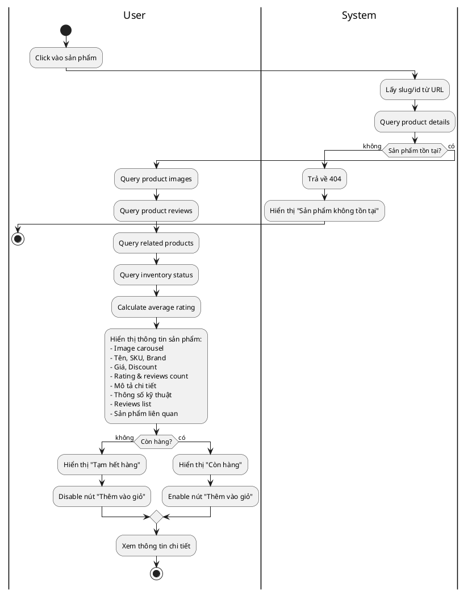

#### Sequence Diagram

```plantuml
@startuml
actor User
participant "ProductDetailPage" as UI
participant "ProductController" as ProdCtrl
participant "ProductService" as ProdSvc
participant "ReviewController" as ReviewCtrl
participant "ReviewService" as ReviewSvc
participant "InventoryController" as InvCtrl
participant "InventoryService" as InvSvc
participant "ProductRepository" as ProdRepo
database "Database" as DB

User -> UI: Click vào sản phẩm
UI -> UI: Navigate to /products/{slug}

UI -> ProdCtrl: GET /api/v1/products/slug/{slug}

ProdCtrl -> ProdSvc: getProductBySlug(slug)
ProdSvc -> ProdRepo: findBySlug(slug)
ProdRepo -> DB: SELECT p.*, pd.*, pi.*\nFROM products p\nLEFT JOIN product_details pd ON p.id = pd.product_id\nLEFT JOIN product_images pi ON p.id = pi.product_id\nWHERE p.slug = ?

alt Product not found
  DB -> ProdRepo: empty
  ProdRepo -> ProdSvc: Optional.empty()
  ProdSvc -> ProdCtrl: throw ProductNotFoundException
  ProdCtrl -> UI: 404 Not Found
  UI -> User: "Sản phẩm không tồn tại"
else Product found
  DB -> ProdRepo: Product with details and images
  ProdRepo -> ProdSvc: Product entity
  
  ProdSvc -> ProdRepo: findRelatedProducts(categoryId, currentProductId)
  ProdRepo -> DB: SELECT ... WHERE category_id = ? AND id != ? LIMIT 4
  DB -> ProdRepo: Related products
  
  ProdSvc -> ProdSvc: Map to ProductDto
  ProdSvc -> ProdCtrl: ProductDto
  ProdCtrl -> UI: 200 OK {product details}
  
  par Get reviews
    UI -> ReviewCtrl: GET /api/v1/reviews/products/{productId}
    ReviewCtrl -> ReviewSvc: getProductReviews(productId)
    ReviewSvc -> DB: SELECT ... WHERE product_id = ? AND status = 'APPROVED'
    DB -> ReviewSvc: Reviews
    ReviewSvc -> ReviewCtrl: List<ReviewDto>
    ReviewCtrl -> UI: 200 OK {reviews}
  
  and Get inventory
    UI -> InvCtrl: GET /api/v1/inventory/product/{productId}
    InvCtrl -> InvSvc: getInventoryByProductId(productId)
    InvSvc -> DB: SELECT ... WHERE product_id = ?
    DB -> InvSvc: Inventory
    InvSvc -> InvCtrl: InventoryDto
    InvCtrl -> UI: 200 OK {availableQuantity, inStock}
  end
  
  UI -> UI: Render product details:\n- Image carousel\n- Product info\n- Technical specs\n- Reviews\n- Related products
  
  alt Product in stock
    UI -> UI: Show "Còn hàng"
    UI -> UI: Enable "Thêm vào giỏ" button
  else Product out of stock
    UI -> UI: Show "Tạm hết hàng"
    UI -> UI: Disable "Thêm vào giỏ" button
  end
  
  UI -> User: Hiển thị chi tiết sản phẩm
end

@enduml
```

---

### UC09: Search Products (Tìm kiếm sản phẩm)

#### Đặc tả Use Case

| Thành phần | Mô tả |
|---|---|
| **Use Case ID** | UC09 |
| **Tên Use Case** | Search Products (Tìm kiếm sản phẩm) |
| **Actor** | Guest, Customer |
| **Mô tả** | Người dùng tìm kiếm sản phẩm theo từ khóa |
| **Tiền điều kiện** | Không có |
| **Hậu điều kiện** | Kết quả tìm kiếm được hiển thị |
| **Luồng chính** | 1. User nhập từ khóa vào ô tìm kiếm<br>2. User nhấn Enter hoặc click nút tìm kiếm<br>3. Hệ thống query database tìm trong tên và mô tả sản phẩm<br>4. Hệ thống trả về danh sách sản phẩm khớp<br>5. Hệ thống hiển thị kết quả với highlighting từ khóa<br>6. User có thể áp dụng thêm bộ lọc |
| **Luồng thay thế** | **4a. Không tìm thấy kết quả**<br>&nbsp;&nbsp;1. Hiển thị "Không tìm thấy sản phẩm phù hợp"<br>&nbsp;&nbsp;2. Hiển thị gợi ý tìm kiếm khác |
| **Ngoại lệ** | - Từ khóa quá ngắn (< 2 ký tự) |

#### Activity Diagram

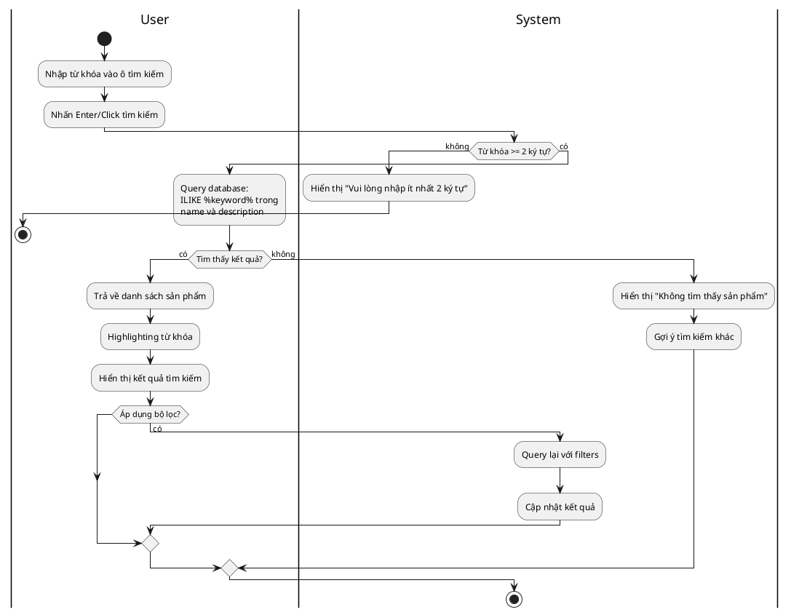

#### Sequence Diagram

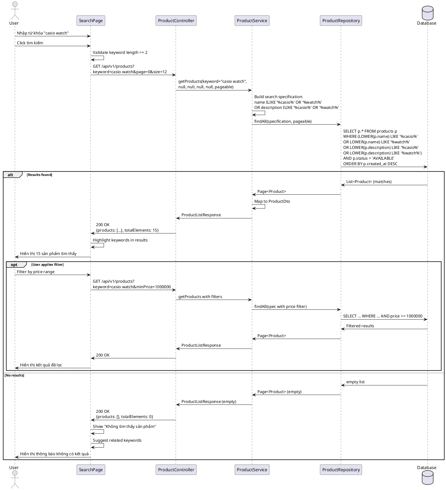

---

### UC15: Write Review (Viết đánh giá sản phẩm)

#### Đặc tả Use Case

| Thành phần | Mô tả |
|---|---|
| **Use Case ID** | UC15 |
| **Tên Use Case** | Write Review (Viết đánh giá sản phẩm) |
| **Actor** | Customer |
| **Mô tả** | Khách hàng viết đánh giá và cho điểm sản phẩm |
| **Tiền điều kiện** | - Customer đã đăng nhập<br>- Có JWT token hợp lệ |
| **Hậu điều kiện** | - Review được lưu với status PENDING<br>- Chờ admin phê duyệt |
| **Luồng chính** | 1. Customer truy cập trang chi tiết sản phẩm<br>2. Customer click "Viết đánh giá"<br>3. Hệ thống hiển thị form đánh giá<br>4. Customer chọn số sao (1-5)<br>5. Customer nhập tiêu đề đánh giá<br>6. Customer nhập nội dung đánh giá<br>7. Customer click "Gửi đánh giá"<br>8. Hệ thống validate dữ liệu<br>9. Hệ thống tạo Review entity với status PENDING<br>10. Hệ thống lưu vào database<br>11. Hệ thống hiển thị "Đánh giá đã được gửi, chờ phê duyệt" |
| **Luồng thay thế** | **8a. Dữ liệu không hợp lệ**<br>&nbsp;&nbsp;1. Hiển thị lỗi (rating bắt buộc, content < 10 ký tự)<br>&nbsp;&nbsp;2. Quay lại bước 4<br><br>**9a. Customer đã đánh giá sản phẩm này**<br>&nbsp;&nbsp;1. Hiển thị "Bạn đã đánh giá sản phẩm này"<br>&nbsp;&nbsp;2. Cho phép chỉnh sửa đánh giá cũ |
| **Ngoại lệ** | - Token hết hạn<br>- Database error |

#### Activity Diagram

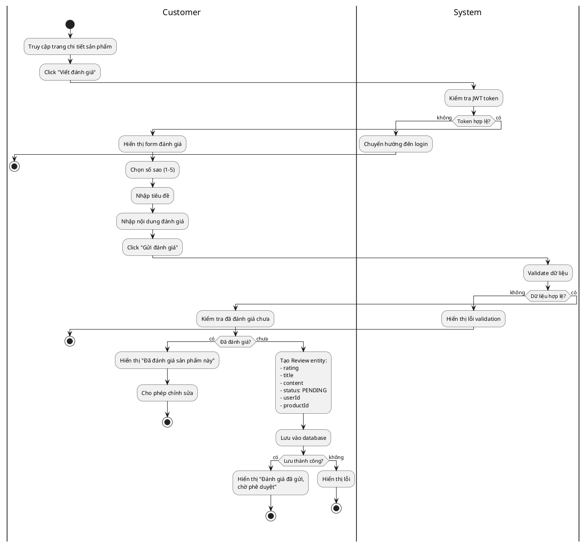

#### Sequence Diagram

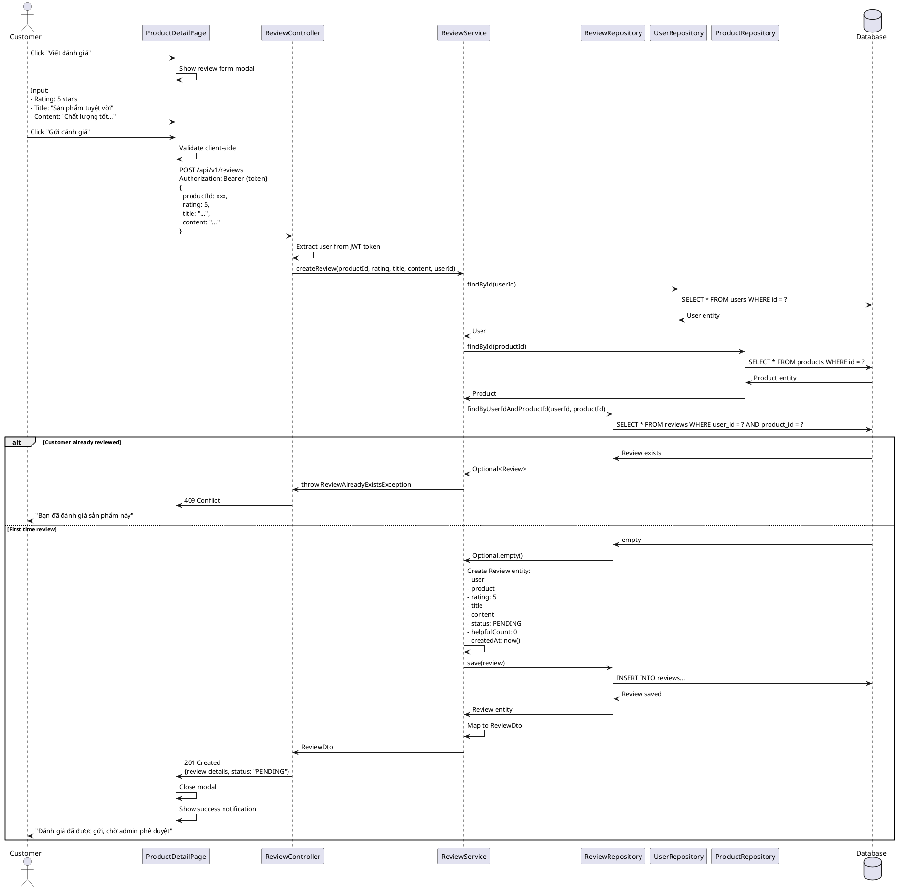

---

### UC19: Add to Cart (Thêm vào giỏ hàng)

#### Đặc tả Use Case

| Thành phần | Mô tả |
|---|---|
| **Use Case ID** | UC19 |
| **Tên Use Case** | Add to Cart (Thêm vào giỏ hàng) |
| **Actor** | Customer |
| **Mô tả** | Khách hàng thêm sản phẩm vào giỏ hàng |
| **Tiền điều kiện** | - Customer đã đăng nhập<br>- Sản phẩm còn hàng |
| **Hậu điều kiện** | - Sản phẩm được thêm vào giỏ hàng<br>- Số lượng giỏ hàng được cập nhật |
| **Luồng chính** | 1. Customer xem sản phẩm<br>2. Customer chọn số lượng<br>3. Customer click "Thêm vào giỏ"<br>4. Hệ thống kiểm tra đăng nhập<br>5. Hệ thống kiểm tra tồn kho<br>6. Hệ thống kiểm tra sản phẩm đã có trong giỏ chưa<br>7a. Nếu chưa có: Tạo CartItem mới<br>7b. Nếu đã có: Cộng dồn số lượng<br>8. Hệ thống lưu vào database<br>9. Hệ thống cập nhật cart count<br>10. Hiển thị thông báo thành công |
| **Luồng thay thế** | **4a. Chưa đăng nhập**<br>&nbsp;&nbsp;1. Chuyển hướng đến trang login<br><br>**5a. Không đủ hàng**<br>&nbsp;&nbsp;1. Hiển thị "Số lượng vượt quá tồn kho"<br><br>**5b. Hết hàng**<br>&nbsp;&nbsp;1. Hiển thị "Sản phẩm tạm hết hàng" |
| **Ngoại lệ** | - Token hết hạn<br>- Database error |

#### Activity Diagram

```plantuml
@startuml
|Customer|
start
:Xem sản phẩm;
:Chọn số lượng;
:Click "Thêm vào giỏ";

|System|
:Kiểm tra JWT token;

if (Đã đăng nhập?) then (không)
  :Chuyển đến trang login;
  |Customer|
  stop
else (có)
  :Kiểm tra tồn kho;
  
  if (Còn đủ hàng?) then (không)
    :Hiển thị "Không đủ hàng";
    |Customer|
    stop
  else (có)
    :Tìm Cart của user;
    
    if (Cart chưa tồn tại?) then (có)
      :Tạo Cart mới;
    endif
    
    :Kiểm tra sản phẩm trong Cart;
    
    if (Sản phẩm đã có?) then (có)
      :Cập nhật quantity:
      oldQty + newQty;
      
      if (Tổng > tồn kho?) then (có)
        :Hiển thị "Vượt quá tồn kho";
        |Customer|
        stop
      else (không)
        :Cập nhật CartItem;
      endif
    else (chưa)
      :Tạo CartItem mới;