# CHƯƠNG 3: PHÂN TÍCH THIẾT KẾ - ĐẶC TẢ USE CASE (PHẦN 2)

## Các Use Cases quan trọng (tiếp theo)

---

### UC19: Add to Cart (Thêm vào giỏ hàng)

#### Bảng đặc tả Use Case

| Thành phần | Mô tả |
|---|---|
| **Use Case ID** | UC19 |
| **Tên Use Case** | Add to Cart (Thêm vào giỏ hàng) |
| **Actor** | Customer |
| **Mô tả** | Khách hàng thêm sản phẩm vào giỏ hàng với số lượng chỉ định |
| **Tiền điều kiện** | - Customer đã đăng nhập - Sản phẩm còn hàng trong kho |
| **Hậu điều kiện** | - Sản phẩm được thêm vào giỏ hàng hoặc cập nhật số lượng nếu đã có - Số lượng giỏ hàng được cập nhật |
| **Luồng chính** | 1. Customer xem chi tiết sản phẩm 2. Customer chọn số lượng muốn mua 3. Customer click nút "Thêm vào giỏ" 4. Hệ thống kiểm tra authentication 5. Hệ thống kiểm tra tồn kho 6. Hệ thống tìm giỏ hàng của customer 7. Hệ thống kiểm tra sản phẩm đã có trong giỏ chưa 8a. Nếu chưa có: Tạo CartItem mới với số lượng được chọn 8b. Nếu đã có: Cộng dồn số lượng (oldQty + newQty) 9. Hệ thống lưu vào database 10. Hệ thống cập nhật cart count trong UI 11. Hiển thị thông báo "Đã thêm vào giỏ hàng" |
| **Luồng thay thế** | **4a. Chưa đăng nhập** &nbsp;&nbsp;1. Chuyển hướng đến trang login &nbsp;&nbsp;2. Sau khi login, quay lại sản phẩm  **5a. Không đủ số lượng trong kho** &nbsp;&nbsp;1. Hiển thị "Chỉ còn X sản phẩm trong kho" &nbsp;&nbsp;2. Đề xuất số lượng tối đa có thể thêm  **5b. Sản phẩm hết hàng** &nbsp;&nbsp;1. Hiển thị "Sản phẩm tạm hết hàng" &nbsp;&nbsp;2. Disable nút "Thêm vào giỏ"  **8b. Tổng số lượng vượt quá tồn kho** &nbsp;&nbsp;1. Hiển thị "Số lượng trong giỏ + số lượng thêm vượt quá tồn kho" &nbsp;&nbsp;2. Đề xuất số lượng có thể thêm |
| **Ngoại lệ** | - Token hết hạn - Database error - Product không tồn tại |

#### Activity Diagram

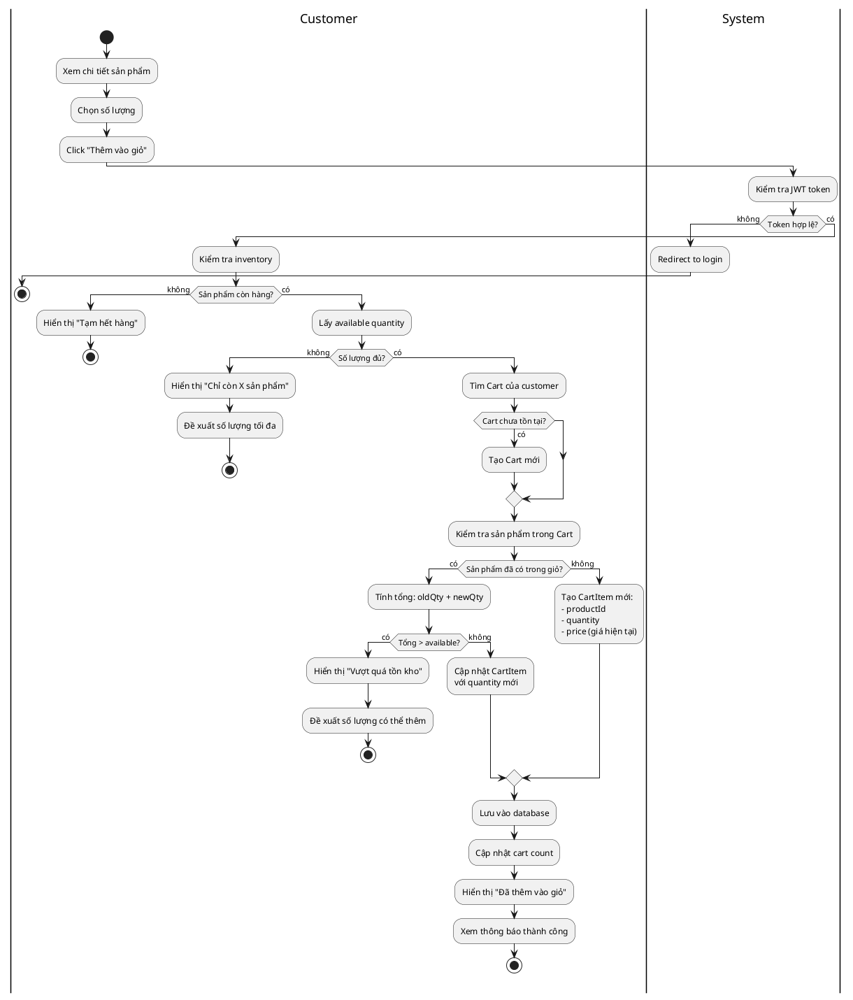
```plantuml
@startuml
|Customer|
start
:Xem chi tiết sản phẩm;
:Chọn số lượng;
:Click "Thêm vào giỏ";

|System|
:Kiểm tra JWT token;

if (Token hợp lệ?) then (không)
  :Redirect to login;
  |Customer|
  stop
else (có)
  :Kiểm tra inventory;
  
  if (Sản phẩm còn hàng?) then (không)
    :Hiển thị "Tạm hết hàng";
    |Customer|
    stop
  else (có)
    :Lấy available quantity;
    
    if (Số lượng đủ?) then (không)
      :Hiển thị "Chỉ còn X sản phẩm";
      :Đề xuất số lượng tối đa;
      |Customer|
      stop
    else (có)
      :Tìm Cart của customer;
      
      if (Cart chưa tồn tại?) then (có)
        :Tạo Cart mới;
      endif
      
      :Kiểm tra sản phẩm trong Cart;
      
      if (Sản phẩm đã có trong giỏ?) then (có)
        :Tính tổng: oldQty + newQty;
        
        if (Tổng > available?) then (có)
          :Hiển thị "Vượt quá tồn kho";
          :Đề xuất số lượng có thể thêm;
          |Customer|
          stop
        else (không)
          :Cập nhật CartItem
          với quantity mới;
        endif
      else (không)
        :Tạo CartItem mới:
        - productId
        - quantity
        - price (giá hiện tại);
      endif
      
      :Lưu vào database;
      :Cập nhật cart count;
      :Hiển thị "Đã thêm vào giỏ";
      
      |Customer|
      :Xem thông báo thành công;
      stop
    endif
  endif
endif

@enduml
```

#### Sequence Diagram

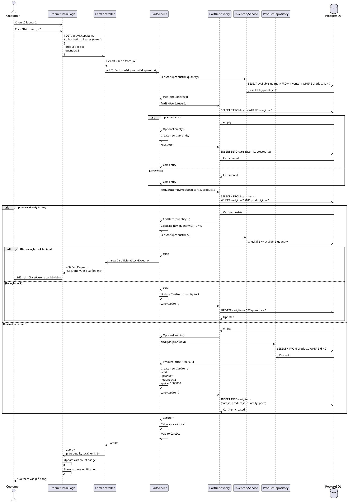
```plantuml
@startuml
actor Customer
participant "ProductDetailPage" as UI
participant "CartController" as Controller
participant "CartService" as Service
participant "CartRepository" as CartRepo
participant "InventoryService" as InvSvc
participant "ProductRepository" as ProdRepo
database "PostgreSQL" as DB

Customer -> UI: Chọn số lượng: 2
Customer -> UI: Click "Thêm vào giỏ"

UI -> Controller: POST /api/v1/cart/items\nAuthorization: Bearer {token}\n{\n  productId: xxx,\n  quantity: 2\n}

Controller -> Controller: Extract userId from JWT

Controller -> Service: addToCart(userId, productId, quantity)

Service -> InvSvc: isInStock(productId, quantity)
InvSvc -> DB: SELECT available_quantity FROM inventory WHERE product_id = ?
DB -> InvSvc: available_quantity: 10
InvSvc -> Service: true (enough stock)

Service -> CartRepo: findByUserId(userId)
CartRepo -> DB: SELECT * FROM carts WHERE user_id = ?

alt Cart not exists
  DB -> CartRepo: empty
  CartRepo -> Service: Optional.empty()
  
  Service -> Service: Create new Cart entity
  Service -> CartRepo: save(cart)
  CartRepo -> DB: INSERT INTO carts (user_id, created_at)
  DB -> CartRepo: Cart created
  CartRepo -> Service: Cart entity
  
else Cart exists
  DB -> CartRepo: Cart record
  CartRepo -> Service: Cart entity
end

Service -> CartRepo: findCartItemByProductId(cartId, productId)
CartRepo -> DB: SELECT * FROM cart_items\nWHERE cart_id = ? AND product_id = ?

alt Product already in cart
  DB -> CartRepo: CartItem exists
  CartRepo -> Service: CartItem (quantity: 3)
  
  Service -> Service: Calculate new quantity: 3 + 2 = 5
  
  Service -> InvSvc: isInStock(productId, 5)
  InvSvc -> DB: Check if 5 <= available_quantity
  
  alt Not enough stock for total
    InvSvc -> Service: false
    Service -> Controller: throw InsufficientStockException
    Controller -> UI: 400 Bad Request\n"Số lượng vượt quá tồn kho"
    UI -> Customer: Hiển thị lỗi + số lượng có thể thêm
    
  else Enough stock
    InvSvc -> Service: true
    Service -> Service: Update CartItem quantity to 5
    Service -> CartRepo: save(cartItem)
    CartRepo -> DB: UPDATE cart_items SET quantity = 5
    DB -> CartRepo: Updated
  end
  
else Product not in cart
  DB -> CartRepo: empty
  CartRepo -> Service: Optional.empty()
  
  Service -> ProdRepo: findById(productId)
  ProdRepo -> DB: SELECT * FROM products WHERE id = ?
  DB -> ProdRepo: Product
  ProdRepo -> Service: Product (price: 1500000)
  
  Service -> Service: Create new CartItem:\n- cart\n- product\n- quantity: 2\n- price: 1500000
  
  Service -> CartRepo: save(cartItem)
  CartRepo -> DB: INSERT INTO cart_items\n(cart_id, product_id, quantity, price)
  DB -> CartRepo: CartItem created
end

CartRepo -> Service: CartItem

Service -> Service: Calculate cart total
Service -> Service: Map to CartDto

Service -> Controller: CartDto

Controller -> UI: 200 OK\n{cart details, totalItems: 5}

UI -> UI: Update cart count badge
UI -> UI: Show success notification

UI -> Customer: "Đã thêm vào giỏ hàng"

@enduml
```

---

### UC20: Update Cart Item (Cập nhật số lượng trong giỏ)

#### Bảng đặc tả Use Case

| Thành phần | Mô tả |
|---|---|
| **Use Case ID** | UC20 |
| **Tên Use Case** | Update Cart Item (Cập nhật số lượng trong giỏ) |
| **Actor** | Customer |
| **Mô tả** | Khách hàng thay đổi số lượng sản phẩm trong giỏ hàng |
| **Tiền điều kiện** | - Customer đã đăng nhập - Sản phẩm đã có trong giỏ hàng |
| **Hậu điều kiện** | - Số lượng sản phẩm được cập nhật - Tổng tiền giỏ hàng được tính lại |
| **Luồng chính** | 1. Customer xem giỏ hàng 2. Customer thay đổi số lượng sản phẩm (tăng/giảm) 3. Hệ thống kiểm tra số lượng mới > 0 4. Hệ thống kiểm tra tồn kho 5. Hệ thống cập nhật số lượng trong CartItem 6. Hệ thống tính lại subtotal (price × quantity) 7. Hệ thống tính lại tổng tiền giỏ hàng 8. Hệ thống lưu vào database 9. Hệ thống trả về cart đã cập nhật 10. UI cập nhật hiển thị |
| **Luồng thay thế** | **3a. Số lượng = 0** &nbsp;&nbsp;1. Hiển thị confirm "Xóa sản phẩm khỏi giỏ?" &nbsp;&nbsp;2. Nếu confirm: Xóa CartItem &nbsp;&nbsp;3. Nếu cancel: Giữ nguyên  **4a. Số lượng mới vượt quá tồn kho** &nbsp;&nbsp;1. Hiển thị "Chỉ còn X sản phẩm" &nbsp;&nbsp;2. Set số lượng = available quantity &nbsp;&nbsp;3. Cập nhật với số lượng tối đa |
| **Ngoại lệ** | - Token hết hạn - CartItem không tồn tại - Database error |

#### Activity Diagram

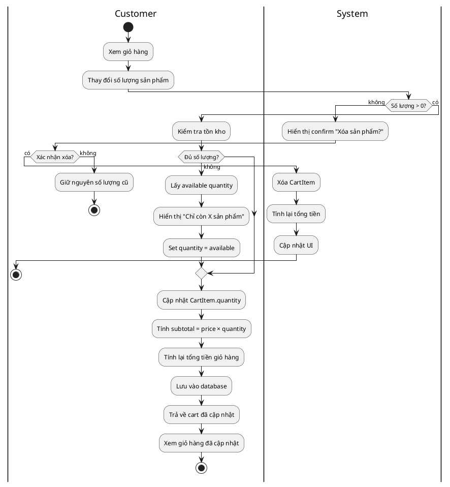
```plantuml
@startuml
|Customer|
start
:Xem giỏ hàng;
:Thay đổi số lượng sản phẩm;

|System|
if (Số lượng > 0?) then (không)
  :Hiển thị confirm "Xóa sản phẩm?";
  |Customer|
  if (Xác nhận xóa?) then (có)
    |System|
    :Xóa CartItem;
    :Tính lại tổng tiền;
    :Cập nhật UI;
    |Customer|
    stop
  else (không)
    :Giữ nguyên số lượng cũ;
    stop
  endif
else (có)
  :Kiểm tra tồn kho;
  
  if (Đủ số lượng?) then (không)
    :Lấy available quantity;
    :Hiển thị "Chỉ còn X sản phẩm";
    :Set quantity = available;
  endif
  
  :Cập nhật CartItem.quantity;
  :Tính subtotal = price × quantity;
  :Tính lại tổng tiền giỏ hàng;
  :Lưu vào database;
  :Trả về cart đã cập nhật;
  
  |Customer|
  :Xem giỏ hàng đã cập nhật;
  stop
endif

@enduml
```

#### Sequence Diagram

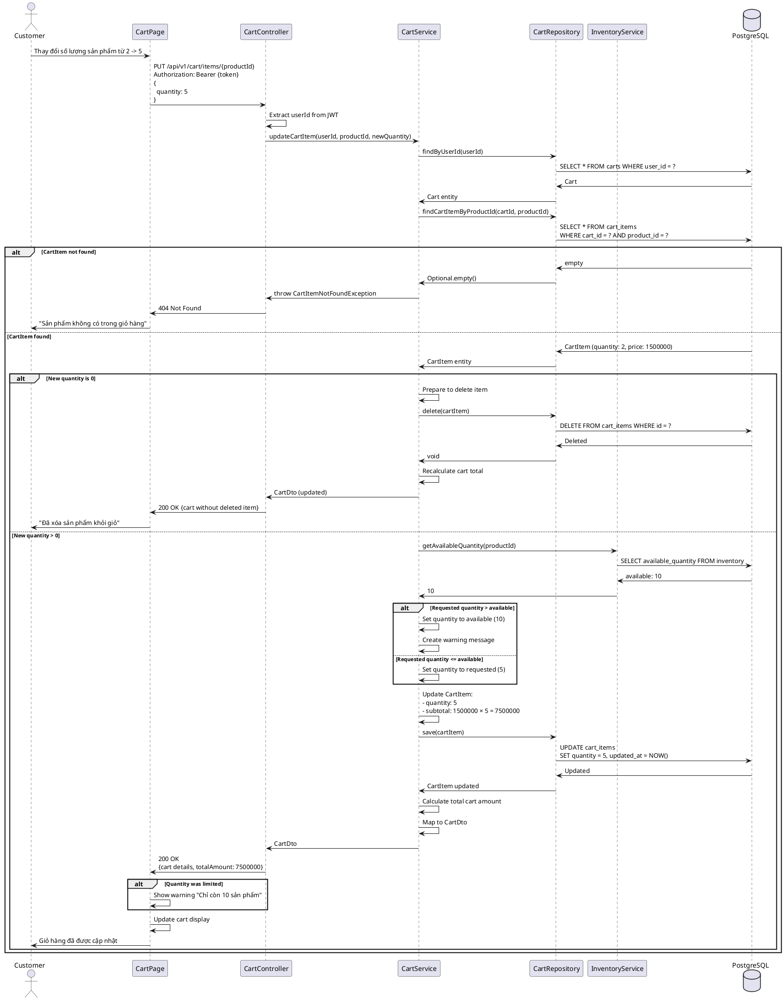
```plantuml
@startuml
actor Customer
participant "CartPage" as UI
participant "CartController" as Controller
participant "CartService" as Service
participant "CartRepository" as CartRepo
participant "InventoryService" as InvSvc
database "PostgreSQL" as DB

Customer -> UI: Thay đổi số lượng sản phẩm từ 2 -> 5

UI -> Controller: PUT /api/v1/cart/items/{productId}\nAuthorization: Bearer {token}\n{\n  quantity: 5\n}

Controller -> Controller: Extract userId from JWT

Controller -> Service: updateCartItem(userId, productId, newQuantity)

Service -> CartRepo: findByUserId(userId)
CartRepo -> DB: SELECT * FROM carts WHERE user_id = ?
DB -> CartRepo: Cart
CartRepo -> Service: Cart entity

Service -> CartRepo: findCartItemByProductId(cartId, productId)
CartRepo -> DB: SELECT * FROM cart_items\nWHERE cart_id = ? AND product_id = ?

alt CartItem not found
  DB -> CartRepo: empty
  CartRepo -> Service: Optional.empty()
  Service -> Controller: throw CartItemNotFoundException
  Controller -> UI: 404 Not Found
  UI -> Customer: "Sản phẩm không có trong giỏ hàng"
  
else CartItem found
  DB -> CartRepo: CartItem (quantity: 2, price: 1500000)
  CartRepo -> Service: CartItem entity
  
  alt New quantity is 0
    Service -> Service: Prepare to delete item
    Service -> CartRepo: delete(cartItem)
    CartRepo -> DB: DELETE FROM cart_items WHERE id = ?
    DB -> CartRepo: Deleted
    CartRepo -> Service: void
    Service -> Service: Recalculate cart total
    Service -> Controller: CartDto (updated)
    Controller -> UI: 200 OK {cart without deleted item}
    UI -> Customer: "Đã xóa sản phẩm khỏi giỏ"
    
  else New quantity > 0
    Service -> InvSvc: getAvailableQuantity(productId)
    InvSvc -> DB: SELECT available_quantity FROM inventory
    DB -> InvSvc: available: 10
    InvSvc -> Service: 10
    
    alt Requested quantity > available
      Service -> Service: Set quantity to available (10)
      Service -> Service: Create warning message
      
    else Requested quantity <= available
      Service -> Service: Set quantity to requested (5)
    end
    
    Service -> Service: Update CartItem:\n- quantity: 5\n- subtotal: 1500000 × 5 = 7500000
    
    Service -> CartRepo: save(cartItem)
    CartRepo -> DB: UPDATE cart_items\nSET quantity = 5, updated_at = NOW()
    DB -> CartRepo: Updated
    CartRepo -> Service: CartItem updated
    
    Service -> Service: Calculate total cart amount
    Service -> Service: Map to CartDto
    
    Service -> Controller: CartDto
    
    Controller -> UI: 200 OK\n{cart details, totalAmount: 7500000}
    
    alt Quantity was limited
      UI -> UI: Show warning "Chỉ còn 10 sản phẩm"
    end
    
    UI -> UI: Update cart display
    UI -> Customer: Giỏ hàng đã được cập nhật
  end
end

@enduml
```

---

### UC23: View Wishlist (Xem danh sách yêu thích)

#### Bảng đặc tả Use Case

| Thành phần | Mô tả |
|---|---|
| **Use Case ID** | UC23 |
| **Tên Use Case** | View Wishlist (Xem danh sách yêu thích) |
| **Actor** | Customer |
| **Mô tả** | Khách hàng xem danh sách sản phẩm yêu thích đã lưu |
| **Tiền điều kiện** | Customer đã đăng nhập |
| **Hậu điều kiện** | Danh sách wishlist được hiển thị |
| **Luồng chính** | 1. Customer click vào icon/menu "Yêu thích" 2. Hệ thống kiểm tra authentication 3. Hệ thống query danh sách WishlistItem của customer 4. Hệ thống lấy thông tin chi tiết sản phẩm cho mỗi item 5. Hệ thống kiểm tra trạng thái tồn kho 6. Hệ thống hiển thị danh sách với: &nbsp;&nbsp;- Hình ảnh sản phẩm &nbsp;&nbsp;- Tên, giá &nbsp;&nbsp;- Trạng thái tồn kho &nbsp;&nbsp;- Nút "Thêm vào giỏ" &nbsp;&nbsp;- Nút "Xóa khỏi yêu thích" |
| **Luồng thay thế** | **3a. Wishlist trống** &nbsp;&nbsp;1. Hiển thị "Chưa có sản phẩm yêu thích" &nbsp;&nbsp;2. Gợi ý "Khám phá sản phẩm" |
| **Ngoại lệ** | - Token hết hạn - Database error |

#### Activity Diagram

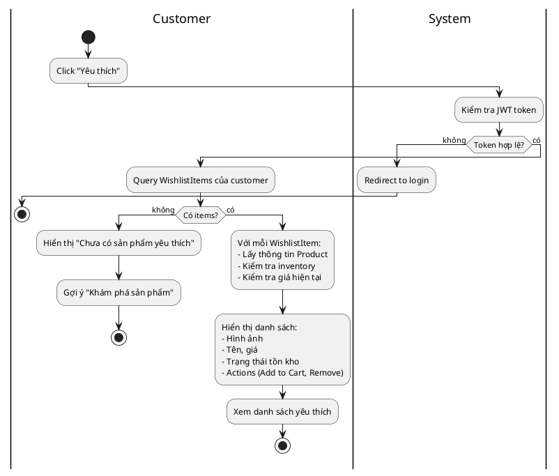
```plantuml
@startuml
|Customer|
start
:Click "Yêu thích";

|System|
:Kiểm tra JWT token;

if (Token hợp lệ?) then (không)
  :Redirect to login;
  |Customer|
  stop
else (có)
  :Query WishlistItems của customer;
  
  if (Có items?) then (không)
    :Hiển thị "Chưa có sản phẩm yêu thích";
    :Gợi ý "Khám phá sản phẩm";
    |Customer|
    stop
  else (có)
    :Với mỗi WishlistItem:
    - Lấy thông tin Product
    - Kiểm tra inventory
    - Kiểm tra giá hiện tại;
    
    :Hiển thị danh sách:
    - Hình ảnh
    - Tên, giá
    - Trạng thái tồn kho
    - Actions (Add to Cart, Remove);
    
    |Customer|
    :Xem danh sách yêu thích;
    stop
  endif
endif

@enduml
```

#### Sequence Diagram

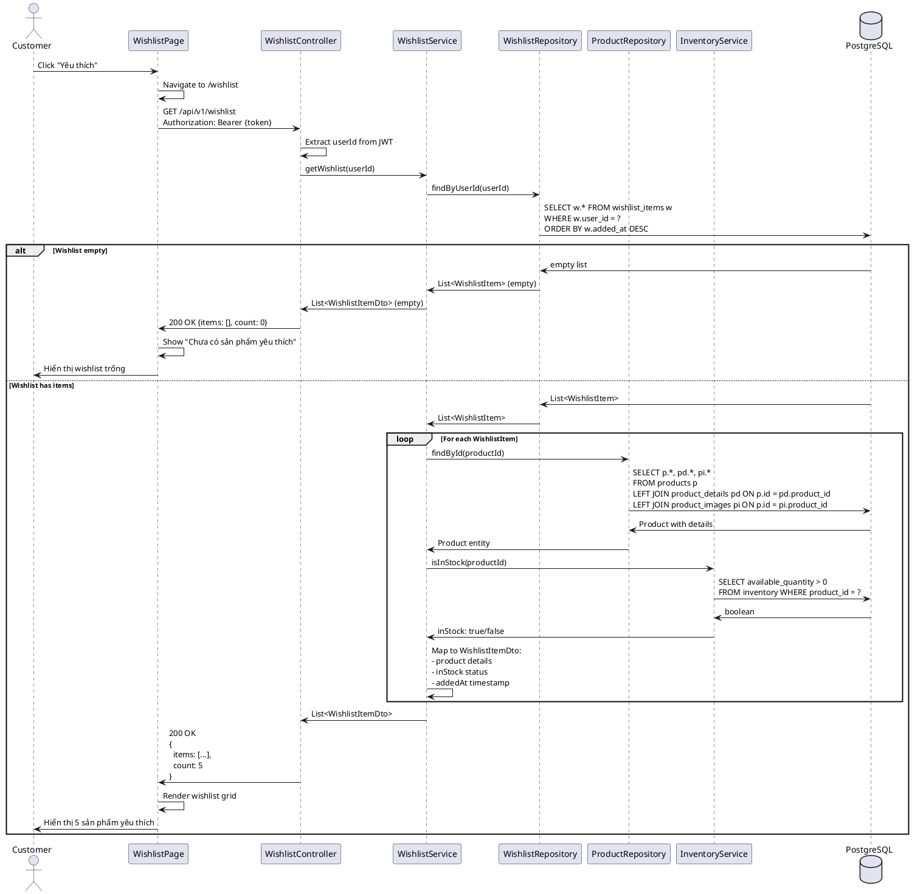
```plantuml
@startuml
actor Customer
participant "WishlistPage" as UI
participant "WishlistController" as Controller
participant "WishlistService" as Service
participant "WishlistRepository" as WishRepo
participant "ProductRepository" as ProdRepo
participant "InventoryService" as InvSvc
database "PostgreSQL" as DB

Customer -> UI: Click "Yêu thích"
UI -> UI: Navigate to /wishlist

UI -> Controller: GET /api/v1/wishlist\nAuthorization: Bearer {token}

Controller -> Controller: Extract userId from JWT

Controller -> Service: getWishlist(userId)

Service -> WishRepo: findByUserId(userId)
WishRepo -> DB: SELECT w.* FROM wishlist_items w\nWHERE w.user_id = ?\nORDER BY w.added_at DESC

alt Wishlist empty
  DB -> WishRepo: empty list
  WishRepo -> Service: List<WishlistItem> (empty)
  Service -> Controller: List<WishlistItemDto> (empty)
  Controller -> UI: 200 OK {items: [], count: 0}
  UI -> UI: Show "Chưa có sản phẩm yêu thích"
  UI -> Customer: Hiển thị wishlist trống
  
else Wishlist has items
  DB -> WishRepo: List<WishlistItem>
  WishRepo -> Service: List<WishlistItem>
  
  loop For each WishlistItem
    Service -> ProdRepo: findById(productId)
    ProdRepo -> DB: SELECT p.*, pd.*, pi.*\nFROM products p\nLEFT JOIN product_details pd ON p.id = pd.product_id\nLEFT JOIN product_images pi ON p.id = pi.product_id
    DB -> ProdRepo: Product with details
    ProdRepo -> Service: Product entity
    
    Service -> InvSvc: isInStock(productId)
    InvSvc -> DB: SELECT available_quantity > 0\nFROM inventory WHERE product_id = ?
    DB -> InvSvc: boolean
    InvSvc -> Service: inStock: true/false
    
    Service -> Service: Map to WishlistItemDto:\n- product details\n- inStock status\n- addedAt timestamp
  end
  
  Service -> Controller: List<WishlistItemDto>
  
  Controller -> UI: 200 OK\n{\n  items: [...],\n  count: 5\n}
  
  UI -> UI: Render wishlist grid
  UI -> Customer: Hiển thị 5 sản phẩm yêu thích
end

@enduml
```

---

### UC24: Add to Wishlist (Thêm vào danh sách yêu thích)

#### Bảng đặc tả Use Case

| Thành phần | Mô tả |
|---|---|
| **Use Case ID** | UC24 |
| **Tên Use Case** | Add to Wishlist (Thêm vào danh sách yêu thích) |
| **Actor** | Customer |
| **Mô tả** | Khách hàng thêm sản phẩm vào danh sách yêu thích |
| **Tiền điều kiện** | - Customer đã đăng nhập - Sản phẩm tồn tại |
| **Hậu điều kiện** | - Sản phẩm được thêm vào wishlist - Icon wishlist được highlight |
| **Luồng chính** | 1. Customer xem sản phẩm 2. Customer click icon trái tim (wishlist) 3. Hệ thống kiểm tra authentication 4. Hệ thống kiểm tra sản phẩm đã có trong wishlist chưa 5. Hệ thống tạo WishlistItem mới 6. Hệ thống lưu vào database 7. Hệ thống cập nhật wishlist count 8. Hệ thống highlight icon trái tim 9. Hiển thị thông báo "Đã thêm vào yêu thích" |
| **Luồng thay thế** | **3a. Chưa đăng nhập** &nbsp;&nbsp;1. Redirect to login  **4a. Sản phẩm đã có trong wishlist** &nbsp;&nbsp;1. Hiển thị "Sản phẩm đã có trong danh sách yêu thích" &nbsp;&nbsp;2. Không thực hiện thêm |
| **Ngoại lệ** | - Token hết hạn - Product không tồn tại - Database error |

#### Activity Diagram

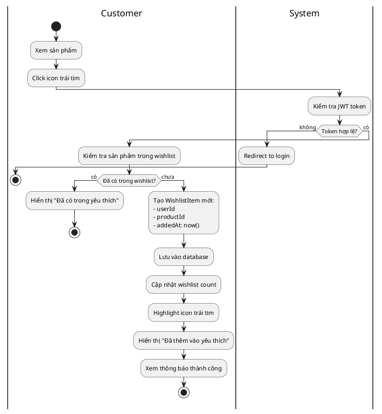
```plantuml
@startuml
|Customer|
start
:Xem sản phẩm;
:Click icon trái tim;

|System|
:Kiểm tra JWT token;

if (Token hợp lệ?) then (không)
  :Redirect to login;
  |Customer|
  stop
else (có)
  :Kiểm tra sản phẩm trong wishlist;
  
  if (Đã có trong wishlist?) then (có)
    :Hiển thị "Đã có trong yêu thích";
    |Customer|
    stop
  else (chưa)
    :Tạo WishlistItem mới:
    - userId
    - productId
    - addedAt: now();
    
    :Lưu vào database;
    :Cập nhật wishlist count;
    :Highlight icon trái tim;
    :Hiển thị "Đã thêm vào yêu thích";
    
    |Customer|
    :Xem thông báo thành công;
    stop
  endif
endif

@enduml
```

#### Sequence Diagram

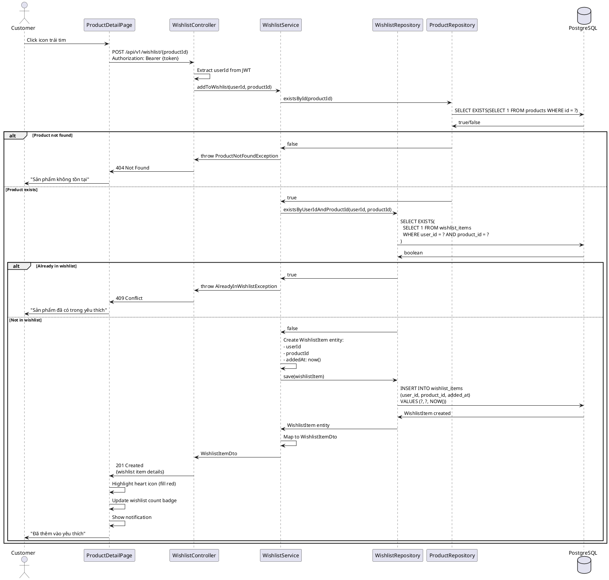
```plantuml
@startuml
actor Customer
participant "ProductDetailPage" as UI
participant "WishlistController" as Controller
participant "WishlistService" as Service
participant "WishlistRepository" as WishRepo
participant "ProductRepository" as ProdRepo
database "PostgreSQL" as DB

Customer -> UI: Click icon trái tim

UI -> Controller: POST /api/v1/wishlist/{productId}\nAuthorization: Bearer {token}

Controller -> Controller: Extract userId from JWT

Controller -> Service: addToWishlist(userId, productId)

Service -> ProdRepo: existsById(productId)
ProdRepo -> DB: SELECT EXISTS(SELECT 1 FROM products WHERE id = ?)
DB -> ProdRepo: true/false

alt Product not found
  ProdRepo -> Service: false
  Service -> Controller: throw ProductNotFoundException
  Controller -> UI: 404 Not Found
  UI -> Customer: "Sản phẩm không tồn tại"
  
else Product exists
  ProdRepo -> Service: true
  
  Service -> WishRepo: existsByUserIdAndProductId(userId, productId)
  WishRepo -> DB: SELECT EXISTS(\n  SELECT 1 FROM wishlist_items\n  WHERE user_id = ? AND product_id = ?\n)
  DB -> WishRepo: boolean
  
  alt Already in wishlist
    WishRepo -> Service: true
    Service -> Controller: throw AlreadyInWishlistException
    Controller -> UI: 409 Conflict
    UI -> Customer: "Sản phẩm đã có trong yêu thích"
    
  else Not in wishlist
    WishRepo -> Service: false
    
    Service -> Service: Create WishlistItem entity:\n- userId\n- productId\n- addedAt: now()
    
    Service -> WishRepo: save(wishlistItem)
    WishRepo -> DB: INSERT INTO wishlist_items\n(user_id, product_id, added_at)\nVALUES (?, ?, NOW())
    DB -> WishRepo: WishlistItem created
    WishRepo -> Service: WishlistItem entity
    
    Service -> Service: Map to WishlistItemDto
    
    Service -> Controller: WishlistItemDto
    
    Controller -> UI: 201 Created\n{wishlist item details}
    
    UI -> UI: Highlight heart icon (fill red)
    UI -> UI: Update wishlist count badge
    UI -> UI: Show notification
    
    UI -> Customer: "Đã thêm vào yêu thích"
  end
end

@enduml
```

---

### UC28: Add Address (Thêm địa chỉ giao hàng)

#### Bảng đặc tả Use Case

| Thành phần | Mô tả |
|---|---|
| **Use Case ID** | UC28 |
| **Tên Use Case** | Add Address (Thêm địa chỉ giao hàng) |
| **Actor** | Customer |
| **Mô tả** | Khách hàng thêm địa chỉ giao hàng mới |
| **Tiền điều kiện** | Customer đã đăng nhập |
| **Hậu điều kiện** | - Địa chỉ mới được lưu vào database - Nếu là địa chỉ đầu tiên, tự động set làm default |
| **Luồng chính** | 1. Customer truy cập trang quản lý địa chỉ 2. Customer click "Thêm địa chỉ mới" 3. Hệ thống hiển thị form nhập địa chỉ 4. Customer nhập thông tin: &nbsp;&nbsp;- Họ tên người nhận &nbsp;&nbsp;- Số điện thoại &nbsp;&nbsp;- Tỉnh/Thành phố &nbsp;&nbsp;- Quận/Huyện &nbsp;&nbsp;- Phường/Xã &nbsp;&nbsp;- Địa chỉ chi tiết &nbsp;&nbsp;- Loại địa chỉ (Nhà riêng/Văn phòng) &nbsp;&nbsp;- Checkbox: Đặt làm địa chỉ mặc định 5. Customer click "Lưu" 6. Hệ thống validate dữ liệu 7. Hệ thống tạo Address entity 8. Nếu là địa chỉ đầu tiên hoặc được chọn làm default: &nbsp;&nbsp;- Set isDefault = true &nbsp;&nbsp;- Set các địa chỉ khác isDefault = false 9. Hệ thống lưu vào database 10. Hiển thị thông báo thành công |
| **Luồng thay thế** | **6a. Dữ liệu không hợp lệ** &nbsp;&nbsp;1. Hiển thị lỗi validation (SĐT không đúng format, thiếu trường bắt buộc) &nbsp;&nbsp;2. Quay lại bước 4 |
| **Ngoại lệ** | - Token hết hạn - Database error |

#### Activity Diagram

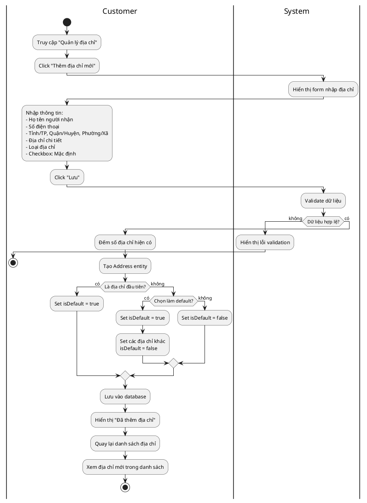
```plantuml
@startuml
|Customer|
start
:Truy cập "Quản lý địa chỉ";
:Click "Thêm địa chỉ mới";

|System|
:Hiển thị form nhập địa chỉ;

|Customer|
:Nhập thông tin:
- Họ tên người nhận
- Số điện thoại
- Tỉnh/TP, Quận/Huyện, Phường/Xã
- Địa chỉ chi tiết
- Loại địa chỉ
- Checkbox: Mặc định;

:Click "Lưu";

|System|
:Validate dữ liệu;

if (Dữ liệu hợp lệ?) then (không)
  :Hiển thị lỗi validation;
  |Customer|
  stop
else (có)
  :Đếm số địa chỉ hiện có;
  
  :Tạo Address entity;
  
  if (Là địa chỉ đầu tiên?) then (có)
    :Set isDefault = true;
  else (không)
    if (Chọn làm default?) then (có)
      :Set isDefault = true;
      :Set các địa chỉ khác
      isDefault = false;
    else (không)
      :Set isDefault = false;
    endif
  endif
  
  :Lưu vào database;
  :Hiển thị "Đã thêm địa chỉ";
  :Quay lại danh sách địa chỉ;
  
  |Customer|
  :Xem địa chỉ mới trong danh sách;
  stop
endif

@enduml
```

#### Sequence Diagram

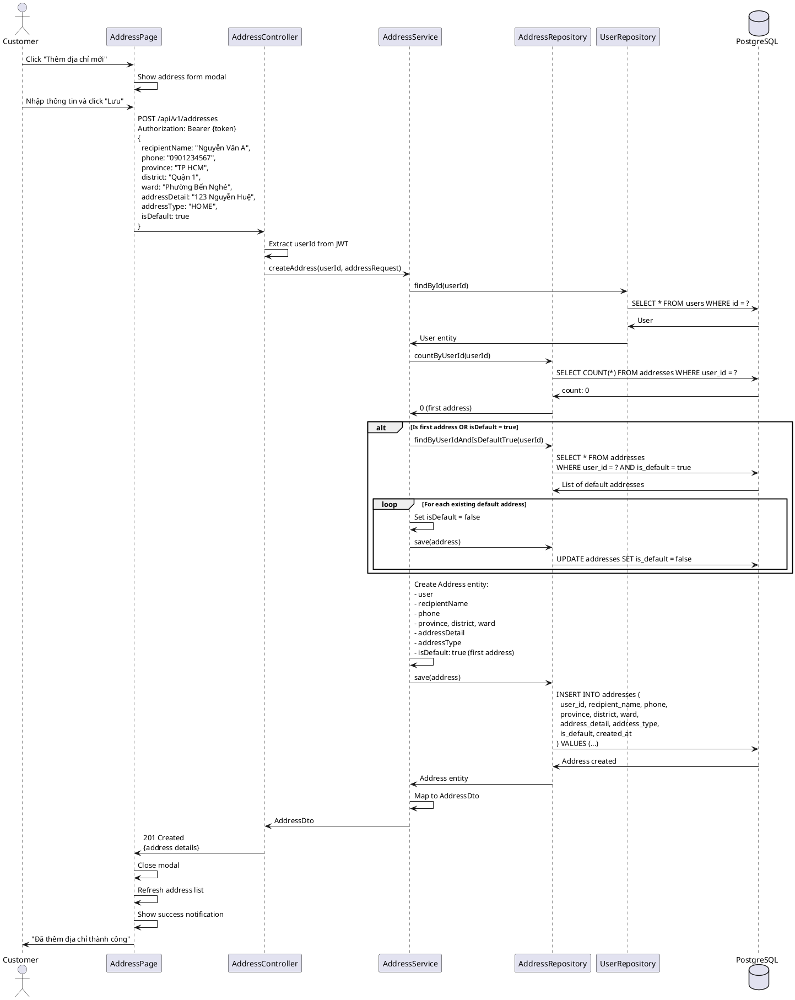
```plantuml
@startuml
actor Customer
participant "AddressPage" as UI
participant "AddressController" as Controller
participant "AddressService" as Service
participant "AddressRepository" as AddrRepo
participant "UserRepository" as UserRepo
database "PostgreSQL" as DB

Customer -> UI: Click "Thêm địa chỉ mới"
UI -> UI: Show address form modal

Customer -> UI: Nhập thông tin và click "Lưu"

UI -> Controller: POST /api/v1/addresses\nAuthorization: Bearer {token}\n{\n  recipientName: "Nguyễn Văn A",\n  phone: "0901234567",\n  province: "TP HCM",\n  district: "Quận 1",\n  ward: "Phường Bến Nghé",\n  addressDetail: "123 Nguyễn Huệ",\n  addressType: "HOME",\n  isDefault: true\n}

Controller -> Controller: Extract userId from JWT

Controller -> Service: createAddress(userId, addressRequest)

Service -> UserRepo: findById(userId)
UserRepo -> DB: SELECT * FROM users WHERE id = ?
DB -> UserRepo: User
UserRepo -> Service: User entity

Service -> AddrRepo: countByUserId(userId)
AddrRepo -> DB: SELECT COUNT(*) FROM addresses WHERE user_id = ?
DB -> AddrRepo: count: 0
AddrRepo -> Service: 0 (first address)

alt Is first address OR isDefault = true
  Service -> AddrRepo: findByUserIdAndIsDefaultTrue(userId)
  AddrRepo -> DB: SELECT * FROM addresses\nWHERE user_id = ? AND is_default = true
  DB -> AddrRepo: List of default addresses
  
  loop For each existing default address
    Service -> Service: Set isDefault = false
    Service -> AddrRepo: save(address)
    AddrRepo -> DB: UPDATE addresses SET is_default = false
  end
end

Service -> Service: Create Address entity:\n- user\n- recipientName\n- phone\n- province, district, ward\n- addressDetail\n- addressType\n- isDefault: true (first address)

Service -> AddrRepo: save(address)
AddrRepo -> DB: INSERT INTO addresses (\n  user_id, recipient_name, phone,\n  province, district, ward,\n  address_detail, address_type,\n  is_default, created_at\n) VALUES (...)

DB -> AddrRepo: Address created
AddrRepo -> Service: Address entity

Service -> Service: Map to AddressDto

Service -> Controller: AddressDto

Controller -> UI: 201 Created\n{address details}

UI -> UI: Close modal
UI -> UI: Refresh address list
UI -> UI: Show success notification

UI -> Customer: "Đã thêm địa chỉ thành công"

@enduml
```

---

### UC32: Checkout Order (Thanh toán đơn hàng)

#### Bảng đặc tả Use Case

| Thành phần | Mô tả |
|---|---|
| **Use Case ID** | UC32 |
| **Tên Use Case** | Checkout Order (Thanh toán đơn hàng) |
| **Actor** | Customer |
| **Mô tả** | Khách hàng tiến hành thanh toán các sản phẩm trong giỏ hàng |
| **Tiền điều kiện** | - Customer đã đăng nhập - Giỏ hàng có ít nhất 1 sản phẩm - Customer có ít nhất 1 địa chỉ giao hàng |
| **Hậu điều kiện** | - Order được tạo với status PENDING - CartItems được chuyển thành OrderItems - Giỏ hàng được xóa - Redirect đến trang thanh toán |
| **Luồng chính** | 1. Customer click "Thanh toán" trong giỏ hàng 2. Hệ thống validate giỏ hàng (có items, tồn kho đủ) 3. Hệ thống hiển thị trang checkout với: &nbsp;&nbsp;- Danh sách sản phẩm &nbsp;&nbsp;- Form chọn địa chỉ giao hàng &nbsp;&nbsp;- Form nhập mã giảm giá (optional) &nbsp;&nbsp;- Chọn phương thức thanh toán &nbsp;&nbsp;- Tổng tiền 4. Customer chọn địa chỉ giao hàng 5. Customer có thể nhập mã giảm giá (UC33) 6. Customer chọn phương thức thanh toán (COD/MoMo) 7. Customer click "Đặt hàng" 8. Hệ thống validate lại inventory 9. Hệ thống tạo Order entity với status PENDING 10. Hệ thống tạo OrderItems từ CartItems 11. Hệ thống tính tổng tiền (subtotal - discount) 12. Hệ thống lưu Order vào database 13. Hệ thống xóa giỏ hàng 14. Nếu chọn COD: Redirect đến trang "Đặt hàng thành công" 15. Nếu chọn MoMo: Redirect đến UC34 (Make Payment) |
| **Luồng thay thế** | **2a. Giỏ hàng trống** &nbsp;&nbsp;1. Hiển thị "Giỏ hàng trống" &nbsp;&nbsp;2. Redirect về trang sản phẩm  **2b. Sản phẩm hết hàng** &nbsp;&nbsp;1. Hiển thị sản phẩm nào hết hàng &nbsp;&nbsp;2. Yêu cầu xóa hoặc cập nhật  **4a. Chưa có địa chỉ** &nbsp;&nbsp;1. Yêu cầu thêm địa chỉ (UC28)  **8a. Inventory thay đổi** &nbsp;&nbsp;1. Hiển thị "Số lượng sản phẩm X đã thay đổi" &nbsp;&nbsp;2. Yêu cầu cập nhật giỏ hàng |
| **Ngoại lệ** | - Token hết hạn - Payment gateway error - Database error |

#### Activity Diagram

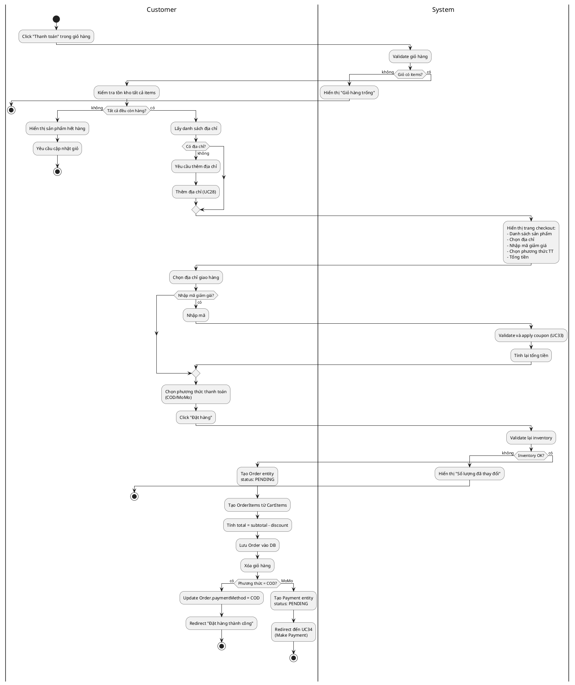
```plantuml
@startuml
|Customer|
start
:Click "Thanh toán" trong giỏ hàng;

|System|
:Validate giỏ hàng;

if (Giỏ có items?) then (không)
  :Hiển thị "Giỏ hàng trống";
  |Customer|
  stop
else (có)
  :Kiểm tra tồn kho tất cả items;
  
  if (Tất cả đều còn hàng?) then (không)
    :Hiển thị sản phẩm hết hàng;
    :Yêu cầu cập nhật giỏ;
    |Customer|
    stop
  else (có)
    :Lấy danh sách địa chỉ;
    
    if (Có địa chỉ?) then (không)
      :Yêu cầu thêm địa chỉ;
      |Customer|
      :Thêm địa chỉ (UC28);
      |System|
    endif
    
    :Hiển thị trang checkout:
    - Danh sách sản phẩm
    - Chọn địa chỉ
    - Nhập mã giảm giá
    - Chọn phương thức TT
    - Tổng tiền;
    
    |Customer|
    :Chọn địa chỉ giao hàng;
    
    if (Nhập mã giảm giá?) then (có)
      :Nhập mã;
      |System|
      :Validate và apply coupon (UC33);
      :Tính lại tổng tiền;
    endif
    
    |Customer|
    :Chọn phương thức thanh toán
    (COD/MoMo);
    
    :Click "Đặt hàng";
    
    |System|
    :Validate lại inventory;
    
    if (Inventory OK?) then (không)
      :Hiển thị "Số lượng đã thay đổi";
      |Customer|
      stop
    else (có)
      :Tạo Order entity
      status: PENDING;
      
      :Tạo OrderItems từ CartItems;
      
      :Tính total = subtotal - discount;
      
      :Lưu Order vào DB;
      
      :Xóa giỏ hàng;
      
      if (Phương thức = COD?) then (có)
        :Update Order.paymentMethod = COD;
        :Redirect "Đặt hàng thành công";
        |Customer|
        stop
      else (MoMo)
        :Tạo Payment entity
        status: PENDING;
        :Redirect đến UC34
        (Make Payment);
        |Customer|
        stop
      endif
    endif
  endif
endif

@enduml
```

#### Sequence Diagram

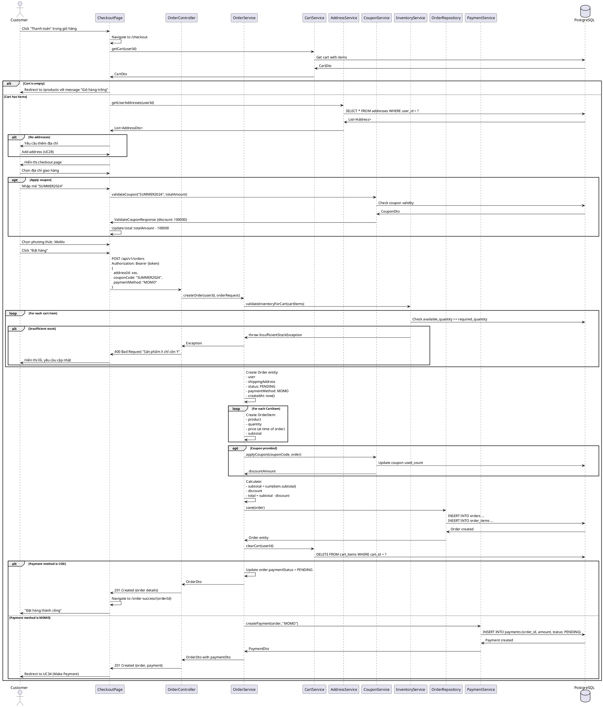
```plantuml
@startuml
actor Customer
participant "CheckoutPage" as UI
participant "OrderController" as OrderCtrl
participant "OrderService" as OrderSvc
participant "CartService" as CartSvc
participant "AddressService" as AddrSvc
participant "CouponService" as CouponSvc
participant "InventoryService" as InvSvc
participant "OrderRepository" as OrderRepo
participant "PaymentService" as PaySvc
database "PostgreSQL" as DB

Customer -> UI: Click "Thanh toán" trong giỏ hàng
UI -> UI: Navigate to /checkout

UI -> CartSvc: getCart(userId)
CartSvc -> DB: Get cart with items
DB -> CartSvc: CartDto
CartSvc -> UI: CartDto

alt Cart is empty
  UI -> Customer: Redirect to /products với message "Giỏ hàng trống"
else Cart has items
  UI -> AddrSvc: getUserAddresses(userId)
  AddrSvc -> DB: SELECT * FROM addresses WHERE user_id = ?
  DB -> AddrSvc: List<Address>
  AddrSvc -> UI: List<AddressDto>
  
  alt No addresses
    UI -> Customer: Yêu cầu thêm địa chỉ
    Customer -> UI: Add address (UC28)
  end
  
  UI -> Customer: Hiển thị checkout page
  
  Customer -> UI: Chọn địa chỉ giao hàng
  
  opt Apply coupon
    Customer -> UI: Nhập mã "SUMMER2024"
    UI -> CouponSvc: validateCoupon("SUMMER2024", totalAmount)
    CouponSvc -> DB: Check coupon validity
    DB -> CouponSvc: CouponDto
    CouponSvc -> UI: ValidateCouponResponse {discount: 100000}
    UI -> UI: Update total: totalAmount - 100000
  end
  
  Customer -> UI: Chọn phương thức: MoMo
  Customer -> UI: Click "Đặt hàng"
  
  UI -> OrderCtrl: POST /api/v1/orders\nAuthorization: Bearer {token}\n{\n  addressId: xxx,\n  couponCode: "SUMMER2024",\n  paymentMethod: "MOMO"\n}
  
  OrderCtrl -> OrderSvc: createOrder(userId, orderRequest)
  
  ' Validate inventory again
  OrderSvc -> InvSvc: validateInventoryForCart(cartItems)
  loop For each cart item
    InvSvc -> DB: Check available_quantity >= required_quantity
    alt Insufficient stock
      InvSvc -> OrderSvc: throw InsufficientStockException
      OrderSvc -> OrderCtrl: Exception
      OrderCtrl -> UI: 400 Bad Request "Sản phẩm X chỉ còn Y"
      UI -> Customer: Hiển thị lỗi, yêu cầu cập nhật
    end
  end
  
  ' Create order
  OrderSvc -> OrderSvc: Create Order entity:\n- user\n- shippingAddress\n- status: PENDING\n- paymentMethod: MOMO\n- createdAt: now()
  
  ' Create order items from cart items
  loop For each CartItem
    OrderSvc -> OrderSvc: Create OrderItem:\n- product\n- quantity\n- price (at time of order)\n- subtotal
  end
  
  ' Apply coupon discount
  opt Coupon provided
    OrderSvc -> CouponSvc: applyCoupon(couponCode, order)
    CouponSvc -> DB: Update coupon used_count
    CouponSvc -> OrderSvc: discountAmount
  end
  
  OrderSvc -> OrderSvc: Calculate:\n- subtotal = sum(item.subtotal)\n- discount\n- total = subtotal - discount
  
  OrderSvc -> OrderRepo: save(order)
  OrderRepo -> DB: INSERT INTO orders ...\nINSERT INTO order_items ...
  DB -> OrderRepo: Order created
  OrderRepo -> OrderSvc: Order entity
  
  ' Clear cart
  OrderSvc -> CartSvc: clearCart(userId)
  CartSvc -> DB: DELETE FROM cart_items WHERE cart_id = ?
  
  alt Payment method is COD
    OrderSvc -> OrderSvc: Update order.paymentStatus = PENDING
    OrderSvc -> OrderCtrl: OrderDto
    OrderCtrl -> UI: 201 Created {order details}
    UI -> UI: Navigate to /order-success/{orderId}
    UI -> Customer: "Đặt hàng thành công"
    
  else Payment method is MOMO
    OrderSvc -> PaySvc: createPayment(order, "MOMO")
    PaySvc -> DB: INSERT INTO payments (order_id, amount, status: PENDING)
    DB -> PaySvc: Payment created
    PaySvc -> OrderSvc: PaymentDto
    
    OrderSvc -> OrderCtrl: OrderDto with paymentDto
    OrderCtrl -> UI: 201 Created {order, payment}
    
    UI -> Customer: Redirect to UC34 (Make Payment)
  end
end

@enduml
```

---

### UC33: Apply Coupon (Áp dụng mã giảm giá)

#### Bảng đặc tả Use Case

| Thành phần | Mô tả |
|---|---|
| **Use Case ID** | UC33 |
| **Tên Use Case** | Apply Coupon (Áp dụng mã giảm giá) |
| **Actor** | Customer |
| **Mô tả** | Khách hàng áp dụng mã giảm giá vào đơn hàng |
| **Tiền điều kiện** | - Customer đang trong quá trình checkout - Có mã giảm giá hợp lệ |
| **Hậu điều kiện** | - Mã giảm giá được validate - Số tiền giảm được tính toán - Tổng tiền đơn hàng được cập nhật |
| **Luồng chính** | 1. Customer nhập mã giảm giá trong form checkout 2. Customer click "Áp dụng" 3. Hệ thống tìm coupon theo code 4. Hệ thống kiểm tra coupon còn hiệu lực 5. Hệ thống kiểm tra điều kiện áp dụng: &nbsp;&nbsp;- Ngày bắt đầu <= ngày hiện tại <= ngày kết thúc &nbsp;&nbsp;- used_count < max_uses &nbsp;&nbsp;- order_total >= min_order_value &nbsp;&nbsp;- Customer chưa dùng quá usage_limit_per_user 6. Hệ thống tính discount: &nbsp;&nbsp;- Nếu PERCENTAGE: discount = total × (discount_value/100) &nbsp;&nbsp;- Nếu FIXED: discount = discount_value &nbsp;&nbsp;- Nếu có max_discount: discount = min(discount, max_discount) 7. Hệ thống trả về discount amount 8. UI cập nhật hiển thị tổng tiền mới |
| **Luồng thay thế** | **3a. Mã không tồn tại** &nbsp;&nbsp;1. Hiển thị "Mã giảm giá không hợp lệ"  **4a. Mã đã hết hạn** &nbsp;&nbsp;1. Hiển thị "Mã giảm giá đã hết hạn"  **5a. Mã đã hết lượt sử dụng** &nbsp;&nbsp;1. Hiển thị "Mã giảm giá đã hết lượt"  **5b. Đơn hàng chưa đạt giá trị tối thiểu** &nbsp;&nbsp;1. Hiển thị "Đơn hàng tối thiểu X VNĐ"  **5c. Customer đã dùng quá giới hạn** &nbsp;&nbsp;1. Hiển thị "Bạn đã sử dụng mã này" |
| **Ngoại lệ** | - Database error |

#### Activity Diagram

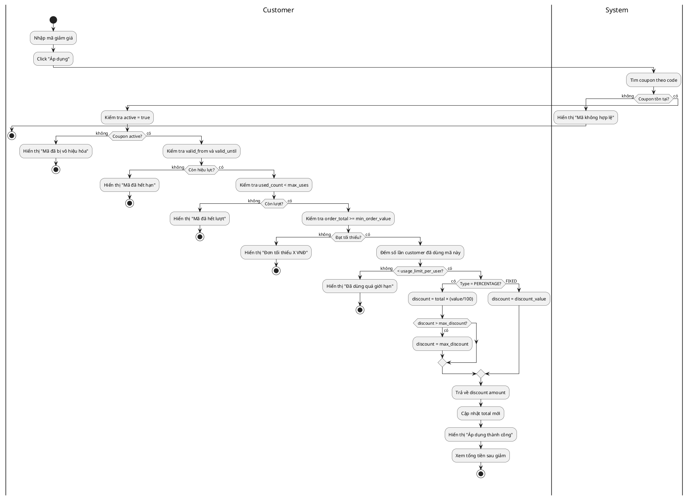
```plantuml
@startuml
|Customer|
start
:Nhập mã giảm giá;
:Click "Áp dụng";

|System|
:Tìm coupon theo code;

if (Coupon tồn tại?) then (không)
  :Hiển thị "Mã không hợp lệ";
  |Customer|
  stop
else (có)
  :Kiểm tra active = true;
  
  if (Coupon active?) then (không)
    :Hiển thị "Mã đã bị vô hiệu hóa";
    |Customer|
    stop
  else (có)
    :Kiểm tra valid_from và valid_until;
    
    if (Còn hiệu lực?) then (không)
      :Hiển thị "Mã đã hết hạn";
      |Customer|
      stop
    else (có)
      :Kiểm tra used_count < max_uses;
      
      if (Còn lượt?) then (không)
        :Hiển thị "Mã đã hết lượt";
        |Customer|
        stop
      else (có)
        :Kiểm tra order_total >= min_order_value;
        
        if (Đạt tối thiểu?) then (không)
          :Hiển thị "Đơn tối thiểu X VNĐ";
          |Customer|
          stop
        else (có)
          :Đếm số lần customer đã dùng mã này;
          
          if (< usage_limit_per_user?) then (không)
            :Hiển thị "Đã dùng quá giới hạn";
            |Customer|
            stop
          else (có)
            if (Type = PERCENTAGE?) then (có)
              :discount = total × (value/100);
              
              if (discount > max_discount?) then (có)
                :discount = max_discount;
              endif
            else (FIXED)
              :discount = discount_value;
            endif
            
            :Trả về discount amount;
            :Cập nhật total mới;
            :Hiển thị "Áp dụng thành công";
            
            |Customer|
            :Xem tổng tiền sau giảm;
            stop
          endif
        endif
      endif
    endif
  endif
endif

@enduml
```

#### Sequence Diagram

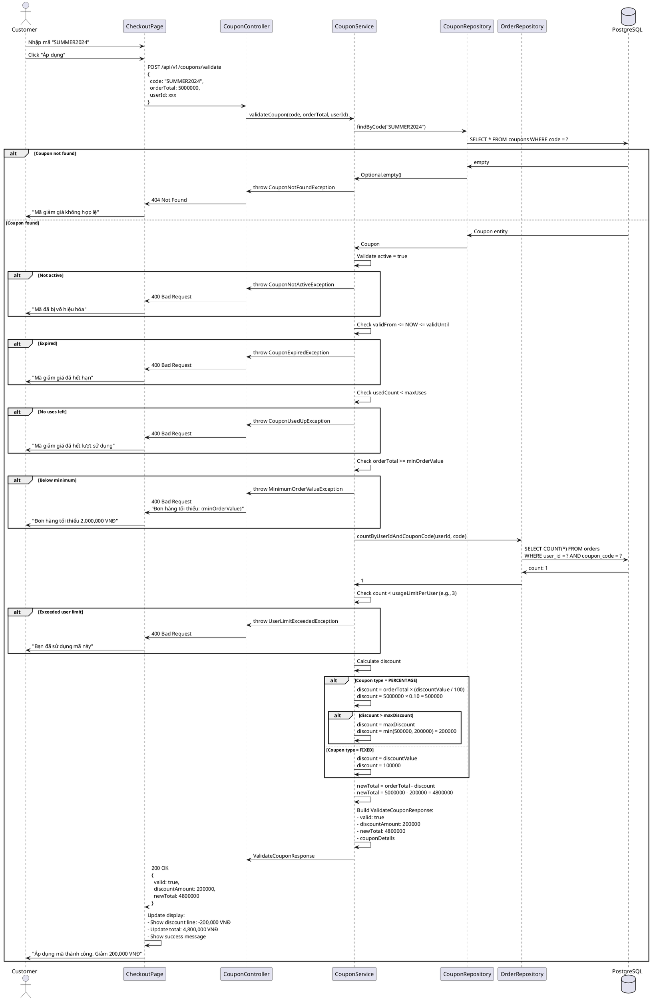
```plantuml
@startuml
actor Customer
participant "CheckoutPage" as UI
participant "CouponController" as Controller
participant "CouponService" as Service
participant "CouponRepository" as CouponRepo
participant "OrderRepository" as OrderRepo
database "PostgreSQL" as DB

Customer -> UI: Nhập mã "SUMMER2024"
Customer -> UI: Click "Áp dụng"

UI -> Controller: POST /api/v1/coupons/validate\n{\n  code: "SUMMER2024",\n  orderTotal: 5000000,\n  userId: xxx\n}

Controller -> Service: validateCoupon(code, orderTotal, userId)

Service -> CouponRepo: findByCode("SUMMER2024")
CouponRepo -> DB: SELECT * FROM coupons WHERE code = ?

alt Coupon not found
  DB -> CouponRepo: empty
  CouponRepo -> Service: Optional.empty()
  Service -> Controller: throw CouponNotFoundException
  Controller -> UI: 404 Not Found
  UI -> Customer: "Mã giảm giá không hợp lệ"
  
else Coupon found
  DB -> CouponRepo: Coupon entity
  CouponRepo -> Service: Coupon
  
  Service -> Service: Validate active = true
  alt Not active
    Service -> Controller: throw CouponNotActiveException
    Controller -> UI: 400 Bad Request
    UI -> Customer: "Mã đã bị vô hiệu hóa"
  end
  
  Service -> Service: Check validFrom <= NOW <= validUntil
  alt Expired
    Service -> Controller: throw CouponExpiredException
    Controller -> UI: 400 Bad Request
    UI -> Customer: "Mã giảm giá đã hết hạn"
  end
  
  Service -> Service: Check usedCount < maxUses
  alt No uses left
    Service -> Controller: throw CouponUsedUpException
    Controller -> UI: 400 Bad Request
    UI -> Customer: "Mã giảm giá đã hết lượt sử dụng"
  end
  
  Service -> Service: Check orderTotal >= minOrderValue
  alt Below minimum
    Service -> Controller: throw MinimumOrderValueException
    Controller -> UI: 400 Bad Request\n"Đơn hàng tối thiểu: {minOrderValue}"
    UI -> Customer: "Đơn hàng tối thiểu 2,000,000 VNĐ"
  end
  
  Service -> OrderRepo: countByUserIdAndCouponCode(userId, code)
  OrderRepo -> DB: SELECT COUNT(*) FROM orders\nWHERE user_id = ? AND coupon_code = ?
  DB -> OrderRepo: count: 1
  OrderRepo -> Service: 1
  
  Service -> Service: Check count < usageLimitPerUser (e.g., 3)
  alt Exceeded user limit
    Service -> Controller: throw UserLimitExceededException
    Controller -> UI: 400 Bad Request
    UI -> Customer: "Bạn đã sử dụng mã này"
  end
  
  ' All validations passed, calculate discount
  Service -> Service: Calculate discount
  
  alt Coupon type = PERCENTAGE
    Service -> Service: discount = orderTotal × (discountValue / 100)\ndiscount = 5000000 × 0.10 = 500000
    
    alt discount > maxDiscount
      Service -> Service: discount = maxDiscount\ndiscount = min(500000, 200000) = 200000
    end
    
  else Coupon type = FIXED
    Service -> Service: discount = discountValue\ndiscount = 100000
  end
  
  Service -> Service: newTotal = orderTotal - discount\nnewTotal = 5000000 - 200000 = 4800000
  
  Service -> Service: Build ValidateCouponResponse:\n- valid: true\n- discountAmount: 200000\n- newTotal: 4800000\n- couponDetails
  
  Service -> Controller: ValidateCouponResponse
  
  Controller -> UI: 200 OK\n{\n  valid: true,\n  discountAmount: 200000,\n  newTotal: 4800000\n}
  
  UI -> UI: Update display:\n- Show discount line: -200,000 VNĐ\n- Update total: 4,800,000 VNĐ\n- Show success message
  
  UI -> Customer: "Áp dụng mã thành công. Giảm 200,000 VNĐ"
end

@enduml
```

---

### UC34: Make Payment (Thanh toán qua MoMo)

#### Bảng đặc tả Use Case

| Thành phần | Mô tả |
|---|---|
| **Use Case ID** | UC34 |
| **Tên Use Case** | Make Payment (Thanh toán qua MoMo) |
| **Actor** | Customer, MoMo Gateway |
| **Mô tả** | Khách hàng thanh toán đơn hàng qua cổng thanh toán MoMo |
| **Tiền điều kiện** | - Order đã được tạo với status PENDING - Payment record đã được tạo với status PENDING - Có MoMo partner code và secret key |
| **Hậu điều kiện** | - Payment status được cập nhật (SUCCESS/FAILED) - Order status được cập nhật - Nếu thành công: Inventory được giảm - Email xác nhận được gửi |
| **Luồng chính** | 1. Sau khi tạo order thành công, hệ thống tạo Payment entity 2. Hệ thống generate requestId và orderId unique 3. Hệ thống build MoMo payment request: &nbsp;&nbsp;- partnerCode &nbsp;&nbsp;- amount &nbsp;&nbsp;- orderId &nbsp;&nbsp;- requestId &nbsp;&nbsp;- orderInfo (description) &nbsp;&nbsp;- redirectUrl (return URL) &nbsp;&nbsp;- ipnUrl (callback URL) &nbsp;&nbsp;- extraData 4. Hệ thống tạo signature = HMAC_SHA256(rawData, secretKey) 5. Hệ thống gửi request đến MoMo API 6. MoMo trả về payUrl 7. Hệ thống lưu payment details 8. Customer được redirect đến MoMo payUrl 9. Customer thực hiện thanh toán trên app MoMo 10. MoMo gọi IPN callback về hệ thống với kết quả 11. Hệ thống verify signature từ MoMo 12. Hệ thống cập nhật Payment và Order status 13. Nếu thành công: Giảm inventory, gửi email 14. MoMo redirect customer về returnUrl 15. Hiển thị kết quả thanh toán |
| **Luồng thay thế** | **5a. MoMo API error** &nbsp;&nbsp;1. Log error &nbsp;&nbsp;2. Hiển thị "Lỗi kết nối cổng thanh toán" &nbsp;&nbsp;3