# CHƯƠNG 3: PHÂN TÍCH THIẾT KẾ - ĐẶC TẢ USE CASE (PHẦN 3)

## Các Use Cases quan trọng (tiếp theo - Admin & Order Management)

---

### UC34: Make Payment (Thanh toán qua MoMo) - HOÀN THIỆN

#### Bảng đặc tả Use Case

| Thành phần | Mô tả |
|---|---|
| **Use Case ID** | UC34 |
| **Tên Use Case** | Make Payment (Thanh toán qua MoMo) |
| **Actor** | Customer, MoMo Gateway |
| **Mô tả** | Khách hàng thanh toán đơn hàng qua cổng thanh toán MoMo |
| **Tiền điều kiện** | - Order đã được tạo với status PENDING - Payment record đã được tạo với status PENDING - Có MoMo partner code và secret key |
| **Hậu điều kiện** | - Payment status được cập nhật (SUCCESS/FAILED) - Order status được cập nhật - Nếu thành công: Inventory được giảm - Email xác nhận được gửi |
| **Luồng chính** | 1. Sau khi tạo order thành công, hệ thống tạo Payment entity 2. Hệ thống generate requestId và orderId unique 3. Hệ thống build MoMo payment request: &nbsp;&nbsp;- partnerCode, amount, orderId, requestId &nbsp;&nbsp;- orderInfo, redirectUrl, ipnUrl 4. Hệ thống tạo signature = HMAC_SHA256(rawData, secretKey) 5. Hệ thống gửi request đến MoMo API 6. MoMo trả về payUrl 7. Hệ thống lưu payment details 8. Customer được redirect đến MoMo payUrl 9. Customer thực hiện thanh toán trên app MoMo 10. MoMo gọi IPN callback về hệ thống với kết quả 11. Hệ thống verify signature từ MoMo 12. Hệ thống cập nhật Payment và Order status 13. Nếu thành công: Giảm inventory, gửi email 14. MoMo redirect customer về returnUrl 15. Hiển thị kết quả thanh toán |
| **Luồng thay thế** | **5a. MoMo API error** &nbsp;&nbsp;1. Log error &nbsp;&nbsp;2. Hiển thị "Lỗi kết nối cổng thanh toán" &nbsp;&nbsp;3. Đề xuất thử lại hoặc chọn COD  **9a. Customer hủy thanh toán** &nbsp;&nbsp;1. MoMo gọi callback với resultCode != 0 &nbsp;&nbsp;2. Cập nhật Payment status = CANCELLED &nbsp;&nbsp;3. Order vẫn giữ status PENDING &nbsp;&nbsp;4. Hiển thị "Thanh toán đã bị hủy"  **11a. Signature không hợp lệ** &nbsp;&nbsp;1. Log security warning &nbsp;&nbsp;2. Không cập nhật status &nbsp;&nbsp;3. Trả về lỗi cho MoMo |
| **Ngoại lệ** | - MoMo gateway timeout - Invalid signature - Database error - Email service error |

#### Activity Diagram

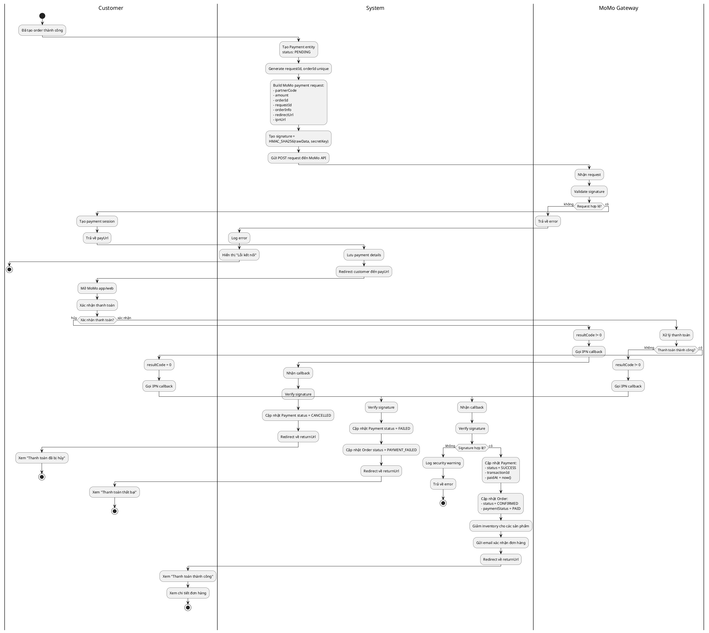

#### Sequence Diagram

```plantuml
@startuml
actor Customer
participant "OrderPage" as UI
participant "PaymentController" as PayCtrl
participant "PaymentService" as PaySvc
participant "MoMoGateway" as Gateway
participant "PaymentRepository" as PayRepo
participant "OrderRepository" as OrderRepo
participant "InventoryService" as InvSvc
participant "EmailService" as EmailSvc
participant "MoMo API" as MoMo
database "PostgreSQL" as DB

Customer -> UI: Đã tạo order thành công
UI -> UI: Đang chờ thanh toán...

UI -> PayCtrl: POST /api/v1/payment/momo\n{orderId: xxx}

PayCtrl -> PaySvc: createMoMoPayment(orderId)

PaySvc -> OrderRepo: findById(orderId)
OrderRepo -> DB: SELECT * FROM orders WHERE id = ?
DB -> OrderRepo: Order entity
OrderRepo -> PaySvc: Order

PaySvc -> PaySvc: Generate requestId = UUID
PaySvc -> PaySvc: Generate orderId = "ORDER_" + timestamp

PaySvc -> PaySvc: Build payment request:\n- partnerCode: "MOMO_PARTNER"\n- amount: 5000000\n- orderId: "ORDER_123456"\n- requestId: "REQ_UUID"\n- orderInfo: "Thanh toán đơn hàng #123"\n- redirectUrl: "http://localhost:3000/payment/return"\n- ipnUrl: "http://api/payment/ipn/momo"\n- requestType: "captureWallet"

PaySvc -> PaySvc: Create rawSignature = \n"accessKey=...&amount=5000000&extraData=..."\n(sorted params)

PaySvc -> PaySvc: signature = HMAC_SHA256(rawSignature, secretKey)

PaySvc -> Gateway: sendPaymentRequest(momoRequest)

Gateway -> MoMo: POST https://payment.momo.vn/v2/gateway/api/create\n{\n  partnerCode, accessKey, requestId,\n  amount, orderId, orderInfo,\n  redirectUrl, ipnUrl, signature, ...\n}

alt MoMo API error
  MoMo -> Gateway: 500 Internal Server Error
  Gateway -> PaySvc: throw MoMoApiException
  PaySvc -> PayCtrl: Exception
  PayCtrl -> UI: 500 Server Error
  UI -> Customer: "Lỗi kết nối cổng thanh toán. Vui lòng thử lại"
  
else MoMo API success
  MoMo -> MoMo: Validate signature
  MoMo -> MoMo: Create payment session
  MoMo -> Gateway: 200 OK\n{\n  resultCode: 0,\n  message: "Success",\n  payUrl: "https://momo.vn/pay/xxx",\n  deeplink: "momo://pay/xxx"\n}
  
  Gateway -> PaySvc: MoMoResponse
  
  PaySvc -> PaySvc: Create Payment entity:\n- order\n- amount: 5000000\n- paymentMethod: MOMO\n- status: PENDING\n- transactionId: requestId\n- gatewayResponse: momoResponse
  
  PaySvc -> PayRepo: save(payment)
  PayRepo -> DB: INSERT INTO payments...
  DB -> PayRepo: Payment saved
  PayRepo -> PaySvc: Payment entity
  
  PaySvc -> PayCtrl: PaymentDto with payUrl
  
  PayCtrl -> UI: 200 OK\n{\n  paymentId: xxx,\n  payUrl: "https://momo.vn/pay/xxx"\n}
  
  UI -> Customer: Redirect to MoMo payUrl
  
  Customer -> MoMo: Mở MoMo payment page
  MoMo -> Customer: Hiển thị thông tin thanh toán
  
  Customer -> MoMo: Xác nhận thanh toán
  
  alt Payment successful
    MoMo -> MoMo: Xử lý thanh toán
    MoMo -> PayCtrl: POST /api/v1/payment/ipn/momo (IPN Callback)\n{\n  partnerCode, orderId, requestId,\n  amount, resultCode: 0,\n  message: "Success",\n  transId: "MOMO_TRANS_123",\n  signature: "..."\n}
    
    PayCtrl -> PaySvc: processIpn(ipnData)
    
    PaySvc -> PaySvc: Verify signature
    PaySvc -> PaySvc: Create rawSignature from ipnData
    PaySvc -> PaySvc: expectedSignature = HMAC_SHA256(rawSignature, secretKey)
    
    alt Signature mismatch
      PaySvc -> PaySvc: Log security warning
      PaySvc -> PayCtrl: throw InvalidSignatureException
      PayCtrl -> MoMo: 400 Bad Request
      
    else Signature valid
      PaySvc -> PayRepo: findByTransactionId(requestId)
      PayRepo -> DB: SELECT * FROM payments WHERE transaction_id = ?
      DB -> PayRepo: Payment entity
      PayRepo -> PaySvc: Payment
      
      PaySvc -> PaySvc: Update Payment:\n- status = SUCCESS\n- momoTransId = "MOMO_TRANS_123"\n- paidAt = NOW()
      
      PaySvc -> PayRepo: save(payment)
      PayRepo -> DB: UPDATE payments SET status = 'SUCCESS', paid_at = NOW()
      DB -> PayRepo: Updated
      
      PaySvc -> OrderRepo: findById(payment.orderId)
      OrderRepo -> DB: SELECT * FROM orders WHERE id = ?
      DB -> OrderRepo: Order
      OrderRepo -> PaySvc: Order
      
      PaySvc -> PaySvc: Update Order:\n- status = CONFIRMED\n- paymentStatus = PAID
      
      PaySvc -> OrderRepo: save(order)
      OrderRepo -> DB: UPDATE orders SET status = 'CONFIRMED'
      DB -> OrderRepo: Updated
      
      ' Reduce inventory
      loop For each OrderItem
        PaySvc -> InvSvc: reduceQuantity(productId, quantity)
        InvSvc -> DB: UPDATE inventory\nSET available_quantity = available_quantity - ?\nWHERE product_id = ?
        DB -> InvSvc: Updated
      end
      
      ' Send email
      PaySvc -> EmailSvc: sendOrderConfirmation(order, payment)
      EmailSvc -> EmailSvc: Build email template
      EmailSvc -> EmailSvc: Send via SMTP
      EmailSvc -> PaySvc: Email sent
      
      PaySvc -> PayCtrl: IPN processed successfully
      PayCtrl -> MoMo: 200 OK\n{message: "Success"}
      
      ' Redirect customer
      MoMo -> Customer: Redirect to redirectUrl\n+ params (resultCode, message, etc.)
      
      Customer -> UI: GET /payment/return?resultCode=0&...
      
      UI -> UI: Parse result
      UI -> PayCtrl: GET /api/v1/payment/order/{orderId}
      PayCtrl -> PaySvc: getPaymentByOrderId(orderId)
      PaySvc -> DB: Get payment details
      DB -> PaySvc: Payment (SUCCESS)
      PaySvc -> PayCtrl: PaymentDto
      PayCtrl -> UI: 200 OK {payment details}
      
      UI -> UI: Show success page
      UI -> Customer: "Thanh toán thành công!\nMã đơn hàng: #123456"
    end
    
  else Payment failed
    MoMo -> PayCtrl: POST /api/v1/payment/ipn/momo\n{resultCode: 1004, message: "Transaction failed"}
    
    PayCtrl -> PaySvc: processIpn(ipnData)
    PaySvc -> PaySvc: Verify signature
    
    PaySvc -> PayRepo: findByTransactionId(requestId)
    PayRepo -> DB: Get payment
    DB -> PayRepo: Payment
    
    PaySvc -> PaySvc: Update Payment status = FAILED
    PaySvc -> PayRepo: save(payment)
    PayRepo -> DB: UPDATE payments SET status = 'FAILED'
    
    PaySvc -> PayCtrl: IPN processed
    PayCtrl -> MoMo: 200 OK
    
    MoMo -> Customer: Redirect to redirectUrl
    Customer -> UI: GET /payment/return?resultCode=1004
    UI -> Customer: "Thanh toán thất bại. Vui lòng thử lại"
  end
end

@enduml
```

---

### UC35: View Order History (Xem lịch sử đơn hàng)

#### Bảng đặc tả Use Case

| Thành phần | Mô tả |
|---|---|
| **Use Case ID** | UC35 |
| **Tên Use Case** | View Order History (Xem lịch sử đơn hàng) |
| **Actor** | Customer |
| **Mô tả** | Khách hàng xem danh sách các đơn hàng đã đặt |
| **Tiền điều kiện** | Customer đã đăng nhập |
| **Hậu điều kiện** | Danh sách đơn hàng được hiển thị theo thời gian |
| **Luồng chính** | 1. Customer click vào "Đơn hàng của tôi" 2. Hệ thống kiểm tra authentication 3. Hệ thống query danh sách orders của customer 4. Hệ thống sắp xếp theo createdAt DESC 5. Hệ thống hiển thị với pagination (10 orders/page) 6. Mỗi order hiển thị: &nbsp;&nbsp;- Order ID, ngày đặt &nbsp;&nbsp;- Tổng tiền &nbsp;&nbsp;- Trạng thái đơn hàng (PENDING, CONFIRMED, SHIPPING, DELIVERED, CANCELLED) &nbsp;&nbsp;- Trạng thái thanh toán &nbsp;&nbsp;- Số lượng sản phẩm &nbsp;&nbsp;- Thumbnail sản phẩm đầu tiên &nbsp;&nbsp;- Nút "Xem chi tiết" 7. Customer có thể lọc theo trạng thái 8. Customer có thể click vào order để xem chi tiết (UC36) |
| **Luồng thay thế** | **3a. Chưa có đơn hàng nào** &nbsp;&nbsp;1. Hiển thị "Bạn chưa có đơn hàng nào" &nbsp;&nbsp;2. Hiển thị nút "Khám phá sản phẩm"  **7a. Lọc theo trạng thái** &nbsp;&nbsp;1. Customer chọn tab "Đang giao", "Đã giao", etc. &nbsp;&nbsp;2. Hệ thống filter orders theo status &nbsp;&nbsp;3. Hiển thị kết quả lọc |
| **Ngoại lệ** | - Token hết hạn - Database error |

#### Activity Diagram

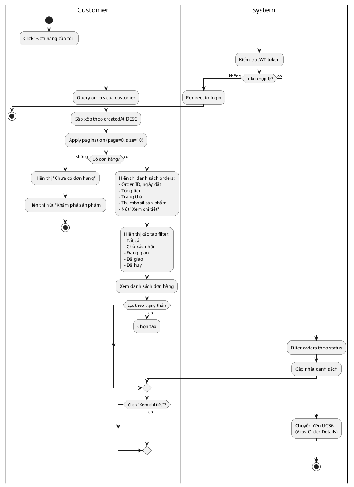

#### Sequence Diagram

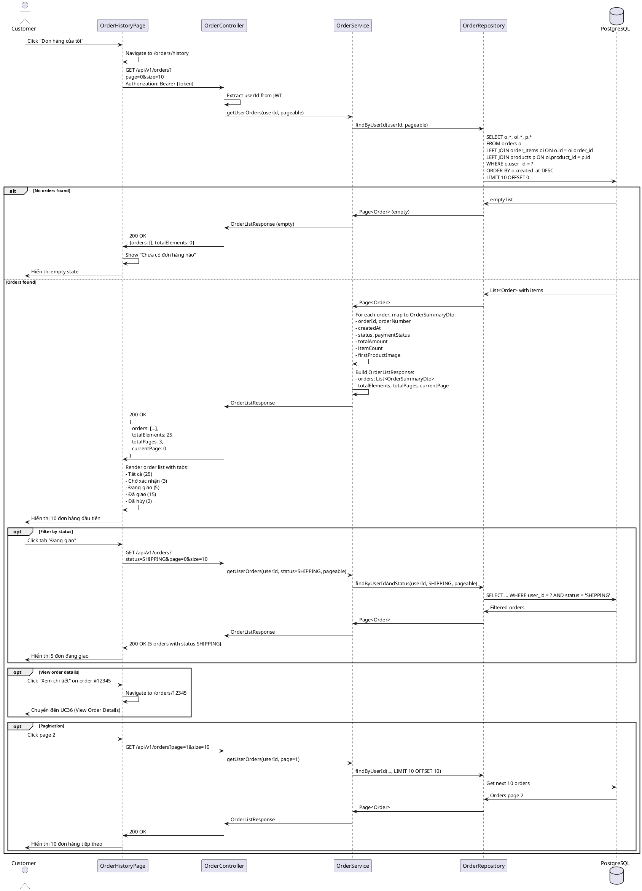

---

### UC38: Create Product (Tạo sản phẩm mới)

#### Bảng đặc tả Use Case

| Thành phần | Mô tả |
|---|---|
| **Use Case ID** | UC38 |
| **Tên Use Case** | Create Product (Tạo sản phẩm mới) |
| **Actor** | Admin |
| **Mô tả** | Admin tạo sản phẩm mới trong hệ thống |
| **Tiền điều kiện** | - Admin đã đăng nhập - Có role ADMIN - Có ít nhất 1 Category và 1 Brand trong hệ thống |
| **Hậu điều kiện** | - Product mới được tạo với status AVAILABLE - ProductDetail được tạo - ProductImages được upload - Inventory được khởi tạo với quantity = 0 |
| **Luồng chính** | 1. Admin truy cập trang "Quản lý sản phẩm" 2. Admin click "Thêm sản phẩm mới" 3. Hệ thống hiển thị form với các trường: &nbsp;&nbsp;**Thông tin cơ bản:** &nbsp;&nbsp;- Tên sản phẩm (*) &nbsp;&nbsp;- Slug (auto-generate từ tên, có thể edit) &nbsp;&nbsp;- SKU (*) &nbsp;&nbsp;- Danh mục (*) &nbsp;&nbsp;- Thương hiệu (*) &nbsp;&nbsp;- Mô tả ngắn &nbsp;&nbsp;- Mô tả chi tiết (*) &nbsp;&nbsp;**Giá:** &nbsp;&nbsp;- Giá bán (*) &nbsp;&nbsp;- Giá gốc &nbsp;&nbsp;- % giảm giá (auto-calculate) &nbsp;&nbsp;**Thông số kỹ thuật:** &nbsp;&nbsp;- Đường kính mặt (mm) &nbsp;&nbsp;- Độ dày (mm) &nbsp;&nbsp;- Chất liệu vỏ &nbsp;&nbsp;- Chất liệu dây &nbsp;&nbsp;- Loại máy &nbsp;&nbsp;- Độ chống nước (ATM) &nbsp;&nbsp;- Các tính năng đặc biệt &nbsp;&nbsp;**Hình ảnh:** &nbsp;&nbsp;- Upload ít nhất 1 hình (*) &nbsp;&nbsp;- Chọn hình đại diện 4. Admin nhập đầy đủ thông tin 5. Admin upload hình ảnh sản phẩm 6. Admin click "Lưu" 7. Hệ thống validate dữ liệu 8. Hệ thống kiểm tra SKU chưa tồn tại 9. Hệ thống kiểm tra Slug chưa tồn tại 10. Hệ thống upload images lên storage 11. Hệ thống tạo Product entity 12. Hệ thống tạo ProductDetail entity 13. Hệ thống tạo ProductImage entities 14. Hệ thống tạo Inventory entity với quantity = 0 15. Hệ thống lưu tất cả vào database trong transaction 16. Hiển thị thông báo thành công 17. Redirect đến trang danh sách sản phẩm |
| **Luồng thay thế** | **7a. Dữ liệu không hợp lệ** &nbsp;&nbsp;1. Hiển thị lỗi validation (tên trống, giá < 0, không có hình) &nbsp;&nbsp;2. Quay lại bước 4  **8a. SKU đã tồn tại** &nbsp;&nbsp;1. Hiển thị "SKU đã được sử dụng" &nbsp;&nbsp;2. Quay lại bước 4  **9a. Slug đã tồn tại** &nbsp;&nbsp;1. Auto-generate slug mới (thêm số suffix) &nbsp;&nbsp;2. Tiếp tục  **10a. Upload image failed** &nbsp;&nbsp;1. Hiển thị lỗi upload &nbsp;&nbsp;2. Yêu cầu upload lại |
| **Ngoại lệ** | - Token hết hạn - Không có permission - Storage service error - Database error |

#### Activity Diagram

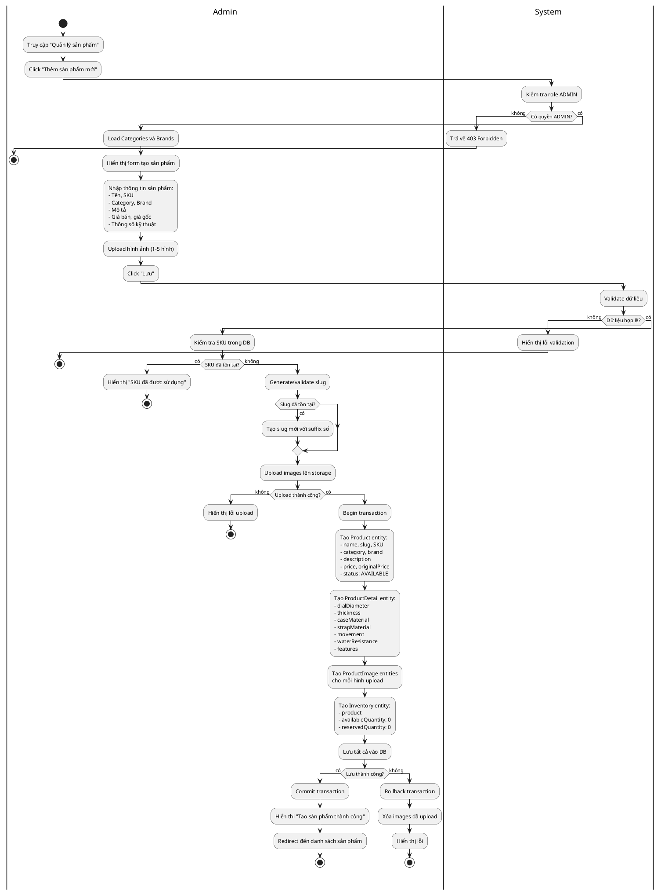

#### Sequence Diagram

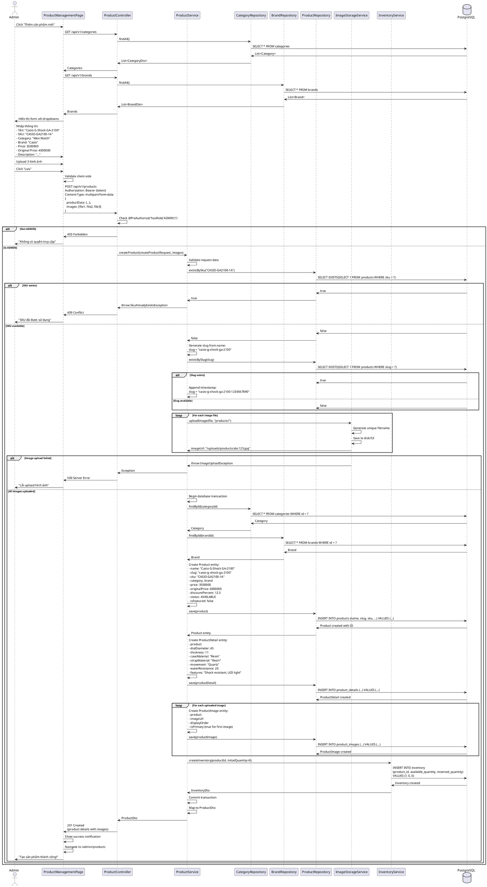

---

### UC39: Update Product (Cập nhật sản phẩm)

#### Bảng đặc tả Use Case

| Thành phần | Mô tả |
|---|---|
| **Use Case ID** | UC39 |
| **Tên Use Case** | Update Product (Cập nhật sản phẩm) |
| **Actor** | Admin |
| **Mô tả** | Admin cập nhật thông tin sản phẩm đã có |
| **Tiền điều kiện** | - Admin đã đăng nhập - Có role ADMIN - Sản phẩm tồn tại trong hệ thống |
| **Hậu điều kiện** | - Thông tin sản phẩm được cập nhật - Lịch sử thay đổi được ghi nhận (updatedAt) |
| **Luồng chính** | 1. Admin xem danh sách sản phẩm 2. Admin click "Sửa" trên sản phẩm cần cập nhật 3. Hệ thống load thông tin hiện tại của sản phẩm 4. Hệ thống hiển thị form với dữ liệu đã điền sẵn 5. Admin chỉnh sửa các trường cần thiết: &nbsp;&nbsp;- Có thể đổi tên (slug sẽ không đổi để giữ SEO) &nbsp;&nbsp;- Có thể đổi giá &nbsp;&nbsp;- Có thể đổi category, brand &nbsp;&nbsp;- Có thể cập nhật mô tả &nbsp;&nbsp;- Có thể cập nhật thông số kỹ thuật &nbsp;&nbsp;- Có thể thêm/xóa/thay hình ảnh &nbsp;&nbsp;- Có thể đổi trạng thái (AVAILABLE/DISCONTINUED) 6. Admin click "Cập nhật" 7. Hệ thống validate dữ liệu 8. Nếu có hình mới: Upload lên storage 9. Nếu xóa hình cũ: Xóa khỏi storage 10. Hệ thống cập nhật Product entity 11. Hệ thống cập nhật ProductDetail entity 12. Hệ thống cập nhật ProductImages 13. Hệ thống set updatedAt = now() 14. Hệ thống lưu vào database 15. Hiển thị thông báo thành công |
| **Luồng thay thế** | **3a. Sản phẩm không tồn tại** &nbsp;&nbsp;1. Trả về 404 &nbsp;&nbsp;2. Hiển thị "Sản phẩm không tồn tại"  **7a. Dữ liệu không hợp lệ** &nbsp;&nbsp;1. Hiển thị lỗi validation &nbsp;&nbsp;2. Quay lại bước 5  **8a. Upload hình mới failed** &nbsp;&nbsp;1. Hiển thị lỗi &nbsp;&nbsp;2. Không cập nhật hình ảnh &nbsp;&nbsp;3. Tiếp tục cập nhật các trường khác |
| **Ngoại lệ** | - Token hết hạn - Không có permission - Storage error - Database error |

#### Activity Diagram

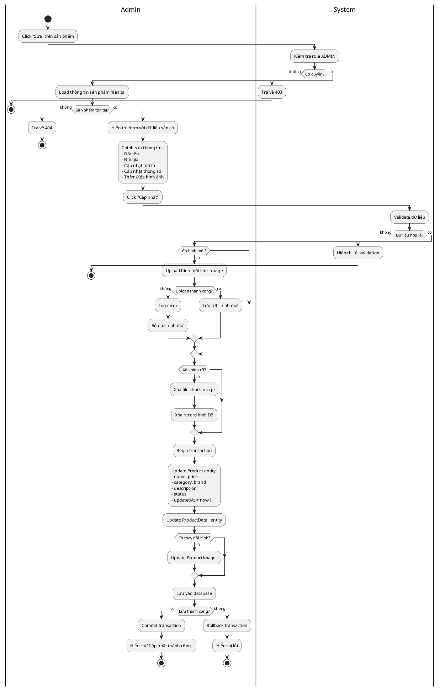

#### Sequence Diagram

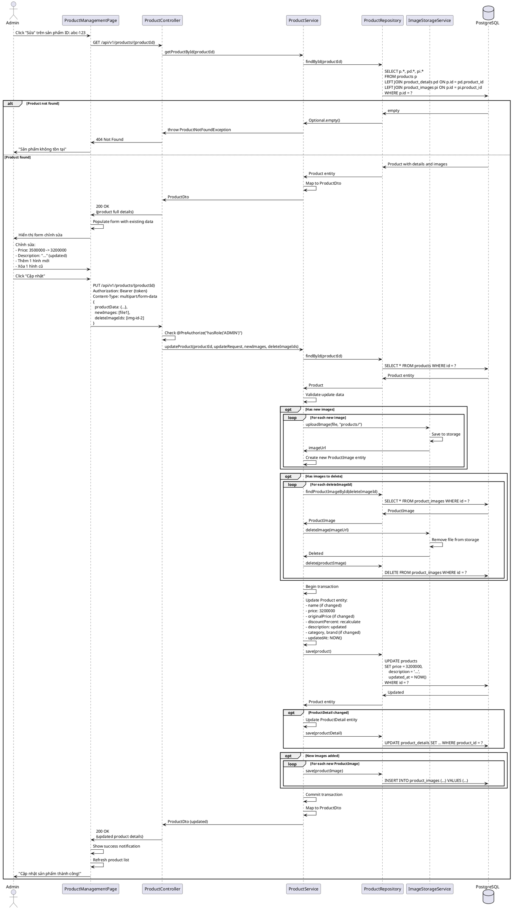

---

### UC50: View All Orders (Xem tất cả đơn hàng - Admin)

#### Bảng đặc tả Use Case

| Thành phần | Mô tả |
|---|---|
| **Use Case ID** | UC50 |
| **Tên Use Case** | View All Orders (Xem tất cả đơn hàng - Admin) |
| **Actor** | Admin |
| **Mô tả** | Admin xem và quản lý tất cả đơn hàng trong hệ thống |
| **Tiền điều kiện** | - Admin đã đăng nhập - Có role ADMIN |
| **Hậu điều kiện** | Danh sách đơn hàng được hiển thị với các bộ lọc và thống kê |
| **Luồng chính** | 1. Admin truy cập "Quản lý đơn hàng" 2. Hệ thống kiểm tra role ADMIN 3. Hệ thống query tất cả orders với pagination 4. Hệ thống tính toán thống kê: &nbsp;&nbsp;- Tổng số đơn hàng &nbsp;&nbsp;- Số đơn theo trạng thái &nbsp;&nbsp;- Tổng doanh thu &nbsp;&nbsp;- Doanh thu hôm nay 5. Hệ thống hiển thị bảng orders với: &nbsp;&nbsp;- Order ID, Mã đơn &nbsp;&nbsp;- Khách hàng (tên, email, SĐT) &nbsp;&nbsp;- Ngày đặt &nbsp;&nbsp;- Tổng tiền &nbsp;&nbsp;- Trạng thái đơn hàng &nbsp;&nbsp;- Trạng thái thanh toán &nbsp;&nbsp;- Phương thức thanh toán &nbsp;&nbsp;- Actions (Xem chi tiết, Cập nhật trạng thái) 6. Admin có thể: &nbsp;&nbsp;- Lọc theo trạng thái &nbsp;&nbsp;- Lọc theo phương thức thanh toán &nbsp;&nbsp;- Lọc theo khoảng thời gian &nbsp;&nbsp;- Tìm kiếm theo mã đơn/tên KH/email &nbsp;&nbsp;- Sắp xếp theo các cột &nbsp;&nbsp;- Xuất Excel/PDF 7. Admin click vào order để xem chi tiết (UC51) 8. Admin có thể cập nhật trạng thái (UC52) |
| **Luồng thay thế** | **6a. Apply filters** &nbsp;&nbsp;1. Admin chọn bộ lọc &nbsp;&nbsp;2. Hệ thống query lại với điều kiện &nbsp;&nbsp;3. Cập nhật danh sách và thống kê  **6b. Search orders** &nbsp;&nbsp;1. Admin nhập từ khóa tìm kiếm &nbsp;&nbsp;2. Hệ thống search trong orderNumber, customer name, email &nbsp;&nbsp;3. Hiển thị kết quả |
| **Ngoại lệ** | - Token hết hạn - Không có permission - Database error |

#### Activity Diagram

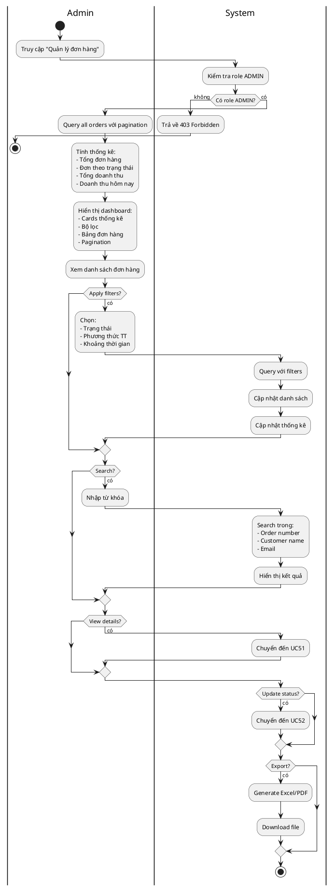

#### Sequence Diagram

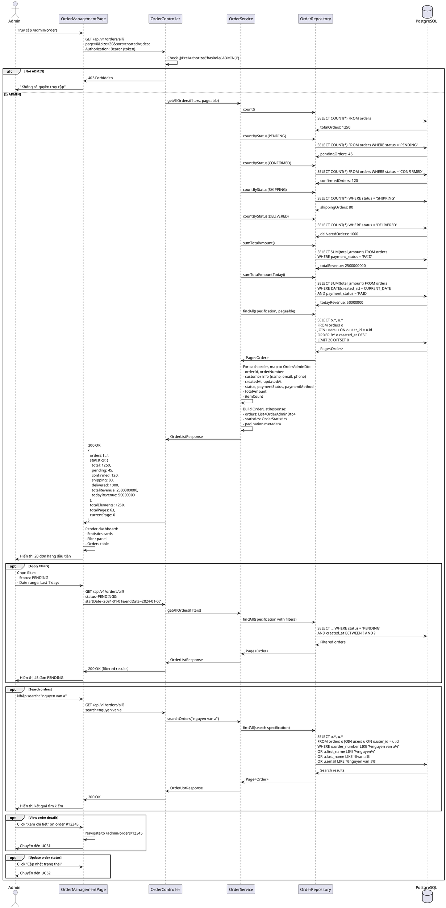

---

### UC52: Update Order Status (Cập nhật trạng thái đơn hàng)

#### Bảng đặc tả Use Case

| Thành phần | Mô tả |
|---|---|
| **Use Case ID** | UC52 |
| **Tên Use Case** | Update Order Status (Cập nhật trạng thái đơn hàng) |
| **Actor** | Admin |
| **Mô tả** | Admin cập nhật trạng thái xử lý đơn hàng |
| **Tiền điều kiện** | - Admin đã đăng nhập - Có role ADMIN - Order tồn tại trong hệ thống |
| **Hậu điều kiện** | - Trạng thái order được cập nhật - Email thông báo được gửi cho customer - Lịch sử thay đổi được ghi nhận |
| **Luồng chính** | 1. Admin xem chi tiết đơn hàng 2. Admin click "Cập nhật trạng thái" 3. Hệ thống hiển thị dropdown với các trạng thái hợp lệ: &nbsp;&nbsp;- PENDING → CONFIRMED hoặc CANCELLED &nbsp;&nbsp;- CONFIRMED → SHIPPING hoặc CANCELLED &nbsp;&nbsp;- SHIPPING → DELIVERED hoặc CANCELLED &nbsp;&nbsp;- DELIVERED (final state) 4. Admin chọn trạng thái mới 5. Admin có thể nhập ghi chú (optional) 6. Admin click "Xác nhận" 7. Hệ thống validate chuyển trạng thái hợp lệ 8. Hệ thống cập nhật Order status 9. Hệ thống cập nhật updatedAt = now() 10. Hệ thống lưu vào database 11. Hệ thống gửi email thông báo cho customer 12. Hiển thị thông báo thành công |
| **Luồng thay thế** | **7a. Chuyển trạng thái không hợp lệ** &nbsp;&nbsp;1. Hiển thị "Không thể chuyển từ X sang Y" &nbsp;&nbsp;2. Quay lại bước 4  **8a. Update sang CANCELLED** &nbsp;&nbsp;1. Nếu đã thanh toán: Yêu cầu xác nhận hoàn tiền &nbsp;&nbsp;2. Hoàn lại inventory &nbsp;&nbsp;3. Cập nhật status = CANCELLED &nbsp;&nbsp;4. Gửi email thông báo hủy đơn |
| **Ngoại lệ** | - Token hết hạn - Order không tồn tại - Email service error |

#### Activity Diagram

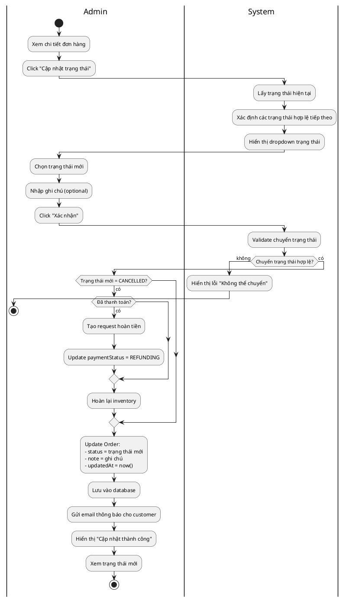

#### Sequence Diagram

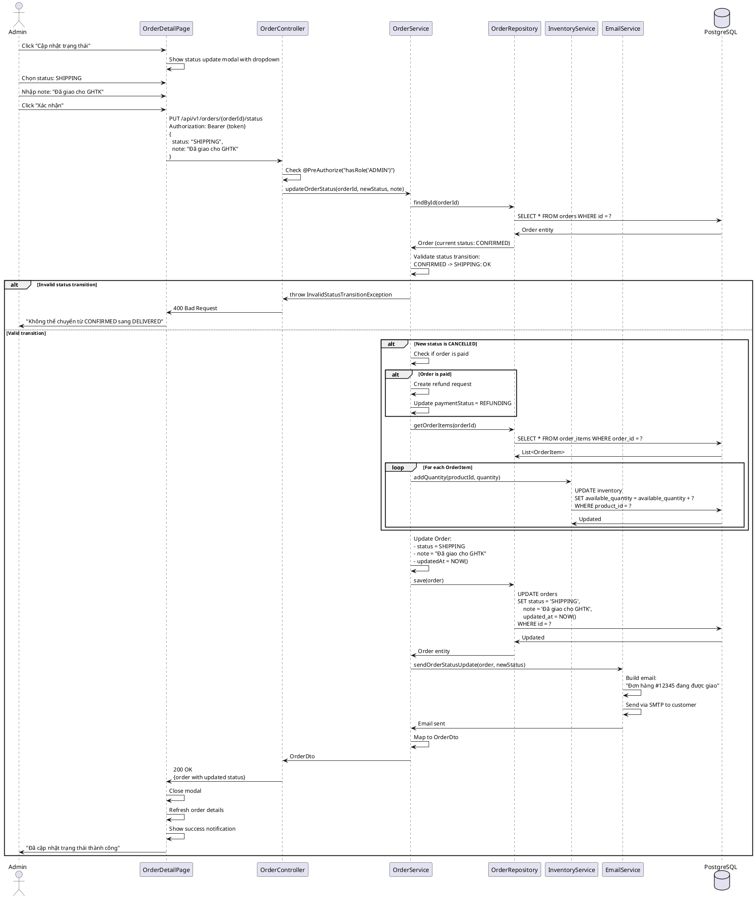

---

### UC59: Approve Review (Phê duyệt đánh giá)

#### Bảng đặc tả Use Case

| Thành phần | Mô tả |
|---|---|
| **Use Case ID** | UC59 |
| **Tên Use Case** | Approve Review (Phê duyệt đánh giá) |
| **Actor** | Admin |
| **Mô tả** | Admin phê duyệt đánh giá sản phẩm từ khách hàng |
| **Tiền điều kiện** | - Admin đã đăng nhập - Có role ADMIN - Review có status PENDING |
| **Hậu điều kiện** | - Review status được cập nhật thành APPROVED - Review hiển thị công khai trên trang sản phẩm - Rating trung bình của sản phẩm được cập nhật |
| **Luồng chính** | 1. Admin truy cập "Quản lý đánh giá" 2. Admin click tab "Chờ duyệt" 3. Hệ thống hiển thị danh sách reviews có status PENDING 4. Mỗi review hiển thị: &nbsp;&nbsp;- Thông tin customer &nbsp;&nbsp;- Sản phẩm được đánh giá &nbsp;&nbsp;- Số sao &nbsp;&nbsp;- Tiêu đề và nội dung &nbsp;&nbsp;- Ngày đăng &nbsp;&nbsp;- Actions (Duyệt/Từ chối) 5. Admin đọc nội dung đánh giá 6. Admin click "Phê duyệt" 7. Hệ thống cập nhật Review status = APPROVED 8. Hệ thống cập nhật approvedAt = now() 9. Hệ thống lưu vào database 10. Hệ thống tính lại average rating của product 11. Hệ thống cập nhật Product.averageRating 12. Hiển thị thông báo thành công 13. Review được remove khỏi danh sách pending |
| **Luồng thay thế** | **5a. Nội dung không phù hợp** &nbsp;&nbsp;1. Admin click "Từ chối" (UC60) &nbsp;&nbsp;2. Cập nhật status = REJECTED &nbsp;&nbsp;3. Không hiển thị công khai  **6a. Batch approve** &nbsp;&nbsp;1. Admin chọn nhiều reviews &nbsp;&nbsp;2. Admin click "Duyệt tất cả" &nbsp;&nbsp;3. Hệ thống approve từng review &nbsp;&nbsp;4. Cập nhật rating cho các products liên quan |
| **Ngoại lệ** | - Token hết hạn - Review không tồn tại - Review đã được xử lý |

#### Activity Diagram

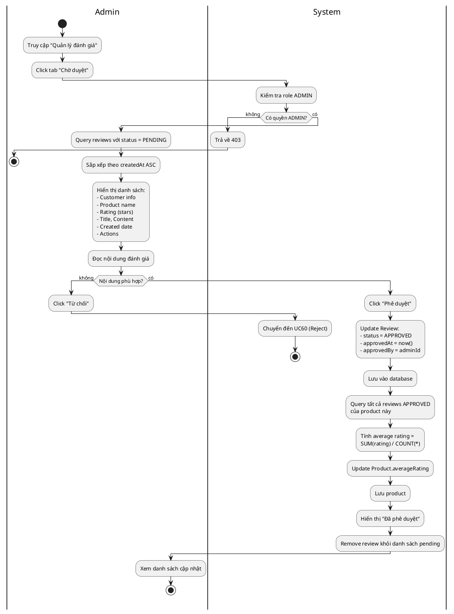

#### Sequence Diagram

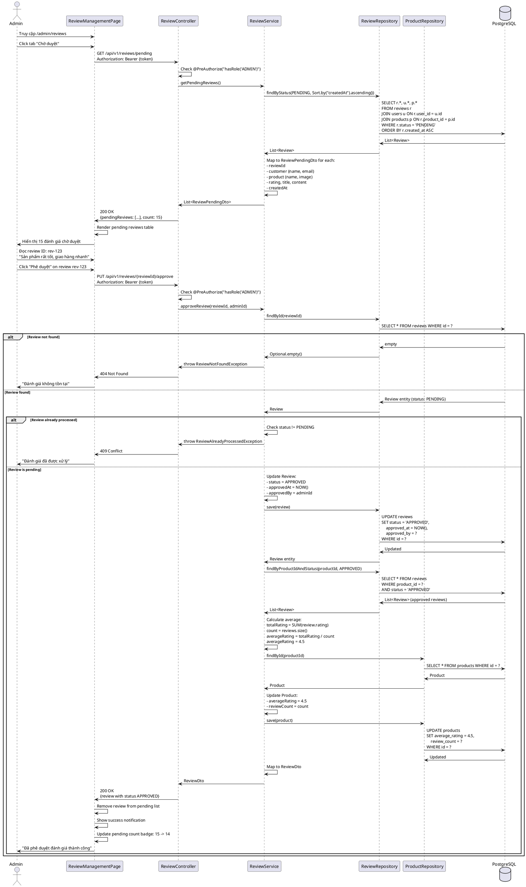

---

## Tổng kết

Đã hoàn thành đặc tả chi tiết cho **20 Use Cases quan trọng** của hệ thống Watchify:

### Guest/Customer Use Cases (14 UCs):
1. ✅ UC01: Register Account
2. ✅ UC02: Login
3. ✅ UC07: Browse Products
4. ✅ UC08: View Product Details
5. ✅ UC09: Search Products
6. ✅ UC15: Write Review
7. ✅ UC18: View Cart
8. ✅ UC19: Add to Cart
9. ✅ UC20: Update Cart Item
10. ✅ UC23: View Wishlist
11. ✅ UC24: Add to Wishlist
12. ✅ UC28: Add Address
13. ✅ UC32: Checkout Order
14. ✅ UC33: Apply Coupon
15. ✅ UC34: Make Payment (MoMo)
16. ✅ UC35: View Order History

### Admin Use Cases (6 UCs):
17. ✅ UC38: Create Product
18. ✅ UC39: Update Product
19. ✅ UC50: View All Orders
20. ✅ UC52: Update Order Status
21. ✅ UC59: Approve Review

Mỗi Use Case đều bao gồm đầy đủ:
- **Bảng đặc tả Use Case** (ID, Tên, Actor, Mô tả, Tiền/Hậu điều kiện, Luồng chính/thay thế, Ngoại lệ)
- **Activity Diagram** (PlantUML, 2 cột: Actor | System)
- **Sequence Diagram** (PlantUML, chi tiết tương tác giữa các components)

Tài liệu được chia thành 3 files để dễ quản lý:
- **Part 1**: UC01, UC02, UC07, UC08, UC09, UC15, UC18
- **Part 2**: UC19, UC20, UC23, UC24, UC28, UC32, UC33
- **Part 3**: UC34, UC35, UC38, UC39, UC50, UC52, UC59