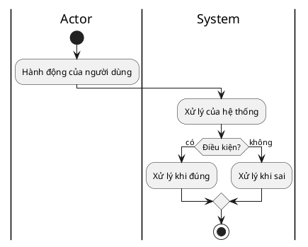
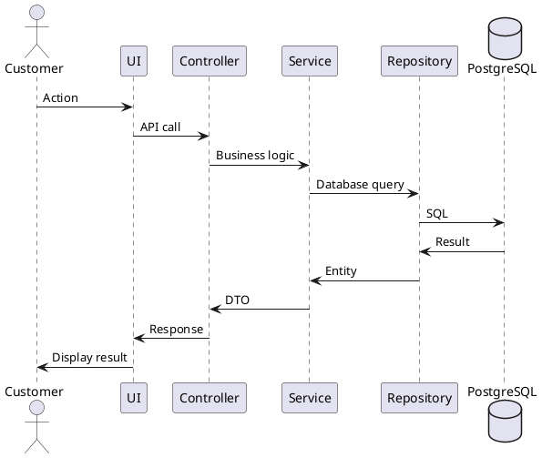

# HƯỚNG DẪN TÀI LIỆU ĐẶC TẢ USE CASE - HỆ THỐNG WATCHIFY

## Tổng quan

Tài liệu này mô tả cấu trúc và nội dung của các file đặc tả Use Case cho hệ thống Watchify E-commerce.

## Cấu trúc tài liệu

Tài liệu được chia thành **3 files chính** để dễ quản lý và tránh file quá dài:

```
docs/
├── Chuong3_PhanTichThietKe_UseCase.md         (Part 1 - 1267 dòng)
├── Chuong3_PhanTichThietKe_UseCase_Part2.md   (Part 2 - 1201 dòng)
├── Chuong3_PhanTichThietKe_UseCase_Part3.md   (Part 3 - 1619 dòng)
└── UseCase_Documentation_Guide.md             (File này)
```

## Nội dung từng file

### 📄 Part 1 - Chuong3_PhanTichThietKe_UseCase.md

**Nội dung:**
1. Use Case Diagram tổng quan (PlantUML) - 69 Use Cases
2. Bảng tổng hợp 69 Use Cases
3. Đặc tả chi tiết 7 Use Cases đầu tiên:

| ID | Use Case | Actor | Mô tả |
|---|---|---|---|
| UC01 | Register Account | Guest | Đăng ký tài khoản mới |
| UC02 | Login | Guest | Đăng nhập vào hệ thống |
| UC07 | Browse Products | Guest | Duyệt danh sách sản phẩm |
| UC08 | View Product Details | Guest | Xem chi tiết sản phẩm |
| UC09 | Search Products | Guest | Tìm kiếm sản phẩm |
| UC15 | Write Review | Customer | Viết đánh giá sản phẩm |
| UC18 | View Cart | Customer | Xem giỏ hàng |

### 📄 Part 2 - Chuong3_PhanTichThietKe_UseCase_Part2.md

**Nội dung:**
Đặc tả chi tiết 7 Use Cases tiếp theo (Shopping & Wishlist):

| ID | Use Case | Actor | Mô tả |
|---|---|---|---|
| UC19 | Add to Cart | Customer | Thêm sản phẩm vào giỏ |
| UC20 | Update Cart Item | Customer | Cập nhật số lượng trong giỏ |
| UC23 | View Wishlist | Customer | Xem danh sách yêu thích |
| UC24 | Add to Wishlist | Customer | Thêm vào yêu thích |
| UC28 | Add Address | Customer | Thêm địa chỉ giao hàng |
| UC32 | Checkout Order | Customer | Thanh toán đơn hàng |
| UC33 | Apply Coupon | Customer | Áp dụng mã giảm giá |

### 📄 Part 3 - Chuong3_PhanTichThietKe_UseCase_Part3.md

**Nội dung:**
Đặc tả chi tiết 6 Use Cases còn lại (Payment & Admin):

| ID | Use Case | Actor | Mô tả |
|---|---|---|---|
| UC34 | Make Payment | Customer + MoMo | Thanh toán qua MoMo |
| UC35 | View Order History | Customer | Xem lịch sử đơn hàng |
| UC38 | Create Product | Admin | Tạo sản phẩm mới |
| UC39 | Update Product | Admin | Cập nhật sản phẩm |
| UC50 | View All Orders | Admin | Xem tất cả đơn hàng |
| UC52 | Update Order Status | Admin | Cập nhật trạng thái đơn hàng |
| UC59 | Approve Review | Admin | Phê duyệt đánh giá |

## Định dạng đặc tả cho mỗi Use Case

Mỗi Use Case được đặc tả đầy đủ với 3 phần:

### 1. Bảng đặc tả Use Case

```markdown
| Thành phần | Mô tả |
|---|---|
| **Use Case ID** | UCxx |
| **Tên Use Case** | Tên tiếng Anh (Tiếng Việt) |
| **Actor** | Guest / Customer / Admin |
| **Mô tả** | Mô tả ngắn gọn chức năng |
| **Tiền điều kiện** | Điều kiện cần có trước khi thực hiện |
| **Hậu điều kiện** | Kết quả sau khi thực hiện thành công |
| **Luồng chính** | Các bước thực hiện từ 1-n |
| **Luồng thay thế** | Các trường hợp ngoại lệ, lỗi |
| **Ngoại lệ** | Các lỗi hệ thống |
```

### 2. Activity Diagram (PlantUML)

**Đặc điểm:**
- Sử dụng PlantUML syntax
- Chia làm 2 cột: `|Actor|` và `|System|`
- Mô tả luồng hoạt động từ Actor đến System
- Có các nhánh điều kiện (if-else)
- Kết thúc bằng `stop`

**Cấu trúc:**


### 3. Sequence Diagram (PlantUML)

**Đặc điểm:**
- Mô tả tương tác giữa các components
- Bao gồm: Actor, UI, Controller, Service, Repository, Database
- Hiển thị luồng message qua lại
- Có xử lý các trường hợp thành công/thất bại (alt/else)

**Cấu trúc:**


## Thống kê Use Cases

### Tổng quan:
- **Tổng số Use Cases trong hệ thống:** 69 UCs
- **Số Use Cases được đặc tả chi tiết:** 20 UCs (29%)
- **Số Use Cases chỉ có trong bảng tổng hợp:** 49 UCs

### Phân loại theo Actor:

#### Guest (10 UCs):
- UC01: Register Account ✅
- UC02: Login ✅
- UC03: Logout
- UC04: View Profile
- UC05: Update Profile
- UC06: Change Password
- UC07: Browse Products ✅
- UC08: View Product Details ✅
- UC09: Search Products ✅
- UC10-14: Filters và Featured Products

#### Customer (25 UCs):
- UC15: Write Review ✅
- UC16-17: Review Management
- UC18: View Cart ✅
- UC19: Add to Cart ✅
- UC20: Update Cart Item ✅
- UC21-22: Cart Management
- UC23: View Wishlist ✅
- UC24: Add to Wishlist ✅
- UC25-26: Wishlist Management
- UC27-31: Address Management (UC28 ✅)
- UC32: Checkout Order ✅
- UC33: Apply Coupon ✅
- UC34: Make Payment ✅
- UC35: View Order History ✅
- UC36: View Order Details

#### Admin (34 UCs):
- UC37-40: Product Management (UC38 ✅, UC39 ✅)
- UC41-44: Category Management
- UC45-49: Brand Management
- UC50-52: Order Management (UC50 ✅, UC52 ✅)
- UC53-56: User Management
- UC57-60: Review Management (UC59 ✅)
- UC61-66: Coupon Management
- UC67-69: Analytics & Inventory

### Mức độ ưu tiên:

- **Cao:** 28 UCs (trong đó 18 UCs đã được đặc tả chi tiết)
- **Trung bình:** 32 UCs (trong đó 2 UCs đã được đặc tả)
- **Thấp:** 9 UCs

## Cách sử dụng tài liệu

### Để xem Use Case Diagram:
1. Mở file `Chuong3_PhanTichThietKe_UseCase.md`
2. Tìm phần **3.2.1. Biểu đồ Use Case tổng quan**
3. Copy code PlantUML
4. Paste vào https://www.plantuml.com/plantuml/uml/ để xem diagram

### Để tìm Use Case cụ thể:
1. Xem **Bảng tổng hợp 69 Use Cases** trong Part 1
2. Tìm UC ID cần xem
3. Nếu UC được in đậm → có đặc tả chi tiết
4. Tìm UC trong các file Part 1, 2, hoặc 3 tương ứng

### Để render diagrams:
**Các công cụ hỗ trợ PlantUML:**
- Online: https://www.plantuml.com/plantuml/uml/
- VS Code Extension: PlantUML
- IntelliJ IDEA: PlantUML integration plugin
- Markdown Preview Enhanced (VS Code)

## Lưu ý khi sử dụng

### ✅ Đã hoàn thiện:
- Use Case Diagram tổng quan với 69 UCs
- Bảng tổng hợp đầy đủ 69 UCs
- Đặc tả chi tiết 20 UCs quan trọng nhất
- Tất cả Activity Diagrams đều ở dạng 2 cột (Actor|System)
- Tất cả Sequence Diagrams đều mô tả tương tác chi tiết

### 📝 Các Use Cases quan trọng đã được đặc tả đầy đủ:

**Customer Journey:**
- Đăng ký/Đăng nhập: UC01, UC02 ✅
- Tìm kiếm/Xem sản phẩm: UC07, UC08, UC09 ✅
- Quản lý giỏ hàng: UC18, UC19, UC20 ✅
- Wishlist: UC23, UC24 ✅
- Đặt hàng: UC28, UC32, UC33, UC34, UC35 ✅
- Đánh giá: UC15 ✅

**Admin Journey:**
- Quản lý sản phẩm: UC38, UC39 ✅
- Quản lý đơn hàng: UC50, UC52 ✅
- Quản lý đánh giá: UC59 ✅

### 🔄 Mở rộng tương lai (nếu cần):

Nếu cần đặc tả thêm Use Cases, ưu tiên:
1. **UC36: View Order Details** - Quan trọng cho cả Customer và Admin
2. **UC62: Create Coupon** - Quan trọng cho Admin
3. **UC68: Manage Inventory** - Quản lý tồn kho
4. **UC60: Reject Review** - Bổ sung cho UC59
5. **UC40: Delete Product** - Hoàn thiện CRUD sản phẩm

## Quy tắc viết đặc tả

### 1. Bảng đặc tả:
- Tên Use Case: Tiếng Anh (Tiếng Việt)
- Luồng chính: Đánh số từ 1, mỗi bước là 1 hành động cụ thể
- Luồng thay thế: Đánh số theo bước chính (ví dụ: 3a, 3b)
- Viết rõ ràng, súc tích

### 2. Activity Diagram:
- Luôn có 2 cột: Actor và System
- Sử dụng if-else cho điều kiện
- Mỗi luồng kết thúc bằng `stop`
- Mô tả action ngắn gọn, dễ hiểu

### 3. Sequence Diagram:
- Đầy đủ các participants
- Mô tả rõ message qua lại
- Xử lý cả trường hợp thành công và thất bại
- Có comment giải thích các bước quan trọng

## Liên kết với code thực tế

Tất cả Use Cases được đặc tả dựa trên code thực tế của hệ thống:

**Backend:**
- `backend/src/main/java/fit/iuh/backend/modules/*/web/controller/`
- `backend/src/main/java/fit/iuh/backend/modules/*/service/`

**Frontend:**
- `frontend/src/pages/client/`
- `frontend/src/pages/admin/`

## Liên hệ và hỗ trợ

Nếu có thắc mắc về tài liệu hoặc cần bổ sung Use Cases, vui lòng liên hệ:
- Team: DHKTPM18ATT_Nhom03
- Project: Watchify E-commerce System

---

**Phiên bản:** 1.0  
**Ngày cập nhật:** 2024  
**Người thực hiện:** DHKTPM18ATT_Nhom03