# PlantUML Class Diagrams - Watchify E-commerce System

## 📋 Tổng Quan

Thư mục này chứa các PlantUML diagrams mô tả kiến trúc và thiết kế của hệ thống Watchify E-commerce.

**Tại sao dùng PlantUML?**
- ✅ Chuẩn UML 2.0 chuyên nghiệp
- ✅ Text-based, dễ version control với Git
- ✅ Hỗ trợ đầy đủ relationships, stereotypes, notes
- ✅ Export nhiều format (PNG, SVG, PDF)
- ✅ Industry standard cho documentation

---

## 📁 Danh Sách Diagrams

### 1. `identity-module.puml`
**Mô tả:** Identity và Authentication Module
- **Entities:** User, Role, Address, RefreshToken
- **Enums:** UserStatus, AddressType
- **Patterns:** Aggregate Root, RBAC, JWT Token Management

**Quan hệ chính:**
- User ↔ Role (Many-to-Many)
- User → Address (One-to-Many)
- User → RefreshToken (One-to-Many)

---

### 2. `catalog-module.puml`
**Mô tả:** Product Catalog Management
- **Entities:** Product, Category, Brand, ProductImage, ProductDetail, Review, Wishlist, Cart, CartItem
- **Enums:** ProductStatus
- **Patterns:** Aggregate Root, Self-referencing Tree, Snapshot Pattern

**Quan hệ chính:**
- Product → Category (Many-to-One via categoryId)
- Product → Brand (Many-to-One via brandId)
- Product ↔ ProductImage (One-to-Many composition)
- Product ↔ ProductDetail (One-to-One)
- Category → Category (Self-referencing via parentId)

**⚠️ Lưu ý quan trọng:**
- Product KHÔNG có navigation properties (Category, Brand objects)
- Chỉ lưu foreign keys (categoryId, brandId)
- Unidirectional relationships cho performance

---

### 3. `inventory-module.puml`
**Mô tả:** Inventory và Stock Management
- **Entities:** Inventory, InventoryTransaction
- **Enums:** TransactionType
- **Patterns:** Aggregate Root, Audit Trail, Optimistic Locking

**Quan hệ chính:**
- Inventory ↔ Product (One-to-One via productId)
- Inventory → InventoryTransaction (One-to-Many)

**Business Logic:**
- Reserve/Release/Confirm stock operations
- Prevent overselling với concurrency control
- Complete audit trail cho mọi inventory changes
- Multi-warehouse support

---

### 4. `order-payment-modules.puml`
**Mô tả:** Order Processing, Payment, và Promotion Management
- **Modules:** Order, Payment, Promotion
- **Entities:** Order, OrderItem, Payment, Coupon, CouponUsage
- **Enums:** OrderStatus, PaymentStatus, PaymentMethod, DiscountType
- **Patterns:** State Machine, Aggregate Root, Audit Trail

**Quan hệ chính:**
- Order → OrderItem (One-to-Many composition)
- Order ↔ Payment (One-to-One)
- Order → Coupon (Many-to-One via couponId)
- Coupon → CouponUsage (One-to-Many)

**Business Logic:**
- Order Status State Machine
- Payment lifecycle
- Coupon validation và redemption tracking

---

### 5. `complete-system-class-diagram.puml`
**Mô tả:** Toàn bộ hệ thống - Overview tất cả modules
- **All Modules:** Identity, Catalog, Inventory, Order, Payment, Promotion
- **Cross-module dependencies**
- **Architecture notes**
- **Business rules documentation**

**Sử dụng khi nào:**
- Presentation cho stakeholders
- Onboarding developers mới
- Architecture review
- System overview documentation

---

## 🚀 Cách Sử Dụng

### Option 1: Online Editor (Nhanh nhất)

1. Truy cập: https://www.plantuml.com/plantuml/uml/
2. Copy nội dung file `.puml`
3. Paste vào editor
4. Click "Submit" để xem diagram
5. Download PNG/SVG nếu cần

**Ưu điểm:** Không cần cài đặt  
**Nhược điểm:** Cần internet, không lưu local

---

### Option 2: VS Code Extension (Khuyến nghị)

#### Cài đặt:
```bash
# Trong VS Code
Ctrl+P → ext install plantuml
```

hoặc tìm "PlantUML" trong Extensions Marketplace

#### Sử dụng:
1. Mở file `.puml` trong VS Code
2. **Alt+D** để xem preview
3. **Ctrl+Shift+P** → "PlantUML: Export Current Diagram" để export

#### Cấu hình (settings.json):
```json
{
  "plantuml.server": "https://www.plantuml.com/plantuml",
  "plantuml.render": "PlantUMLServer",
  "plantuml.exportFormat": "png",
  "plantuml.exportSubFolder": false
}
```

**Ưu điểm:** Live preview, export dễ dàng  
**Nhược điểm:** Cần VS Code

---

### Option 3: IntelliJ IDEA Plugin

#### Cài đặt:
1. Settings → Plugins → Marketplace
2. Search "PlantUML Integration"
3. Install và restart

#### Sử dụng:
1. Mở file `.puml`
2. Tool window tự động hiển thị preview
3. Right-click → "Copy/Export Diagram" để export

**Ưu điểm:** Tích hợp tốt với IDE  
**Nhược điểm:** Chỉ dùng cho IntelliJ

---

### Option 4: Command Line (CI/CD)

#### Cài đặt:
```bash
# Option A: Node.js
npm install -g node-plantuml

# Option B: Java (yêu cầu Java 8+)
# Download plantuml.jar từ https://plantuml.com/download
```

#### Sử dụng với Node:
```bash
# Generate single file
puml generate identity-module.puml -o output/

# Generate all files
puml generate *.puml -o output/

# Specify format
puml generate identity-module.puml -o output/ -f svg
```

#### Sử dụng với Java:
```bash
# Generate PNG
java -jar plantuml.jar identity-module.puml

# Generate SVG
java -jar plantuml.jar -tsvg identity-module.puml

# Generate all in directory
java -jar plantuml.jar *.puml

# Custom output directory
java -jar plantuml.jar -o output/ *.puml
```

**Ưu điểm:** Automation, batch processing  
**Nhược điểm:** Cần setup môi trường

---

## 📝 Cách Chỉnh Sửa Diagrams

### 1. Thêm Entity Mới

```plantuml
class NewEntity <<Entity>> {
    - UUID id
    - String name
    - LocalDateTime createdAt
    __
    + doSomething(): void
}
```

### 2. Thêm Relationship

```plantuml
' Composition (owns lifecycle)
Order "1" *-- "1..*" OrderItem : contains >

' Aggregation (has reference)
Product "1" o-- "0..*" ProductImage : has >

' Association
User "1" -- "0..*" Address : owns >

' Dependency (weak reference via FK)
Product "*" ..> "1" Category : {categoryId}
```

### 3. Thêm Note

```plantuml
note right of Product
    **Important Notes:**
    - Uses foreign keys (categoryId, brandId)
    - NO JPA navigation properties
    - Unidirectional relationships
end note
```

### 4. Thêm Enum

```plantuml
enum OrderStatus <<Enumeration>> ENUM_COLOR {
    PENDING
    CONFIRMED
    COMPLETED
    CANCELLED
    __
    + isCancellable(): boolean
}
```

### 5. Thay Đổi Màu Sắc

```plantuml
!define ENTITY_COLOR #E3F2FD
!define ENUM_COLOR #FFF9C4

package "Module Name" ENTITY_COLOR {
    class MyEntity { ... }
}
```

---

## 🎨 Quy Ước Trong Diagrams

### Stereotypes
- `<<Entity>>` - JPA Entity
- `<<Aggregate Root>>` - DDD Aggregate Root
- `<<Value Object>>` - DDD Value Object
- `<<Enumeration>>` - Java Enum
- `<<Join Table>>` - Many-to-Many join table

### Relationships
- `-->` Dependency (thường là FK reference)
- `--` Association (bidirectional)
- `*--` Composition (parent owns child lifecycle)
- `o--` Aggregation (parent has child reference)
- `..>` Weak dependency (cross-module reference)

### Multiplicity
- `1` - Exactly one
- `0..1` - Zero or one
- `*` hoặc `0..*` - Zero to many
- `1..*` - One to many
- `2..5` - Two to five

### Field Visibility
- `-` Private
- `+` Public
- `#` Protected
- `~` Package

### Constraints
- `{unique}` - Unique constraint
- `{readonly}` - Immutable field
- `{FK}` - Foreign key

---

## 📦 Export Diagrams

### Export tất cả diagrams thành PNG:

**Windows (PowerShell):**
```powershell
# Sử dụng Java
Get-ChildItem *.puml | ForEach-Object { java -jar plantuml.jar $_.FullName }

# Sử dụng Node
Get-ChildItem *.puml | ForEach-Object { puml generate $_.Name -o ../images/ }
```

**Linux/Mac (Bash):**
```bash
# Sử dụng Java
for file in *.puml; do java -jar plantuml.jar "$file"; done

# Sử dụng Node
for file in *.puml; do puml generate "$file" -o ../images/; done
```

### Export thành SVG (scalable):
```bash
java -jar plantuml.jar -tsvg *.puml
```

### Export thành PDF:
```bash
java -jar plantuml.jar -tpdf complete-system-class-diagram.puml
```

---

## 🔄 Workflow Cập Nhật Diagrams

### 1. Khi Code Thay Đổi

```
Code Change → Update .puml → Generate Image → Update Documentation
```

**Ví dụ:** Thêm field mới vào User entity

```java
// Code
public class User {
    private String avatar; // NEW FIELD
}
```

```plantuml
// Update identity-module.puml
class User {
    ...
    - String avatar  // ADD THIS
    ...
}
```

```bash
# Regenerate
java -jar plantuml.jar identity-module.puml
```

### 2. Khi Thêm Entity Mới

1. Thêm entity vào file `.puml` tương ứng
2. Thêm relationships nếu cần
3. Thêm notes giải thích
4. Regenerate diagram
5. Update complete-system-class-diagram.puml nếu cần

### 3. Review Checklist

- [ ] Entity fields khớp với code thực tế?
- [ ] Relationships đúng (FK vs navigation properties)?
- [ ] Data types chính xác?
- [ ] Enums đầy đủ các values?
- [ ] Notes giải thích rõ ràng?
- [ ] Stereotypes đúng?
- [ ] Colors consistent?

---

## 🐛 Troubleshooting

### Lỗi: "Syntax Error"
**Nguyên nhân:** Sai cú pháp PlantUML  
**Giải pháp:** Check dấu ngoặc, indentation, keywords

### Lỗi: "Cannot generate diagram"
**Nguyên nhân:** Server không khả dụng hoặc file quá lớn  
**Giải pháp:** 
- Dùng local generator (Java)
- Split diagram thành nhiều files nhỏ hơn

### Diagram không hiển thị trong VS Code
**Nguyên nhân:** Extension chưa cài hoặc server setting sai  
**Giải pháp:**
1. Check extension đã install
2. Check settings.json
3. Reload VS Code

### Font chữ Việt bị lỗi
**Nguyên nhân:** PlantUML default không hỗ trợ Unicode tốt  
**Giải pháp:** Thêm vào đầu file:

```plantuml
@startuml
skinparam defaultFontName Arial Unicode MS
...
@enduml
```


---

## 📚 Tài Liệu Tham Khảo

### Official Documentation
- PlantUML Class Diagram: https://plantuml.com/class-diagram
- PlantUML Guide: https://plantuml.com/guide
- UML 2.0 Specification: https://www.omg.org/spec/UML/

### Tutorials
- PlantUML Tutorial: https://modeling-languages.com/plantuml-tutorial/
- Real-world Examples: https://real-world-plantuml.com/

### Tools
- Online Editor: https://www.plantuml.com/plantuml/uml/
- VS Code Extension: https://marketplace.visualstudio.com/items?itemName=jebbs.plantuml
- IntelliJ Plugin: https://plugins.jetbrains.com/plugin/7017-plantuml-integration

### Best Practices
- Martin Fowler - UML Distilled: https://martinfowler.com/books/uml.html
- DDD Patterns: https://domainlanguage.com/ddd/
- C4 Model: https://c4model.com/

---

## 🤝 Contributing

### Khi thêm/sửa diagram:

1. **Fork và tạo branch:**
   ```bash
   git checkout -b feature/update-diagram
   ```

2. **Edit .puml file**

3. **Test render:**
   ```bash
   java -jar plantuml.jar your-diagram.puml
   ```

4. **Commit:**
   ```bash
   git add diagrams/your-diagram.puml
   git commit -m "docs: update Product entity in catalog-module diagram"
   ```

5. **Push và tạo PR**

### Commit Message Convention:
```
docs: update [entity/module] in [diagram-name]
docs: add [new-entity] to [diagram-name]
docs: fix relationship between [entity1] and [entity2]
```

---

## 📊 Diagram Statistics

| Diagram | Entities | Enums | Relationships | Lines of Code |
|---------|----------|-------|---------------|---------------|
| identity-module.puml | 4 | 2 | 5 | ~164 |
| catalog-module.puml | 9 | 1 | 11 | ~274 |
| inventory-module.puml | 2 | 1 | 3 | ~245 |
| order-payment-modules.puml | 6 | 5 | 10 | ~281 |
| complete-system-class-diagram.puml | 21+ | 9 | 28+ | ~499 |

**Total:** 21+ entities, 9+ enums, 28+ relationships

---

## ✅ Checklist Khi Làm Việc Với Diagrams

### Trước khi commit:
- [ ] Diagram render thành công
- [ ] Syntax không có lỗi
- [ ] Entity fields khớp với code
- [ ] Relationships đúng
- [ ] Notes giải thích rõ ràng
- [ ] Colors consistent
- [ ] Legend đầy đủ

### Trước khi presentation:
- [ ] Export PNG/SVG resolution cao
- [ ] Test diagram trên nhiều devices
- [ ] Prepare backup images
- [ ] Print test (nếu cần)

---

## 📞 Support

**Questions?** Liên hệ:
- GitHub Issues: [Link to repo issues]
- Team Chat: [Link to team chat]
- Documentation Lead: [Contact info]

---

**Last Updated:** 2024  
**Maintained By:** Development Team  
**Version:** 1.0